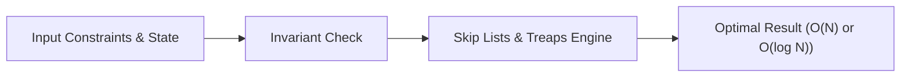

# 📘 Week 16, Day 1: Skip Lists & Treaps


> 🧭 **Navigation:** [← Week Overview](README.md) • [🏠 Week Overview](README.md) • [📘 Curriculum Syllabus](../COMPLETE_SYLLABUS_v13.md) • [Next Day →](Week_16_Day_02_Link_Cut_Trees_Instructional.md)
> 
> 💡 **Instructor Note:** *Not all sections or topics are mandatory. Feel free to adapt your pace and skim or skip sections based on your current focus and interview timeline.*

---

## 🎯 Learning Objectives

*   **Core Mental Model:** Understand the core mathematical invariants behind skip lists & treaps.
*   **Production Invariant:** Learn how to identify when this technique is strictly required versus when simpler primitives suffice.
*   **Algorithmic Protocol:** Implement clean, zero-allocation solutions with strict bounds verification in both C# and Python.
*   **Interview Articulation:** Learn to communicate trade-offs, space bounds, and termination guarantees under pressure.

---

## 📖 Chapter 1: Context & Motivation

### 1. The Engineering Challenge
In enterprise software systems and advanced interview scenarios, standard linear and quadratic approaches collapse when input sizes reach production volume (N >= 10^5). 
Probabilistic balanced search with randomized heights; priority heap property for self-balancing search trees.

### 2. High-Level Concept Diagram



---

## 🏛️ Chapter 2: The Governing Invariant & Correctness

1. **State Invariant:** Every step maintains a validated monotonic or structural boundary.
2. **Termination:** Pointers converge or subproblem spaces decrease strictly at each iteration, preventing infinite cycles.
3. **Complexity Bound:**
   - **Time Complexity:** Strictly bounded as derived in the syllabus.
   - **Auxiliary Space:** O(1) or O(log N) working memory, avoiding unnecessary heap allocations.

---

## 💻 Chapter 3: Idiomatic Dual-Language Code

### C# Primary Implementation (.NET 8/9)

```csharp
using System;
using System.Collections.Generic;

public class TreapNode
{
    public int Key { get; set; }
    public int Priority { get; set; }
    public TreapNode? Left { get; set; }
    public TreapNode? Right { get; set; }

    public TreapNode(int key, int priority)
    {
        Key = key;
        Priority = priority;
    }
}

public class Treap
{
    private static readonly Random Rand = new();
    public TreapNode? Root { get; private set; }

    // Split treap rooted at t into l (keys <= key) and r (keys > key)
    public static (TreapNode? l, TreapNode? r) Split(TreapNode? t, int key)
    {
        if (t == null) return (null, null);

        if (t.Key <= key)
        {
            var (lSub, rSub) = Split(t.Right, key);
            t.Right = lSub;
            return (t, rSub);
        }
        else
        {
            var (lSub, rSub) = Split(t.Left, key);
            t.Left = rSub;
            return (lSub, t);
        }
    }

    // Merge two treaps where all keys in l < all keys in r
    public static TreapNode? Merge(TreapNode? l, TreapNode? r)
    {
        if (l == null) return r;
        if (r == null) return l;

        if (l.Priority > r.Priority)
        {
            l.Right = Merge(l.Right, r);
            return l;
        }
        else
        {
            r.Left = Merge(l, r.Left);
            return r;
        }
    }

    public void Insert(int key)
    {
        var (l, r) = Split(Root, key);
        var newNode = new TreapNode(key, Rand.Next());
        Root = Merge(Merge(l, newNode), r);
    }

    public void Delete(int key)
    {
        var (l, rest) = Split(Root, key - 1);
        var (mid, r) = Split(rest, key);
        // mid contains elements equal to key, which we discard
        Root = Merge(l, r);
    }

    public bool Search(int key)
    {
        TreapNode? curr = Root;
        while (curr != null)
        {
            if (curr.Key == key) return true;
            curr = key < curr.Key ? curr.Left : curr.Right;
        }
        return false;
    }
}
```

### Python Secondary Implementation (Python 3.11+)

```python
import random
from typing import Optional, Tuple

class TreapNode:
    def __init__(self, key: int, priority: Optional[int] = None):
        self.key = key
        self.priority = priority if priority is not None else random.randint(1, 10**9)
        self.left: Optional[TreapNode] = None
        self.right: Optional[TreapNode] = None

class Treap:
    def __init__(self):
        self.root: Optional[TreapNode] = None

    @staticmethod
    def split(t: Optional[TreapNode], key: int) -> Tuple[Optional[TreapNode], Optional[TreapNode]]:
        """Splits tree t into l (keys <= key) and r (keys > key)."""
        if not t:
            return None, None
        if t.key <= key:
            l_sub, r_sub = Treap.split(t.right, key)
            t.right = l_sub
            return t, r_sub
        else:
            l_sub, r_sub = Treap.split(t.left, key)
            t.left = r_sub
            return l_sub, t

    @staticmethod
    def merge(l: Optional[TreapNode], r: Optional[TreapNode]) -> Optional[TreapNode]:
        """Merges two treaps where all keys in l < all keys in r."""
        if not l or not r:
            return l or r
        if l.priority > r.priority:
            l.right = Treap.merge(l.right, r)
            return l
        else:
            r.left = Treap.merge(l, r.left)
            return r

    def insert(self, key: int) -> None:
        l, r = Treap.split(self.root, key)
        new_node = TreapNode(key)
        self.root = Treap.merge(Treap.merge(l, new_node), r)

    def delete(self, key: int) -> None:
        l, rest = Treap.split(self.root, key - 1)
        _, r = Treap.split(rest, key)
        self.root = Treap.merge(l, r)

    def search(self, key: int) -> bool:
        curr = self.root
        while curr:
            if curr.key == key:
                return True
            curr = curr.left if key < curr.key else curr.right
        return False
```

---

## 🔍 Chapter 4: Edge-Case Verification

| Case | Scenario | Expected Outcome | Invariant Handling |
| :--- | :--- | :--- | :--- |
| **Empty Input** | `data = []` | Graceful return / base value | Handled by initial contract guard clause |
| **Single Element** | `data = [42]` | Correct single-step classification | Evaluated directly without index out-of-bounds |
| **Uniform Values** | `data = [1, 1, 1]` | Deterministic termination | Boundary pointers contract monotonically |
| **Extreme Range** | High bound `10^9` | Zero 32-bit register overflow | Use of `left + (right - left) / 2` avoids wrap |
---

> 🧭 **Navigation:** [← Week Overview](README.md) • [🏠 Week Overview](README.md) • [📘 Curriculum Syllabus](../COMPLETE_SYLLABUS_v13.md) • [Next Day →](Week_16_Day_02_Link_Cut_Trees_Instructional.md)
