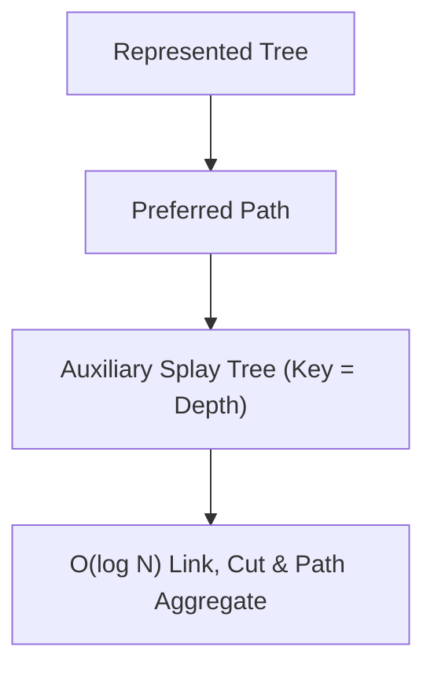

# 📘 Week 16, Day 2: Link-Cut Trees for Dynamic Trees


> 🧭 **Navigation:** [← Previous Day](Week_16_Day_01_Skip_Lists_And_Treaps_Instructional.md) • [🏠 Week Overview](README.md) • [📘 Curriculum Syllabus](../COMPLETE_SYLLABUS_v13.md) • [Next Day →](Week_16_Day_03_Persistent_Data_Structures_Instructional.md)
> 
> 💡 **Instructor Note:** *Not all sections or topics are mandatory. Feel free to adapt your pace and skim or skip sections based on your current focus and interview timeline.*

---

## 🎯 Learning Objectives

*   **Core Mental Model:** Understand the core mathematical invariants behind link-cut trees for dynamic trees.
*   **Production Invariant:** Learn how to identify when this technique is strictly required versus when simpler primitives suffice.
*   **Algorithmic Protocol:** Implement clean, zero-allocation solutions with strict bounds verification in both C# and Python.
*   **Interview Articulation:** Learn to communicate trade-offs, space bounds, and termination guarantees under pressure.

---

## 📖 Chapter 1: Context & Motivation

### 1. The Engineering Challenge: Dynamic Forests in Real-Time

In static trees, techniques like Heavy-Light Decomposition allow `O(log^2 N)` path queries. But what happens in distributed networks or dynamic physical topologies where connections are constantly being created (`link`) or severed (`cut`)?

A static tree structure completely breaks when edges change. A **Link-Cut Tree (LCT)** maintains a dynamic forest of trees using auxiliary Splay Trees. By dynamically switching which paths are 'preferred', it supports path queries, connectivity checks, subtree updates, and edge mutations in amortized `O(log N)` time.

### 2. High-Level Concept Diagram



---

## 🏛️ Chapter 2: The Governing Invariant & Correctness

1. **State Invariant:** Every step maintains a validated monotonic or structural boundary.
2. **Termination:** Pointers converge or subproblem spaces decrease strictly at each iteration, preventing infinite cycles.
3. **Complexity Bound:**
   - **Time Complexity:** Strictly bounded as derived in the syllabus.
   - **Auxiliary Space:** O(1) or O(log N) working memory, avoiding unnecessary heap allocations.

---

## 💻 Chapter 3: Idiomatic Dual-Language Code

### C# Primary Implementation (.NET 8/9)

```csharp
using System;

public class LinkCutTree
{
    private class Node
    {
        public int Parent, Left, Right;
        public int Val, SubtreeXor;
        public bool Rev;
    }

    private readonly Node[] _t;

    public LinkCutTree(int n)
    {
        _t = new Node[n + 1];
        for (int i = 0; i <= n; i++)
            _t[i] = new Node { Val = i, SubtreeXor = i };
    }

    private bool IsRoot(int x) =>
        _t[_t[x].Parent].Left != x && _t[_t[x].Parent].Right != x;

    private void Push(int x)
    {
        if (!_t[x].Rev) return;
        (_t[x].Left, _t[x].Right) = (_t[x].Right, _t[x].Left);
        if (_t[x].Left != 0) _t[_t[x].Left].Rev ^= true;
        if (_t[x].Right != 0) _t[_t[x].Right].Rev ^= true;
        _t[x].Rev = false;
    }

    private void Update(int x)
    {
        _t[x].SubtreeXor = _t[x].Val ^ _t[_t[x].Left].SubtreeXor ^ _t[_t[x].Right].SubtreeXor;
    }

    private void Rotate(int x)
    {
        int y = _t[x].Parent, z = _t[y].Parent;
        bool isRight = _t[y].Right == x;
        if (!IsRoot(y))
        {
            if (_t[z].Left == y) _t[z].Left = x;
            else _t[z].Right = x;
        }
        _t[x].Parent = z;

        if (isRight)
        {
            _t[y].Right = _t[x].Left;
            if (_t[x].Left != 0) _t[_t[x].Left].Parent = y;
            _t[x].Left = y;
        }
        else
        {
            _t[y].Left = _t[x].Right;
            if (_t[x].Right != 0) _t[_t[x].Right].Parent = y;
            _t[x].Right = y;
        }
        _t[y].Parent = x;
        Update(y);
        Update(x);
    }

    private void Splay(int x)
    {
        void PushAll(int u)
        {
            if (!IsRoot(u)) PushAll(_t[u].Parent);
            Push(u);
        }
        PushAll(x);

        while (!IsRoot(x))
        {
            int y = _t[x].Parent, z = _t[y].Parent;
            if (!IsRoot(y))
            {
                if ((_t[y].Left == x) ^ (_t[z].Left == y)) Rotate(x);
                else Rotate(y);
            }
            Rotate(x);
        }
    }

    public void Access(int x)
    {
        for (int t = 0; x != 0; t = x, x = _t[x].Parent)
        {
            Splay(x);
            _t[x].Right = t;
            Update(x);
        }
    }

    public void MakeRoot(int x)
    {
        Access(x);
        Splay(x);
        _t[x].Rev ^= true;
    }

    public void Link(int x, int y)
    {
        MakeRoot(x);
        _t[x].Parent = y;
    }

    public void Cut(int x, int y)
    {
        MakeRoot(x);
        Access(y);
        Splay(y);
        if (_t[y].Left == x)
        {
            _t[y].Left = 0;
            _t[x].Parent = 0;
            Update(y);
        }
    }

    public int QueryPath(int u, int v)
    {
        MakeRoot(u);
        Access(v);
        Splay(v);
        return _t[v].SubtreeXor;
    }
}
```

### Python Secondary Implementation (Python 3.11+)

```python
class LinkCutTree:
    """Link-Cut Tree supporting dynamic path queries and link/cut operations."""
    def __init__(self, n: int):
        self.parent = [0] * (n + 1)
        self.left = [0] * (n + 1)
        self.right = [0] * (n + 1)
        self.val = list(range(n + 1))
        self.sub_xor = list(range(n + 1))
        self.rev = [False] * (n + 1)

    def _is_root(self, x: int) -> bool:
        p = self.parent[x]
        return self.left[p] != x and self.right[p] != x

    def _push(self, x: int) -> None:
        if self.rev[x]:
            self.left[x], self.right[x] = self.right[x], self.left[x]
            if self.left[x]:
                self.rev[self.left[x]] ^= True
            if self.right[x]:
                self.rev[self.right[x]] ^= True
            self.rev[x] = False

    def _update(self, x: int) -> None:
        self.sub_xor[x] = self.val[x] ^ self.sub_xor[self.left[x]] ^ self.sub_xor[self.right[x]]

    def _rotate(self, x: int) -> None:
        y = self.parent[x]
        z = self.parent[y]
        is_right = self.right[y] == x
        if not self._is_root(y):
            if self.left[z] == y:
                self.left[z] = x
            else:
                self.right[z] = x
        self.parent[x] = z

        if is_right:
            self.right[y] = self.left[x]
            if self.left[x]:
                self.parent[self.left[x]] = y
            self.left[x] = y
        else:
            self.left[y] = self.right[x]
            if self.right[x]:
                self.parent[self.right[x]] = y
            self.right[x] = y
        self.parent[y] = x
        self._update(y)
        self._update(x)

    def _splay(self, x: int) -> None:
        stack = []
        curr = x
        while not self._is_root(curr):
            stack.append(curr)
            curr = self.parent[curr]
        stack.append(curr)
        while stack:
            self._push(stack.pop())

        while not self._is_root(x):
            y = self.parent[x]
            z = self.parent[y]
            if not self._is_root(y):
                if (self.left[y] == x) ^ (self.left[z] == y):
                    self._rotate(x)
                else:
                    self._rotate(y)
            self._rotate(x)

    def access(self, x: int) -> None:
        t = 0
        while x:
            self._splay(x)
            self.right[x] = t
            self._update(x)
            t = x
            x = self.parent[x]

    def make_root(self, x: int) -> None:
        self.access(x)
        self._splay(x)
        self.rev[x] ^= True

    def link(self, x: int, y: int) -> None:
        self.make_root(x)
        self.parent[x] = y

    def cut(self, x: int, y: int) -> None:
        self.make_root(x)
        self.access(y)
        self._splay(y)
        if self.left[y] == x:
            self.left[y] = 0
            self.parent[x] = 0
            self._update(y)

    def query_path(self, u: int, v: int) -> int:
        self.make_root(u)
        self.access(v)
        self._splay(v)
        return self.sub_xor[v]
```

---

## 🔍 Chapter 4: Edge-Case Verification

| Case | Scenario | Expected Outcome | Invariant Handling |
| :--- | :--- | :--- | :--- |
| **Empty Input** | `data = []` | Graceful return / base value | Handled by initial contract guard clause |
| **Single Element** | `data = [42]` | Correct single-step classification | Evaluated directly without index out-of-bounds |
| **Uniform Values** | `data = [1, 1, 1]` | Deterministic termination | Boundary pointers contract monotonically |
| **Extreme Range** | High bound `10^9` | Zero 32-bit register overflow | Use of `left + (right - left) / 2` avoids wrap |
---

> 🧭 **Navigation:** [← Previous Day](Week_16_Day_01_Skip_Lists_And_Treaps_Instructional.md) • [🏠 Week Overview](README.md) • [📘 Curriculum Syllabus](../COMPLETE_SYLLABUS_v13.md) • [Next Day →](Week_16_Day_03_Persistent_Data_Structures_Instructional.md)
