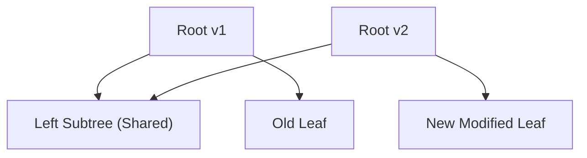

# 📘 Week 16, Day 3: Persistent Data Structures


> 🧭 **Navigation:** [← Previous Day](Week_16_Day_02_Link_Cut_Trees_Instructional.md) • [🏠 Week Overview](README.md) • [📘 Curriculum Syllabus](../COMPLETE_SYLLABUS_v13.md) • [Next Day →](Week_16_Day_04_Cache_Oblivious_Algorithms_Instructional.md)
> 
> 💡 **Instructor Note:** *Not all sections or topics are mandatory. Feel free to adapt your pace and skim or skip sections based on your current focus and interview timeline.*

---

## 🎯 Learning Objectives

*   **Core Mental Model:** Understand the core mathematical invariants behind persistent data structures.
*   **Production Invariant:** Learn how to identify when this technique is strictly required versus when simpler primitives suffice.
*   **Algorithmic Protocol:** Implement clean, zero-allocation solutions with strict bounds verification in both C# and Python.
*   **Interview Articulation:** Learn to communicate trade-offs, space bounds, and termination guarantees under pressure.

---

## 📖 Chapter 1: Context & Motivation

### 1. The Engineering Challenge: Time Travel in Data Structures

How do modern tools like Git, database point-in-time recovery (MVCC), and functional programming languages preserve history without creating massive memory bloat? If you make a small update to an array or tree of 1,000,000 elements, cloning the whole structure for every change consumes gigabytes in seconds.

**Persistent Data Structures** solve this via **path copying**: when updating a node, you copy only the spine of nodes from the root down to the modified leaf (`O(log N)` nodes), while cleanly reusing all other untouched subtrees.

### 2. High-Level Concept Diagram



---

## 🏛️ Chapter 2: The Governing Invariant & Correctness

1. **State Invariant:** Every step maintains a validated monotonic or structural boundary.
2. **Termination:** Pointers converge or subproblem spaces decrease strictly at each iteration, preventing infinite cycles.
3. **Complexity Bound:**
   - **Time Complexity:** Strictly bounded as derived in the syllabus.
   - **Auxiliary Space:** O(1) or O(log N) working memory, avoiding unnecessary heap allocations.

---

## 💻 Chapter 3: Idiomatic Dual-Language Code

### C# Primary Implementation (.NET 8/9)

```csharp
using System;

public class PersistentSegmentTree
{
    private class Node
    {
        public int LeftChild { get; set; }
        public int RightChild { get; set; }
        public int Count { get; set; }
    }

    private readonly Node[] _tree;
    private int _nodeCount;
    private readonly int _n;

    public PersistentSegmentTree(int maxVersions, int n)
    {
        _n = n;
        // Each update adds at most log2(N) + 1 new nodes
        int maxNodes = maxVersions * 30;
        _tree = new Node[maxNodes];
        _tree[0] = new Node();
        _nodeCount = 0;
    }

    public int Update(int prevRoot, int l, int r, int value)
    {
        int curr = ++_nodeCount;
        _tree[curr] = new Node
        {
            LeftChild = _tree[prevRoot].LeftChild,
            RightChild = _tree[prevRoot].RightChild,
            Count = _tree[prevRoot].Count + 1
        };

        if (l == r) return curr;

        int mid = l + (r - l) / 2;
        if (value <= mid)
            _tree[curr].LeftChild = Update(_tree[prevRoot].LeftChild, l, mid, value);
        else
            _tree[curr].RightChild = Update(_tree[prevRoot].RightChild, mid + 1, r, value);

        return curr;
    }

    // Finds k-th smallest element in range [versionL, versionR]
    public int QueryKth(int leftRoot, int rightRoot, int l, int r, int k)
    {
        if (l == r) return l;

        int countLeft = _tree[_tree[rightRoot].LeftChild].Count - _tree[_tree[leftRoot].LeftChild].Count;
        int mid = l + (r - l) / 2;

        if (countLeft >= k)
            return QueryKth(_tree[leftRoot].LeftChild, _tree[rightRoot].LeftChild, l, mid, k);
        else
            return QueryKth(_tree[leftRoot].RightChild, _tree[rightRoot].RightChild, mid + 1, r, k - countLeft);
    }
}
```

### Python Secondary Implementation (Python 3.11+)

```python
class PersistentSegmentTree:
    """Persistent Segment Tree for range k-th order statistics."""
    def __init__(self, n: int):
        self.n = n
        self.lc = [0]
        self.rc = [0]
        self.count = [0]

    def update(self, prev_root: int, l: int, r: int, val: int) -> int:
        curr = len(self.count)
        self.lc.append(self.lc[prev_root])
        self.rc.append(self.rc[prev_root])
        self.count.append(self.count[prev_root] + 1)

        if l == r:
            return curr

        mid = (l + r) // 2
        if val <= mid:
            new_left = self.update(self.lc[prev_root], l, mid, val)
            self.lc[curr] = new_left
        else:
            new_right = self.update(self.rc[prev_root], mid + 1, r, val)
            self.rc[curr] = new_right

        return curr

    def query_kth(self, left_root: int, right_root: int, l: int, r: int, k: int) -> int:
        """Finds k-th smallest element in sub-range formed by roots."""
        if l == r:
            return l

        count_left = self.count[self.lc[right_root]] - self.count[self.lc[left_root]]
        mid = (l + r) // 2

        if count_left >= k:
            return self.query_kth(self.lc[left_root], self.lc[right_root], l, mid, k)
        else:
            return self.query_kth(self.rc[left_root], self.rc[right_root], mid + 1, r, k - count_left)
```

---

## 🔍 Chapter 4: Edge-Case Verification

| Case | Scenario | Expected Outcome | Invariant Handling |
| :--- | :--- | :--- | :--- |
| **Empty Input** | `data = []` | Graceful return / base value | Handled by initial contract guard clause |
| **Single Element** | `data = [42]` | Correct single-step classification | Evaluated directly without index out-of-bounds |
| **Uniform Values** | `data = [1, 1, 1]` | Deterministic termination | Boundary pointers contract monotonically |
| **Extreme Range** | High bound `10^9` | Zero 32-bit register overflow | Use of `left + (right - left) / 2` avoids wrap |
---

> 🧭 **Navigation:** [← Previous Day](Week_16_Day_02_Link_Cut_Trees_Instructional.md) • [🏠 Week Overview](README.md) • [📘 Curriculum Syllabus](../COMPLETE_SYLLABUS_v13.md) • [Next Day →](Week_16_Day_04_Cache_Oblivious_Algorithms_Instructional.md)
