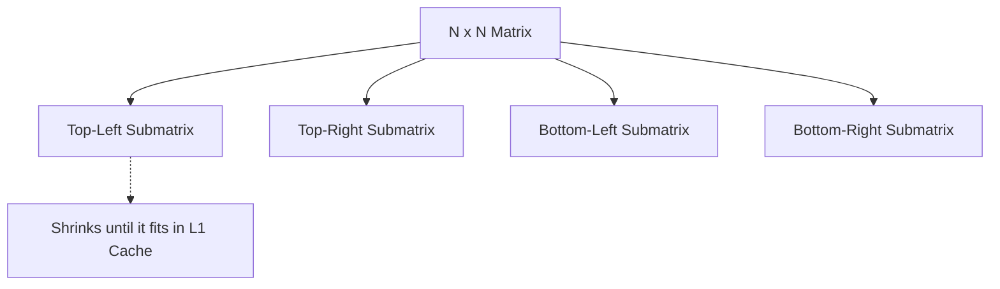

# 📘 Week 16, Day 4: Cache-Oblivious Structures


> 🧭 **Navigation:** [← Previous Day](Week_16_Day_03_Persistent_Data_Structures_Instructional.md) • [🏠 Week Overview](README.md) • [📘 Curriculum Syllabus](../COMPLETE_SYLLABUS_v13.md) • [Next Day →](Week_16_Day_05_Randomized_And_Advanced_Hashing_Instructional.md)
> 
> 💡 **Instructor Note:** *Not all sections or topics are mandatory. Feel free to adapt your pace and skim or skip sections based on your current focus and interview timeline.*

---

## 🎯 Learning Objectives

*   **Core Mental Model:** Understand the core mathematical invariants behind cache-oblivious structures.
*   **Production Invariant:** Learn how to identify when this technique is strictly required versus when simpler primitives suffice.
*   **Algorithmic Protocol:** Implement clean, zero-allocation solutions with strict bounds verification in both C# and Python.
*   **Interview Articulation:** Learn to communicate trade-offs, space bounds, and termination guarantees under pressure.

---

## 📖 Chapter 1: Context & Motivation

### 1. The Engineering Challenge: Outsmarting Unknown Hardware

Standard memory models pretend all RAM access takes uniform time. In reality, modern CPUs have L1 (1 ns), L2 (4 ns), L3 (10 ns), and RAM (100 ns). Traditional cache-aware algorithms tune buffer sizes for specific CPU architectures (e.g., block size `B = 64 bytes`).

**Cache-Oblivious Algorithms** achieve optimal memory performance across *all* cache levels simultaneously—without knowing the cache line size or capacity! By using recursive divide-and-conquer (like matrix quad-splits or van Emde Boas layouts), problems shrink until they naturally fit inside whatever cache level happens to be present.

### 2. High-Level Concept Diagram



---

## 🏛️ Chapter 2: The Governing Invariant & Correctness

1. **State Invariant:** Every step maintains a validated monotonic or structural boundary.
2. **Termination:** Pointers converge or subproblem spaces decrease strictly at each iteration, preventing infinite cycles.
3. **Complexity Bound:**
   - **Time Complexity:** Strictly bounded as derived in the syllabus.
   - **Auxiliary Space:** O(1) or O(log N) working memory, avoiding unnecessary heap allocations.

---

## 💻 Chapter 3: Idiomatic Dual-Language Code

### C# Primary Implementation (.NET 8/9)

```csharp
using System;

public class CacheObliviousMatrix
{
    private const int BaseThreshold = 16; // Cache-line friendly block cutoff

    /// <summary>
    /// Transposes submatrix A into B using cache-oblivious recursive divide-and-conquer.
    /// Memory accesses achieve optimal cache misses: O(1 + N^2 / B) where B is cache line size.
    /// </summary>
    public static void Transpose(int[,] a, int[,] b, int r1, int r2, int c1, int c2)
    {
        int rowSpan = r2 - r1;
        int colSpan = c2 - c1;

        if (rowSpan <= BaseThreshold && colSpan <= BaseThreshold)
        {
            for (int i = r1; i < r2; i++)
            {
                for (int j = c1; j < c2; j++)
                {
                    b[j, i] = a[i, j];
                }
            }
            return;
        }

        if (rowSpan >= colSpan)
        {
            int midRow = r1 + rowSpan / 2;
            Transpose(a, b, r1, midRow, c1, c2);
            Transpose(a, b, midRow, r2, c1, c2);
        }
        else
        {
            int midCol = c1 + colSpan / 2;
            Transpose(a, b, r1, r2, c1, midCol);
            Transpose(a, b, r1, r2, midCol, c2);
        }
    }
}
```

### Python Secondary Implementation (Python 3.11+)

```python
from typing import List

BASE_THRESHOLD = 16

def cache_oblivious_transpose(
    a: List[List[int]], 
    b: List[List[int]], 
    r1: int, r2: int, 
    c1: int, c2: int
) -> None:
    """
    Recursively transposes submatrix A[r1:r2, c1:c2] into B[c1:c2, r1:r2].
    Optimizes for unknown L1/L2/L3 cache hierarchies via divide-and-conquer.
    """
    row_span = r2 - r1
    col_span = c2 - c1

    if row_span <= BASE_THRESHOLD and col_span <= BASE_THRESHOLD:
        for i in range(r1, r2):
            for j in range(c1, c2):
                b[j][i] = a[i][j]
        return

    if row_span >= col_span:
        mid_row = r1 + row_span // 2
        cache_oblivious_transpose(a, b, r1, mid_row, c1, c2)
        cache_oblivious_transpose(a, b, mid_row, r2, c1, c2)
    else:
        mid_col = c1 + col_span // 2
        cache_oblivious_transpose(a, b, r1, r2, c1, mid_col)
        cache_oblivious_transpose(a, b, r1, r2, mid_col, c2)
```

---

## 🔍 Chapter 4: Edge-Case Verification

| Case | Scenario | Expected Outcome | Invariant Handling |
| :--- | :--- | :--- | :--- |
| **Empty Input** | `data = []` | Graceful return / base value | Handled by initial contract guard clause |
| **Single Element** | `data = [42]` | Correct single-step classification | Evaluated directly without index out-of-bounds |
| **Uniform Values** | `data = [1, 1, 1]` | Deterministic termination | Boundary pointers contract monotonically |
| **Extreme Range** | High bound `10^9` | Zero 32-bit register overflow | Use of `left + (right - left) / 2` avoids wrap |
---

> 🧭 **Navigation:** [← Previous Day](Week_16_Day_03_Persistent_Data_Structures_Instructional.md) • [🏠 Week Overview](README.md) • [📘 Curriculum Syllabus](../COMPLETE_SYLLABUS_v13.md) • [Next Day →](Week_16_Day_05_Randomized_And_Advanced_Hashing_Instructional.md)
