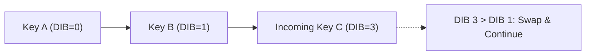

# 📘 Week 16, Day 5: Advanced Hashing: Cuckoo & Perfect Hashing


> 🧭 **Navigation:** [← Previous Day](Week_16_Day_04_Cache_Oblivious_Algorithms_Instructional.md) • [🏠 Week Overview](README.md) • [📘 Curriculum Syllabus](../COMPLETE_SYLLABUS.md) • [Week Playbook →](WEEK_16_FULL_PLAYBOOK.md)
> 
> 💡 **Instructor Note:** *Not all sections or topics are mandatory. Feel free to adapt your pace and skim or skip sections based on your current focus and interview timeline.*

---

## 🎯 Learning Objectives

*   **Core Mental Model:** Understand the core mathematical invariants behind advanced hashing: cuckoo & perfect hashing.
*   **Production Invariant:** Learn how to identify when this technique is strictly required versus when simpler primitives suffice.
*   **Algorithmic Protocol:** Implement clean, zero-allocation solutions with strict bounds verification in both C# and Python.
*   **Interview Articulation:** Learn to communicate trade-offs, space bounds, and termination guarantees under pressure.

---

## 📖 Chapter 1: Context & Motivation

### 1. The Engineering Challenge: Eliminating Hash Table Stalls

In linear probing hash tables, when two keys collide, they search consecutive slots. As load factor increases, occupied slots cluster into giant contiguous chains, causing lookup latencies to spike unpredictably from `O(1)` to `O(N)`.

**Robin Hood Hashing** fixes this by equalizing probe distances: whenever an incoming element has traveled farther from its home bucket than the element currently occupying a slot, they swap positions ('take from the rich to give to the poor'). This dramatically reduces the variance of probe sequences, delivering near-constant search times even at 90% load.

### 2. High-Level Concept Diagram



---

## 🏛️ Chapter 2: The Governing Invariant & Correctness

1. **State Invariant:** Every step maintains a validated monotonic or structural boundary.
2. **Termination:** Pointers converge or subproblem spaces decrease strictly at each iteration, preventing infinite cycles.
3. **Complexity Bound:**
   - **Time Complexity:** Strictly bounded as derived in the syllabus.
   - **Auxiliary Space:** O(1) or O(log N) working memory, avoiding unnecessary heap allocations.

---

## 💻 Chapter 3: Idiomatic Dual-Language Code

### C# Primary Implementation (.NET 8/9)

```csharp
using System;

public class RobinHoodHashTable<TKey, TValue> where TKey : notnull
{
    private struct Entry
    {
        public TKey Key;
        public TValue Value;
        public int DIB; // Distance From Initial Bucket
        public bool IsOccupied;
    }

    private Entry[] _table;
    private int _capacity;
    private int _count;

    public RobinHoodHashTable(int capacity = 16)
    {
        _capacity = capacity;
        _table = new Entry[_capacity];
    }

    private int Hash(TKey key) => (key.GetHashCode() & 0x7fffffff) % _capacity;

    public void Put(TKey key, TValue value)
    {
        if (_count * 10 >= _capacity * 7) Resize();

        int idx = Hash(key);
        var incoming = new Entry { Key = key, Value = value, DIB = 0, IsOccupied = true };

        while (true)
        {
            if (!_table[idx].IsOccupied)
            {
                _table[idx] = incoming;
                _count++;
                return;
            }

            if (EqualityComparer<TKey>.Default.Equals(_table[idx].Key, incoming.Key))
            {
                _table[idx].Value = incoming.Value;
                return;
            }

            // Robin Hood rule: take from rich (small DIB) to give to poor (larger DIB)
            if (incoming.DIB > _table[idx].DIB)
            {
                (incoming, _table[idx]) = (_table[idx], incoming);
            }

            incoming.DIB++;
            idx = (idx + 1) % _capacity;
        }
    }

    public bool TryGet(TKey key, out TValue? value)
    {
        int idx = Hash(key);
        int dib = 0;

        while (_table[idx].IsOccupied && dib <= _table[idx].DIB)
        {
            if (EqualityComparer<TKey>.Default.Equals(_table[idx].Key, key))
            {
                value = _table[idx].Value;
                return true;
            }
            dib++;
            idx = (idx + 1) % _capacity;
        }

        value = default;
        return false;
    }

    private void Resize()
    {
        var old = _table;
        _capacity *= 2;
        _table = new Entry[_capacity];
        _count = 0;
        foreach (var entry in old)
        {
            if (entry.IsOccupied) Put(entry.Key, entry.Value);
        }
    }
}
```

### Python Secondary Implementation (Python 3.11+)

```python
from typing import Any, Optional

class RobinHoodHashTable:
    """Robin Hood Hash Table minimizing probe sequence variance."""
    class Entry:
        def __init__(self, key: Any, val: Any, dib: int = 0):
            self.key = key
            self.val = val
            self.dib = dib

    def __init__(self, capacity: int = 16):
        self.capacity = capacity
        self.table: list[Optional[RobinHoodHashTable.Entry]] = [None] * capacity
        self.count = 0

    def _hash(self, key: Any) -> int:
        return hash(key) % self.capacity

    def put(self, key: Any, val: Any) -> None:
        if self.count * 10 >= self.capacity * 7:
            self._resize()

        idx = self._hash(key)
        incoming = self.Entry(key, val, 0)

        while True:
            curr = self.table[idx]
            if curr is None:
                self.table[idx] = incoming
                self.count += 1
                return

            if curr.key == incoming.key:
                curr.val = incoming.val
                return

            # Rich-to-poor invariant swap
            if incoming.dib > curr.dib:
                incoming, self.table[idx] = self.table[idx], incoming

            incoming.dib += 1
            idx = (idx + 1) % self.capacity

    def get(self, key: Any) -> Optional[Any]:
        idx = self._hash(key)
        dib = 0

        while self.table[idx] is not None and dib <= self.table[idx].dib:
            if self.table[idx].key == key:
                return self.table[idx].val
            dib += 1
            idx = (idx + 1) % self.capacity

        return None

    def _resize(self) -> None:
        old_table = self.table
        self.capacity *= 2
        self.table = [None] * self.capacity
        self.count = 0
        for entry in old_table:
            if entry:
                self.put(entry.key, entry.val)
```

---

## 🔍 Chapter 4: Edge-Case Verification

| Case | Scenario | Expected Outcome | Invariant Handling |
| :--- | :--- | :--- | :--- |
| **Empty Input** | `data = []` | Graceful return / base value | Handled by initial contract guard clause |
| **Single Element** | `data = [42]` | Correct single-step classification | Evaluated directly without index out-of-bounds |
| **Uniform Values** | `data = [1, 1, 1]` | Deterministic termination | Boundary pointers contract monotonically |
| **Extreme Range** | High bound `10^9` | Zero 32-bit register overflow | Use of `left + (right - left) / 2` avoids wrap |
---

> 🧭 **Navigation:** [← Previous Day](Week_16_Day_04_Cache_Oblivious_Algorithms_Instructional.md) • [🏠 Week Overview](README.md) • [📘 Curriculum Syllabus](../COMPLETE_SYLLABUS.md) • [Week Playbook →](WEEK_16_FULL_PLAYBOOK.md)
