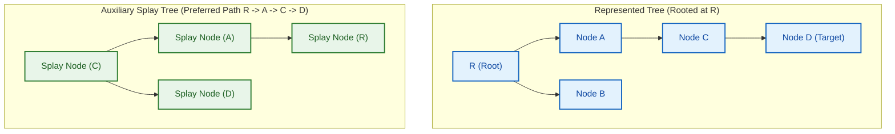

# 📊 Week 16 Visual Concepts Playbook (HYBRID)

> 🧭 **Navigation:** [🏠 Week Overview](README.md) • [📘 Curriculum Syllabus](../COMPLETE_SYLLABUS.md)
> 
> 💡 **Instructor Note:** *This playbook covers advanced dynamic and persistent data structures. In Tier-1 systems interviews (e.g. database engines, distributed caches, version control systems), these structures demonstrate how probabilistic balance, path-copying persistence, and cache-conscious memory layouts optimize real hardware execution.*

---

## 📋 Quick Navigation

- **Day 1:** Skip Lists & Treaps (Probabilistic Express Lanes, Heap-Priority Rotations)
- **Day 2:** Link-Cut Trees & Dynamic Connectivity (Preferred Paths, Splay Trees)
- **Day 3:** Persistent Data Structures (Path Copying, Versioned Trees & Tries)
- **Day 4:** Cache-Oblivious Layouts (Van Emde Boas Layout, Memory Hierarchies)
- **Day 5:** Advanced Collision Resolution (Cuckoo Hashing, Robin Hood Hashing)

---

# DAY 1: Skip Lists & Treaps

## Pattern Map: Balanced Search Alternatives

| Structure | Balancing Mechanism | Search Time | Insertion Time | Rebalancing Overhead | Use in Production Systems |
| :--- | :--- | :---: | :---: | :---: | :--- |
| **Red-Black Tree** | Strict color rules & rotations | `O(log N)` | `O(log N)` | Complex rebalance cases | Java `TreeMap`, C++ `std::map`, Linux kernel |
| **Skip List** | Probabilistic coin-flips (geometric level) | `O(log N)` avg | `O(log N)` avg | **Zero rotations** (pointer re-links only) | Redis sorted sets (`ZSET`), RocksDB MemTable |
| **Treap** | BST keys + randomized heap priorities | `O(log N)` exp | `O(log N)` exp | Single/Double rotations on insert/delete | Randomized split/merge in text editors |

---

## Pattern 1.1: Skip List Multi-Level Express Lanes

### Concept

A **Skip List** consists of a hierarchy of layered linked lists. The bottom layer (Level 0) contains all elements in sorted order. Each higher level acts as an "express lane", skipping over elements with probability `p` (typically `p = 1/2`).

### Visual 1: Skip List Search Traversal

Searching for target value `19` in a 4-level Skip List:

```text
Level 3: [Head] -----------------------------------------> [17] -------------------------> [NIL]
             |                                               |
Level 2: [Head] -------------------------> [9] ----------> [17] -------------------------> [NIL]
             |                              |                |
Level 1: [Head] -----------> [5] --------> [9] ----------> [17] ----------> [25] --------> [NIL]
             |                |             |                |               |
Level 0: [Head] -> [3] ----> [5] -> [7] -> [9] -> [12] -> [17] -> [19] -> [25] -> [31] -> [NIL]

Search Walk for Target 19:
1. Start at Level 3 Head. Peek forward: 17 < 19 -> Step forward to [17]. Peek next: NIL > 19 -> Drop to Level 2 at [17].
2. Level 2 at [17]: Peek next: NIL > 19 -> Drop to Level 1 at [17].
3. Level 1 at [17]: Peek next: 25 > 19 -> Drop to Level 0 at [17].
4. Level 0 at [17]: Peek next: 19 == 19 -> MATCH FOUND! Total comparisons: 6 steps instead of 8 linear hops.
```

### Visual 2: Level Generation Invariant

```text
Coin-Flip Invariant:
When inserting a new node:
level = 0
while (random() < 0.5 && level < MAX_LEVEL):
    level++

Expected number of nodes at level `k`: N / (2^k)
Expected total height: O(log N)
Expected space complexity: O(N) since N * (1 + 1/2 + 1/4 + ...) = 2N pointers total.
```

---

## Pattern 1.2: Treap (Tree + Heap)

### Concept

Each node maintains two attributes:
1. **Key:** Satisfies Binary Search Tree invariant (`left.key < node.key < right.key`).
2. **Priority:** A randomly assigned value satisfying Max-Heap invariant (`node.priority >= children.priority`).

By assigning uniformly distributed random priorities upon node creation, the resulting tree height is probabilistically guaranteed to be `O(log N)` without complex AVL/Red-Black balance proofs.

```text
Treap Insertion Rule:
1. Insert node by key as in standard BST (at a leaf).
2. Assign random priority.
3. While node.priority > parent.priority:
   - If node is left child -> Perform Right Rotation on parent.
   - If node is right child -> Perform Left Rotation on parent.
Both BST key ordering and Heap priority ordering remain strictly preserved!
```

---

# DAY 2: Link-Cut Trees (Dynamic Trees)

## Pattern Map: Link-Cut Tree Mechanics



---

## Pattern 2.1: Preferred Paths & The `Access(u)` Primitive

### Concept

A Link-Cut Tree maintains a dynamic forest of rooted trees supporting `O(log N)` amortized connectivity queries, tree path aggregations, and link/cut edge modifications.

- **Preferred Child:** For each node, at most ONE child edge is designated "preferred" (heavy).
- **Preferred Path:** A chain of preferred edges.
- **Auxiliary Tree:** Each preferred path is stored in a **Splay Tree**, ordered by node depth in the represented tree.

```text
The Core Operation: Access(u)
Goal: Make the unique path from the represented tree root to node `u` a single contiguous preferred path.
1. Splice away the previous preferred child of `u` (make it a dashed/normal edge).
2. Splay `u` to the root of its current auxiliary splay tree.
3. Climb up to `u`'s parent in the represented tree via path-parent pointer.
4. Replace parent's old preferred child with `u`.
5. Repeat until the root of the represented tree is reached.
Result: Node `u` is now the deepest node in a single Splay Tree containing the entire path from root to `u`!
```

---

# DAY 3: Persistent Data Structures

## Pattern Map: Persistent Evolution

| Persistence Level | Read Capabilities | Write Capabilities | Canonical Real-World Example |
| :--- | :--- | :--- | :--- |
| **Partially Persistent** | Any historical version `v <= current` | Only the latest version (`v_now`) | Append-only database logs, undo history |
| **Fully Persistent** | Any historical version | Any historical version (creates branching trees) | Git commit graph, copy-on-write filesystem |
| **Confluently Persistent**| Any historical version | Can merge two historical versions into a new one | Git branch merges |

---

## Pattern 3.1: Path Copying Technique

### Concept

Instead of mutating nodes in-place, create copies of ONLY the nodes along the modification path (from the root down to the updated element). All other branches point back to existing nodes in prior versions.

### Visual 1: Persistent Binary Tree Path Copying

```text
Version 0: Updating leaf [C] creates Version 1

Version 0 Root: (R0)                      Version 1 Root: (R1) [New Copy]
                /   \                                     /   \
              (A)   (B0)                                (A)   (B1) [New Copy]
             /   \  /   \   --------------------------->/   \  /   \
            L1   L2 C0   D                            L1   L2 C1    D
                                                              ^     ^
                                                           (New) (Shared with V0)

Space per modification: O(height) = O(log N) new nodes allocated per write!
Version 0 remains completely intact and accessible in O(1) via reference R0.
Version 1 is accessible via reference R1.
```

---

# DAY 4: Cache-Oblivious Algorithms

## Pattern Map: Memory Hierarchy & Cache Miss Analysis

```text
CPU Register:     < 1 ns   | ~1 KB
L1 Cache:         ~1 ns    | 32 KB - 64 KB   | Cache Line = 64 Bytes
L2 Cache:         ~4 ns    | 256 KB - 1 MB   | Cache Line = 64 Bytes
L3 Cache:         ~15 ns   | 16 MB - 64 MB   | Cache Line = 64 Bytes
Main Memory (RAM):~60 ns   | 16 GB - 64 GB   | Page = 4 KB
Disk / SSD:       ~10-100µs| 1 TB - 4 TB     | Block = 4 KB - 64 KB

Cache-Oblivious Principle:
An algorithm designed without knowing hardware parameters (cache size M or block size B),
yet proven to achieve asymptotically optimal memory transfers (cache misses) across ALL levels simultaneously!
```

---

## Pattern 4.1: The Van Emde Boas Recursive Layout

### Concept

Standard pointer-based binary search trees scatter nodes randomly across memory, causing a cache miss on almost every pointer hop (`O(log N)` cache misses).

The **Van Emde Boas (vEB) Layout** lays out a complete binary tree of height `H` in contiguous memory by recursively bisecting the tree height:
1. Divide tree of height `H` into a top recursive tree of height `H/2`.
2. Beneath it are `2^(H/2)` bottom subtrees, each of height `H/2`.
3. Store the top tree first in contiguous memory, followed immediately by each bottom subtree.

```text
Height H=4 Binary Tree:
Top Tree (height 2): Nodes {1, 2, 3}
Bottom Subtrees (height 2 each): {4, 8, 9}, {5, 10, 11}, {6, 12, 13}, {7, 14, 15}

Contiguous Memory Layout in Array:
[ 1, 2, 3 | 4, 8, 9 | 5, 10, 11 | 6, 12, 13 | 7, 14, 15 ]
  ^______^   ^______^   ^________^   ^________^   ^________^
  Top Tree   Subtree 1  Subtree 2    Subtree 3    Subtree 4

Cache Miss Bound:
Optimal O(log_B N) cache misses for any block size B, matching B-Tree cache efficiency
without storing any block-size constants in code!
```

---

# DAY 5: Advanced Collision Resolution

## Pattern Map: Open Addressing vs Cuckoo Hashing

| Strategy | Worst-Case Lookup | Expected Lookup | Cache Friendliness | Rehashing Cost | Key Mechanism |
| :--- | :---: | :---: | :---: | :---: | :--- |
| **Linear Probing** | `O(N)` | `O(1)` | Outstanding (sequential scan) | Cheap | Cluster formation ("primary clustering") |
| **Robin Hood** | `O(N)` | `O(1)` | Outstanding | Moderate | Steal from the rich (small probe count) to give to poor |
| **Cuckoo Hashing** | `O(1)` strictly | `O(1)` | Good (at most 2 cache lines) | Expensive on cycle | 2 tables; kick existing occupant to alternate table |

---

## Pattern 5.1: Cuckoo Hashing Invariant

### Concept

Cuckoo Hashing uses two independent hash functions `h1(k)` and `h2(k)` and two tables `T1` and `T2`. A key `k` is stored in **either `T1[h1(k)]` OR `T2[h2(k)]`**, but nowhere else!

- **Lookup:** Check `T1[h1(k)]` and `T2[h2(k)]`. At most **2 memory reads**, guaranteed strictly `O(1)` worst case!

### Visual 1: The "Kick-Out" Insertion Walk

```text
Inserting key X into Table 1 at slot h1(X):
Step 1: Check T1[h1(X)].
        If empty -> Insert X. Done.
        If occupied by key Y -> Evict Y! Place X in T1[h1(X)].

Step 2: Y must now migrate to Table 2 at slot h2(Y).
        If T2[h2(Y)] is empty -> Insert Y. Done.
        If occupied by key Z -> Evict Z! Place Y in T2[h2(Y)].

Step 3: Z must now migrate back to Table 1 at slot h1(Z)...
        Repeat cascade of evictions up to threshold MAX_LOOP.
        If cycle detected -> Rehash entire table with new random seed functions!
```

---

## Pattern 5.2: Robin Hood Hashing (Equalizing Probe Depths)

### Concept

In standard open addressing, some keys sit at their ideal slot (probe distance `0`), while unlucky keys sit 10+ slots away (probe distance `10`).

**Robin Hood Invariant:** When probing for an empty slot to insert key `A` (current probe distance `d_A`), if we encounter an occupied slot holding key `B` with probe distance `d_B < d_A`:
- Swap `A` and `B`! Key `A` takes the slot.
- Continue probing down the array with key `B` (now with distance `d_B + 1`).
- **Effect:** Variance of probe distances is drastically reduced, ensuring fast worst-case searches in high load factor tables.

---

### Common Failure Modes: Day 5

> [!WARNING]
> **Failure 5.1: Load Factor in Cuckoo Hashing**
> Cuckoo hashing guarantees `O(1)` lookup, but its insertion cycle probability explodes when load factor exceeds `50%` (for 2 hash tables). Keep maximum load factor <= `0.49` or employ a stash bucket of size `3-5` to absorb transient cycles.

---

## 📝 Final Note: Architectural Systems Selection

1. **Redis / RocksDB MemTables:** Choose **Skip Lists** over Red-Black trees when building concurrent data structures; concurrent lock-free skip lists require only atomic pointer CAS operations at individual levels, avoiding the global tree locking required for tree rotations.
2. **Versioned State Engines (Git, Blockchain, Immutability):** Choose **Persistent Trees via Path Copying**. It provides historical snapshots with only `O(log N)` memory overhead per commit.
3. **Low-Latency In-Memory Caches:** Choose **Robin Hood Hashing** to prevent latency tail spikes caused by open addressing clustering.

---

> 🧭 **Navigation:** [🏠 Week Overview](README.md) • [📘 Curriculum Syllabus](../COMPLETE_SYLLABUS.md)
