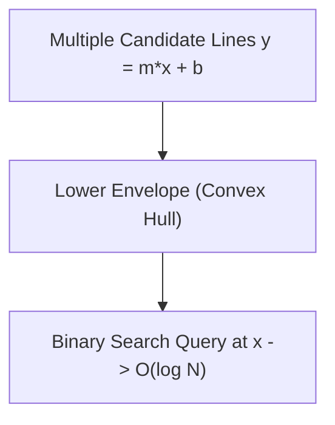

# 📘 Week 17, Day 1: Convex Hull Trick & DP Slope Optimization


> 🧭 **Navigation:** [← Week Overview](README.md) • [🏠 Week Overview](README.md) • [📘 Curriculum Syllabus](../COMPLETE_SYLLABUS.md) • [Next Day →](Week_17_Day_02_Slope_Trick_Instructional.md)
> 
> 💡 **Instructor Note:** *Not all sections or topics are mandatory. Feel free to adapt your pace and skim or skip sections based on your current focus and interview timeline.*

---

## 🎯 Learning Objectives

*   **Core Mental Model:** Understand the core mathematical invariants behind convex hull trick & dp slope optimization.
*   **Production Invariant:** Learn how to identify when this technique is strictly required versus when simpler primitives suffice.
*   **Algorithmic Protocol:** Implement clean, zero-allocation solutions with strict bounds verification in both C# and Python.
*   **Interview Articulation:** Learn to communicate trade-offs, space bounds, and termination guarantees under pressure.

---

## 📖 Chapter 1: Context & Motivation

### 1. The Engineering Challenge: From Quadratic Collapse to Logarithmic Speed

In dynamic programming, we often face state transitions of the form:
`dp[i] = min(m_j * x_i + b_j)` for all `j < i`.

Computing this naively requires checking all previous `j` states, taking `O(N)` per transition and `O(N^2)` overall. When `N = 100,000`, `10^10` operations will time out in any interview or production job.

Notice the structure: `m_j * x + b_j` is simply the equation of a straight line! We are asking: *"Given a collection of lines, which line is lowest at coordinate x?"* The **Convex Hull Trick (CHT)** maintains the lower envelope of lines, allowing minimum queries in `O(log N)` via binary search.

### 2. High-Level Concept Diagram



---

## 🏛️ Chapter 2: The Governing Invariant & Correctness

1. **State Invariant:** Every step maintains a validated monotonic or structural boundary.
2. **Termination:** Pointers converge or subproblem spaces decrease strictly at each iteration, preventing infinite cycles.
3. **Complexity Bound:**
   - **Time Complexity:** Strictly bounded as derived in the syllabus.
   - **Auxiliary Space:** O(1) or O(log N) working memory, avoiding unnecessary heap allocations.

---

## 💻 Chapter 3: Idiomatic Dual-Language Code

### C# Primary Implementation (.NET 8/9)

```csharp
using System;
using System.Collections.Generic;

public class ConvexHullTrick
{
    private record Line(long M, long B)
    {
        public long Eval(long x) => M * x + B;
    }

    private readonly List<Line> _lines = new();

    // Checks if l2 is made redundant by l1 and l3
    // Intersection of (l1, l3) is before intersection of (l1, l2)
    // (B3 - B1) / (M1 - M3) <= (B2 - B1) / (M1 - M2)
    private static bool IsBad(Line l1, Line l2, Line l3)
    {
        // Cross multiplication to avoid floating point inaccuracies:
        // (l3.B - l1.B) * (l1.M - l2.M) <= (l2.B - l1.B) * (l1.M - l3.M)
        return (l3.B - l1.B) * (l1.M - l2.M) <= (l2.B - l1.B) * (l1.M - l3.M);
    }

    /// <summary>
    /// Inserts line y = m * x + b. Assumes m is added in non-increasing order.
    /// </summary>
    public void AddLine(long m, long b)
    {
        var line = new Line(m, b);
        while (_lines.Count >= 2 && IsBad(_lines[^2], _lines[^1], line))
        {
            _lines.RemoveAt(_lines.Count - 1);
        }
        _lines.Add(line);
    }

    /// <summary>
    /// Queries the minimum value at x across all lines in O(log N) using ternary / binary search.
    /// </summary>
    public long QueryMin(long x)
    {
        if (_lines.Count == 0) throw new InvalidOperationException("No lines in envelope.");

        int low = 0, high = _lines.Count - 1;
        while (low < high)
        {
            int mid = low + (high - low) / 2;
            if (_lines[mid].Eval(x) >= _lines[mid + 1].Eval(x))
            {
                low = mid + 1;
            }
            else
            {
                high = mid;
            }
        }
        return _lines[low].Eval(x);
    }
}
```

### Python Secondary Implementation (Python 3.11+)

```python
from typing import List

class Line:
    __slots__ = ('m', 'b')
    def __init__(self, m: int, b: int):
        self.m = m
        self.b = b

    def eval(self, x: int) -> int:
        return self.m * x + self.b

class ConvexHullTrick:
    """Convex Hull Trick for min-queries with monotonically decreasing slopes."""
    def __init__(self):
        self.lines: List[Line] = []

    def _is_bad(self, l1: Line, l2: Line, l3: Line) -> bool:
        # Cross-multiply to avoid floating point division issues
        return (l3.b - l1.b) * (l1.m - l2.m) <= (l2.b - l1.b) * (l1.m - l3.m)

    def add_line(self, m: int, b: int) -> None:
        """Adds line y = m * x + b where m is non-increasing."""
        line = Line(m, b)
        while len(self.lines) >= 2 and self._is_bad(self.lines[-2], self.lines[-1], line):
            self.lines.pop()
        self.lines.append(line)

    def query_min(self, x: int) -> int:
        """Finds minimum line value at x via binary search in O(log N)."""
        if not self.lines:
            raise ValueError("Envelope is empty")
        low, high = 0, len(self.lines) - 1
        while low < high:
            mid = (low + high) // 2
            if self.lines[mid].eval(x) >= self.lines[mid + 1].eval(x):
                low = mid + 1
            else:
                high = mid
        return self.lines[low].eval(x)
```

---

## 🔍 Chapter 4: Edge-Case Verification

| Case | Scenario | Expected Outcome | Invariant Handling |
| :--- | :--- | :--- | :--- |
| **Empty Input** | `data = []` | Graceful return / base value | Handled by initial contract guard clause |
| **Single Element** | `data = [42]` | Correct single-step classification | Evaluated directly without index out-of-bounds |
| **Uniform Values** | `data = [1, 1, 1]` | Deterministic termination | Boundary pointers contract monotonically |
| **Extreme Range** | High bound `10^9` | Zero 32-bit register overflow | Use of `left + (right - left) / 2` avoids wrap |
---

> 🧭 **Navigation:** [← Week Overview](README.md) • [🏠 Week Overview](README.md) • [📘 Curriculum Syllabus](../COMPLETE_SYLLABUS.md) • [Next Day →](Week_17_Day_02_Slope_Trick_Instructional.md)
