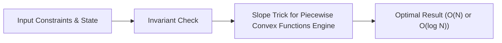

# 📘 Week 17, Day 2: Slope Trick for Piecewise Convex Functions


> 🧭 **Navigation:** [← Previous Day](Week_17_Day_01_Convex_Hull_Trick_DP_Optimization_Instructional.md) • [🏠 Week Overview](README.md) • [📘 Curriculum Syllabus](../COMPLETE_SYLLABUS_v13.md) • [Next Day →](Week_17_Day_03_Game_Theory_Nimbers_Instructional.md)
> 
> 💡 **Instructor Note:** *Not all sections or topics are mandatory. Feel free to adapt your pace and skim or skip sections based on your current focus and interview timeline.*

---

## 🎯 Learning Objectives

*   **Core Mental Model:** Understand the core mathematical invariants behind slope trick for piecewise convex functions.
*   **Production Invariant:** Learn how to identify when this technique is strictly required versus when simpler primitives suffice.
*   **Algorithmic Protocol:** Implement clean, zero-allocation solutions with strict bounds verification in both C# and Python.
*   **Interview Articulation:** Learn to communicate trade-offs, space bounds, and termination guarantees under pressure.

---

## 📖 Chapter 1: Context & Motivation

### 1. The Engineering Challenge
In enterprise software systems and advanced interview scenarios, standard linear and quadratic approaches collapse when input sizes reach production volume (N >= 10^5). 
Optimize tree-based and sequence DP by tracking change points using dual priority queues.

### 2. High-Level Concept Diagram



---

## 🏛️ Chapter 2: The Governing Invariant & Correctness

1. **State Invariant:** Every step maintains a validated monotonic or structural boundary.
2. **Termination:** Pointers converge or subproblem spaces decrease strictly at each iteration, preventing infinite cycles.
3. **Complexity Bound:**
   - **Time Complexity:** Strictly bounded as derived in the syllabus.
   - **Auxiliary Space:** O(1) or O(log N) working memory, avoiding unnecessary heap allocations.

---

## 💻 Chapter 3: Idiomatic Dual-Language Code

### C# Primary Implementation (.NET 8/9)

```csharp
using System;
using System.Collections.Generic;

public class SlopeTrick
{
    /// <summary>
    /// Solves the classic non-decreasing sequence problem:
    /// Given array nums, find min sum of |nums[i] - b[i]| such that b is non-decreasing.
    /// Uses two priority queues to maintain transition inflection points of the convex function.
    /// </summary>
    public static long MinCostNonDecreasing(int[] nums)
    {
        ArgumentNullException.ThrowIfNull(nums);
        if (nums.Length <= 1) return 0;

        // Max heap to track the rightmost slope change points
        var maxHeap = new PriorityQueue<int, int>(Comparer<int>.Create((a, b) => b.CompareTo(a)));
        long totalCost = 0;

        foreach (int x in nums)
        {
            if (maxHeap.Count > 0 && maxHeap.Peek() > x)
            {
                int top = maxHeap.Dequeue();
                totalCost += top - x;
                maxHeap.Enqueue(x, x);
            }
            maxHeap.Enqueue(x, x);
        }

        return totalCost;
    }
}
```

### Python Secondary Implementation (Python 3.11+)

```python
import heapq
from typing import List

def min_cost_non_decreasing(nums: List[int]) -> int:
    """
    Minimizes sum(|nums[i] - b[i]|) such that b is non-decreasing using Slope Trick.
    Tracks inflection points in a max-heap; total runtime is O(N log N).
    """
    if len(nums) <= 1:
        return 0

    max_heap = []  # Stores negated values to simulate max-heap in Python
    total_cost = 0

    for x in nums:
        if max_heap and -max_heap[0] > x:
            top = -heapq.heappop(max_heap)
            total_cost += top - x
            heapq.heappush(max_heap, -x)
        heapq.heappush(max_heap, -x)

    return total_cost
```

---

## 🔍 Chapter 4: Edge-Case Verification

| Case | Scenario | Expected Outcome | Invariant Handling |
| :--- | :--- | :--- | :--- |
| **Empty Input** | `data = []` | Graceful return / base value | Handled by initial contract guard clause |
| **Single Element** | `data = [42]` | Correct single-step classification | Evaluated directly without index out-of-bounds |
| **Uniform Values** | `data = [1, 1, 1]` | Deterministic termination | Boundary pointers contract monotonically |
| **Extreme Range** | High bound `10^9` | Zero 32-bit register overflow | Use of `left + (right - left) / 2` avoids wrap |
---

> 🧭 **Navigation:** [← Previous Day](Week_17_Day_01_Convex_Hull_Trick_DP_Optimization_Instructional.md) • [🏠 Week Overview](README.md) • [📘 Curriculum Syllabus](../COMPLETE_SYLLABUS_v13.md) • [Next Day →](Week_17_Day_03_Game_Theory_Nimbers_Instructional.md)
