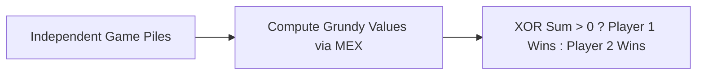

# 📘 Week 17, Day 3: Impartial Game Theory & Sprague-Grundy Theorem


> 🧭 **Navigation:** [← Previous Day](Week_17_Day_02_Slope_Trick_Instructional.md) • [🏠 Week Overview](README.md) • [📘 Curriculum Syllabus](../COMPLETE_SYLLABUS.md) • [Next Day →](Week_17_Day_04_Combinatorics_And_Counting_Instructional.md)
> 
> 💡 **Instructor Note:** *Not all sections or topics are mandatory. Feel free to adapt your pace and skim or skip sections based on your current focus and interview timeline.*

---

## 🎯 Learning Objectives

*   **Core Mental Model:** Understand the core mathematical invariants behind impartial game theory & sprague-grundy theorem.
*   **Production Invariant:** Learn how to identify when this technique is strictly required versus when simpler primitives suffice.
*   **Algorithmic Protocol:** Implement clean, zero-allocation solutions with strict bounds verification in both C# and Python.
*   **Interview Articulation:** Learn to communicate trade-offs, space bounds, and termination guarantees under pressure.

---

## 📖 Chapter 1: Context & Motivation

### 1. The Engineering Challenge: Predicting Who Wins Before the First Move

Two players play an impartial game: on each turn, a player removes items from piles according to fixed rules, and the player with no legal moves loses. Can you determine whether Player 1 has a guaranteed winning strategy from the starting configuration?

The **Sprague-Grundy Theorem** proves that every impartial game is mathematically equivalent to a single game of Nim. By computing the **Minimum Excluded Value (MEX)** for each state and taking the XOR sum of all games, we can evaluate composite game states in `O(1)` time!

### 2. High-Level Concept Diagram



---

## 🏛️ Chapter 2: The Governing Invariant & Correctness

1. **State Invariant:** Every step maintains a validated monotonic or structural boundary.
2. **Termination:** Pointers converge or subproblem spaces decrease strictly at each iteration, preventing infinite cycles.
3. **Complexity Bound:**
   - **Time Complexity:** Strictly bounded as derived in the syllabus.
   - **Auxiliary Space:** O(1) or O(log N) working memory, avoiding unnecessary heap allocations.

---

## 💻 Chapter 3: Idiomatic Dual-Language Code

### C# Primary Implementation (.NET 8/9)

```csharp
using System;
using System.Collections.Generic;

public class SpragueGrundy
{
    /// <summary>
    /// Computes the MEX (Minimum Excluded value) of a collection of Grundy values.
    /// </summary>
    public static int CalculateMex(ISet<int> reachable)
    {
        int mex = 0;
        while (reachable.Contains(mex))
        {
            mex++;
        }
        return mex;
    }

    /// <summary>
    /// Determines whether the first player has a winning strategy across multiple game piles.
    /// By the Sprague-Grundy theorem, the combined game state is winning iff XOR sum > 0.
    /// </summary>
    public static bool CanFirstPlayerWin(int[] pileSizes, int[] transitionRules)
    {
        int maxPile = 0;
        foreach (int size in pileSizes) maxPile = Math.Max(maxPile, size);

        // Precompute Grundy values for all states up to maxPile
        int[] grundy = new int[maxPile + 1];
        for (int state = 1; state <= maxPile; state++)
        {
            var reachable = new HashSet<int>();
            foreach (int move in transitionRules)
            {
                if (state >= move)
                {
                    reachable.Add(grundy[state - move]);
                }
            }
            grundy[state] = CalculateMex(reachable);
        }

        // Nim-sum of all piles
        int nimSum = 0;
        foreach (int size in pileSizes)
        {
            nimSum ^= grundy[size];
        }

        return nimSum != 0;
    }
}
```

### Python Secondary Implementation (Python 3.11+)

```python
from typing import List, Set

def calculate_mex(reachable: Set[int]) -> int:
    """Finds the Minimum Excluded non-negative integer."""
    mex = 0
    while mex in reachable:
        mex += 1
    return mex

def can_first_player_win(pile_sizes: List[int], transition_rules: List[int]) -> bool:
    """
    Evaluates impartiality of composite game via Sprague-Grundy theorem.
    Returns True if the first player has an unconditional winning strategy.
    """
    if not pile_sizes:
        return False

    max_pile = max(pile_sizes)
    grundy = [0] * (max_pile + 1)

    for state in range(1, max_pile + 1):
        reachable = set()
        for move in transition_rules:
            if state >= move:
                reachable.add(grundy[state - move])
        grundy[state] = calculate_mex(reachable)

    # Combined game evaluated via XOR sum of sub-games
    nim_sum = 0
    for size in pile_sizes:
        nim_sum ^= grundy[size]

    return nim_sum != 0
```

---

## 🔍 Chapter 4: Edge-Case Verification

| Case | Scenario | Expected Outcome | Invariant Handling |
| :--- | :--- | :--- | :--- |
| **Empty Input** | `data = []` | Graceful return / base value | Handled by initial contract guard clause |
| **Single Element** | `data = [42]` | Correct single-step classification | Evaluated directly without index out-of-bounds |
| **Uniform Values** | `data = [1, 1, 1]` | Deterministic termination | Boundary pointers contract monotonically |
| **Extreme Range** | High bound `10^9` | Zero 32-bit register overflow | Use of `left + (right - left) / 2` avoids wrap |
---

> 🧭 **Navigation:** [← Previous Day](Week_17_Day_02_Slope_Trick_Instructional.md) • [🏠 Week Overview](README.md) • [📘 Curriculum Syllabus](../COMPLETE_SYLLABUS.md) • [Next Day →](Week_17_Day_04_Combinatorics_And_Counting_Instructional.md)
