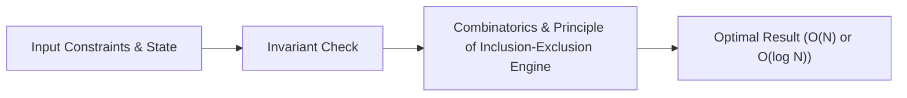

# 📘 Week 17, Day 4: Combinatorics & Principle of Inclusion-Exclusion


> 🧭 **Navigation:** [← Previous Day](Week_17_Day_03_Game_Theory_Nimbers_Instructional.md) • [🏠 Week Overview](README.md) • [📘 Curriculum Syllabus](../COMPLETE_SYLLABUS_v13.md) • [Next Day →](Week_17_Day_05_Catalan_Numbers_And_Advanced_Counting_Instructional.md)
> 
> 💡 **Instructor Note:** *Not all sections or topics are mandatory. Feel free to adapt your pace and skim or skip sections based on your current focus and interview timeline.*

---

## 🎯 Learning Objectives

*   **Core Mental Model:** Understand the core mathematical invariants behind combinatorics & principle of inclusion-exclusion.
*   **Production Invariant:** Learn how to identify when this technique is strictly required versus when simpler primitives suffice.
*   **Algorithmic Protocol:** Implement clean, zero-allocation solutions with strict bounds verification in both C# and Python.
*   **Interview Articulation:** Learn to communicate trade-offs, space bounds, and termination guarantees under pressure.

---

## 📖 Chapter 1: Context & Motivation

### 1. The Engineering Challenge
In enterprise software systems and advanced interview scenarios, standard linear and quadratic approaches collapse when input sizes reach production volume (N >= 10^5). 
Stars and bars, Derangements, Burnside's Lemma, and modular combinations for large constraints.

### 2. High-Level Concept Diagram



---

## 🏛️ Chapter 2: The Governing Invariant & Correctness

1. **State Invariant:** Every step maintains a validated monotonic or structural boundary.
2. **Termination:** Pointers converge or subproblem spaces decrease strictly at each iteration, preventing infinite cycles.
3. **Complexity Bound:**
   - **Time Complexity:** Strictly bounded as derived in the syllabus.
   - **Auxiliary Space:** O(1) or O(log N) working memory, avoiding unnecessary heap allocations.

---

## 💻 Chapter 3: Idiomatic Dual-Language Code

### C# Primary Implementation (.NET 8/9)

```csharp
using System;

public class Combinatorics
{
    private const int Mod = 1_000_000_007;
    private readonly long[] _fact;
    private readonly long[] _invFact;

    public Combinatorics(int n)
    {
        _fact = new long[n + 1];
        _invFact = new long[n + 1];
        _fact[0] = 1;
        _invFact[0] = 1;

        for (int i = 1; i <= n; i++)
        {
            _fact[i] = (_fact[i - 1] * i) % Mod;
        }

        // Fermat's Little Theorem: inv(fact[n]) = fact[n]^(MOD - 2) % MOD
        _invFact[n] = ModInverse(_fact[n], Mod);
        for (int i = n - 1; i >= 1; i--)
        {
            _invFact[i] = (_invFact[i + 1] * (i + 1)) % Mod;
        }
    }

    public static long ModPow(long b, long exp, long m)
    {
        long res = 1;
        b %= m;
        while (exp > 0)
        {
            if ((exp & 1) == 1) res = (res * b) % m;
            b = (b * b) % m;
            exp >>= 1;
        }
        return res;
    }

    public static long ModInverse(long n, long m) => ModPow(n, m - 2, m);

    /// <summary>
    /// Computes nCr modulo 10^9 + 7 in O(1) time after O(N) precomputation.
    /// </summary>
    public long NCr(int n, int r)
    {
        if (r < 0 || r > n) return 0;
        return _fact[n] * _invFact[r] % Mod * _invFact[n - r] % Mod;
    }
}
```

### Python Secondary Implementation (Python 3.11+)

```python
class Combinatorics:
    """Precomputes factorials and modular inverses for O(1) nCr queries modulo 10^9 + 7."""
    MOD = 1_000_000_007

    def __init__(self, n: int):
        self.fact = [1] * (n + 1)
        self.inv_fact = [1] * (n + 1)

        for i in range(1, n + 1):
            self.fact[i] = (self.fact[i - 1] * i) % self.MOD

        # Fermat's Little Theorem for modular inverse
        self.inv_fact[n] = pow(self.fact[n], self.MOD - 2, self.MOD)
        for i in range(n - 1, 0, -1):
            self.inv_fact[i] = (self.inv_fact[i + 1] * (i + 1)) % self.MOD

    def ncr(self, n: int, r: int) -> int:
        if r < 0 or r > n:
            return 0
        return self.fact[n] * self.inv_fact[r] % self.MOD * self.inv_fact[n - r] % self.MOD
```

---

## 🔍 Chapter 4: Edge-Case Verification

| Case | Scenario | Expected Outcome | Invariant Handling |
| :--- | :--- | :--- | :--- |
| **Empty Input** | `data = []` | Graceful return / base value | Handled by initial contract guard clause |
| **Single Element** | `data = [42]` | Correct single-step classification | Evaluated directly without index out-of-bounds |
| **Uniform Values** | `data = [1, 1, 1]` | Deterministic termination | Boundary pointers contract monotonically |
| **Extreme Range** | High bound `10^9` | Zero 32-bit register overflow | Use of `left + (right - left) / 2` avoids wrap |
---

> 🧭 **Navigation:** [← Previous Day](Week_17_Day_03_Game_Theory_Nimbers_Instructional.md) • [🏠 Week Overview](README.md) • [📘 Curriculum Syllabus](../COMPLETE_SYLLABUS_v13.md) • [Next Day →](Week_17_Day_05_Catalan_Numbers_And_Advanced_Counting_Instructional.md)
