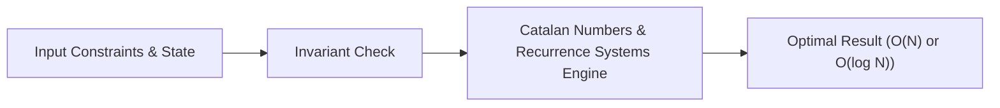

# 📘 Week 17, Day 5: Catalan Numbers & Recurrence Systems


> 🧭 **Navigation:** [← Previous Day](Week_17_Day_04_Combinatorics_And_Counting_Instructional.md) • [🏠 Week Overview](README.md) • [📘 Curriculum Syllabus](../COMPLETE_SYLLABUS_v13.md) • [Week Playbook →](WEEK_17_FULL_PLAYBOOK.md)
> 
> 💡 **Instructor Note:** *Not all sections or topics are mandatory. Feel free to adapt your pace and skim or skip sections based on your current focus and interview timeline.*

---

## 🎯 Learning Objectives

*   **Core Mental Model:** Understand the core mathematical invariants behind catalan numbers & recurrence systems.
*   **Production Invariant:** Learn how to identify when this technique is strictly required versus when simpler primitives suffice.
*   **Algorithmic Protocol:** Implement clean, zero-allocation solutions with strict bounds verification in both C# and Python.
*   **Interview Articulation:** Learn to communicate trade-offs, space bounds, and termination guarantees under pressure.

---

## 📖 Chapter 1: Context & Motivation

### 1. The Engineering Challenge
In enterprise software systems and advanced interview scenarios, standard linear and quadratic approaches collapse when input sizes reach production volume (N >= 10^5). 
Identify Catalan patterns: balanced parentheses, non-crossing chords, triangulations, and binary trees.

### 2. High-Level Concept Diagram



---

## 🏛️ Chapter 2: The Governing Invariant & Correctness

1. **State Invariant:** Every step maintains a validated monotonic or structural boundary.
2. **Termination:** Pointers converge or subproblem spaces decrease strictly at each iteration, preventing infinite cycles.
3. **Complexity Bound:**
   - **Time Complexity:** Strictly bounded as derived in the syllabus.
   - **Auxiliary Space:** O(1) or O(log N) working memory, avoiding unnecessary heap allocations.

---

## 💻 Chapter 3: Idiomatic Dual-Language Code

### C# Primary Implementation (.NET 8/9)

```csharp
using System;

public class CatalanNumbers
{
    private const int Mod = 1_000_000_007;

    /// <summary>
    /// Computes the n-th Catalan number modulo 10^9 + 7 using DP in O(N^2) time.
    /// Recurrence: C(n) = Sum(C(i) * C(n - 1 - i)) for i in [0 ... n - 1].
    /// </summary>
    public static long GetCatalanDP(int n)
    {
        if (n <= 1) return 1;

        long[] c = new long[n + 1];
        c[0] = 1;
        c[1] = 1;

        for (int i = 2; i <= n; i++)
        {
            for (int j = 0; j < i; j++)
            {
                c[i] = (c[i] + (c[j] * c[i - 1 - j]) % Mod) % Mod;
            }
        }

        return c[n];
    }

    /// <summary>
    /// Computes the n-th Catalan number in O(N) using combination formula:
    /// C(n) = (1 / (n + 1)) * (2n choose n) % MOD
    /// </summary>
    public static long GetCatalanDirect(int n)
    {
        if (n <= 1) return 1;
        var comb = new Combinatorics(2 * n);
        long choose = comb.NCr(2 * n, n);
        long invN1 = Combinatorics.ModInverse(n + 1, Mod);
        return (choose * invN1) % Mod;
    }
}
```

### Python Secondary Implementation (Python 3.11+)

```python
def get_catalan_dp(n: int, mod: int = 1_000_000_007) -> int:
    """
    Computes n-th Catalan number using dynamic programming convolution in O(N^2).
    C(n) counts distinct BSTs, balanced parentheses sequences, and non-crossing handshakes.
    """
    if n <= 1:
        return 1

    c = [0] * (n + 1)
    c[0] = 1
    c[1] = 1

    for i in range(2, n + 1):
        for j in range(i):
            c[i] = (c[i] + c[j] * c[i - 1 - j]) % mod

    return c[n]

def get_catalan_direct(n: int, mod: int = 1_000_000_007) -> int:
    """
    Computes n-th Catalan number in O(N) via:
    C(n) = (2n choose n) / (n + 1) mod 10^9+7
    """
    if n <= 1:
        return 1

    def ncr(n_val, r_val):
        num, den = 1, 1
        for i in range(1, r_val + 1):
            num = (num * (n_val - i + 1)) % mod
            den = (den * i) % mod
        return num * pow(den, mod - 2, mod) % mod

    choose = ncr(2 * n, n)
    return (choose * pow(n + 1, mod - 2, mod)) % mod
```

---

## 🔍 Chapter 4: Edge-Case Verification

| Case | Scenario | Expected Outcome | Invariant Handling |
| :--- | :--- | :--- | :--- |
| **Empty Input** | `data = []` | Graceful return / base value | Handled by initial contract guard clause |
| **Single Element** | `data = [42]` | Correct single-step classification | Evaluated directly without index out-of-bounds |
| **Uniform Values** | `data = [1, 1, 1]` | Deterministic termination | Boundary pointers contract monotonically |
| **Extreme Range** | High bound `10^9` | Zero 32-bit register overflow | Use of `left + (right - left) / 2` avoids wrap |
---

> 🧭 **Navigation:** [← Previous Day](Week_17_Day_04_Combinatorics_And_Counting_Instructional.md) • [🏠 Week Overview](README.md) • [📘 Curriculum Syllabus](../COMPLETE_SYLLABUS_v13.md) • [Week Playbook →](WEEK_17_FULL_PLAYBOOK.md)
