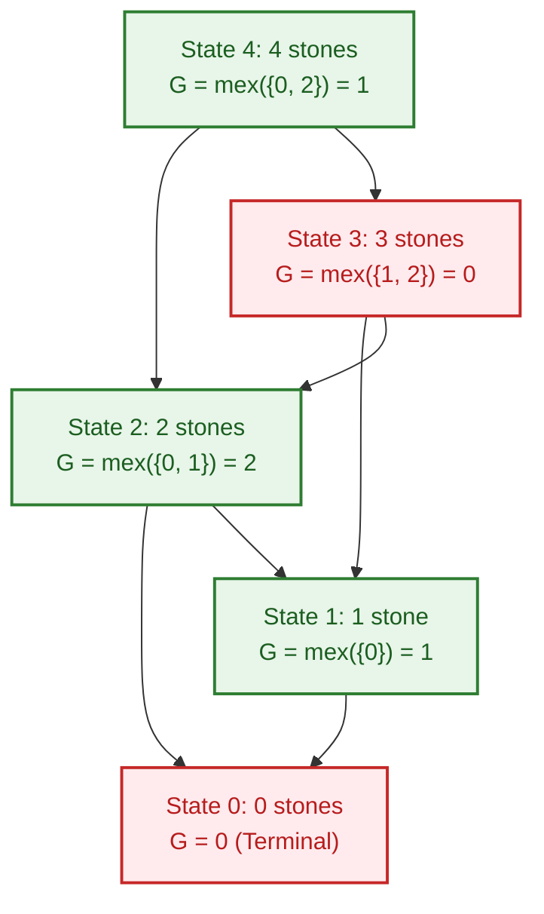

# 📊 Week 17 Visual Concepts Playbook (HYBRID)

> 🧭 **Navigation:** [🏠 Week Overview](README.md) • [📘 Curriculum Syllabus](../COMPLETE_SYLLABUS.md)
> 
> 💡 **Instructor Note:** *This playbook covers dynamic programming optimizations (Convex Hull Trick), combinatorial game theory (Nimbers), and structural counting (Catalan numbers). These mathematical invariants reduce brute-force search spaces from exponential `O(2^N)` or quadratic `O(N^2)` down to linear `O(N)` or logarithmic `O(log N)` algorithms.*

---

## 📋 Quick Navigation

- **Day 1:** Convex Hull Trick & Li Chao Tree (Linear Function Envelope for Quadratic DP)
- **Day 2:** Slope Trick (Convex Function Optimization with Priority Queues)
- **Day 3:** Game Theory & Sprague-Grundy Theorem (Nim-Sum XOR Invariant)
- **Day 4:** Combinatorics & Stars and Bars (Distribution Invariants)
- **Day 5:** Catalan Numbers & Dyck Paths (Balanced Parentheses & Non-Crossing Structures)

---

# DAY 1: Convex Hull Trick (CHT) & Li Chao Tree

## Pattern Map: DP Acceleration Techniques

| DP Form | Naive Complexity | Optimization Technique | Accelerated Complexity | Key Constraint |
| :--- | :---: | :--- | :---: | :--- |
| `dp[i] = min_{j < i} { b[j] * a[i] + dp[j] }` | `O(N^2)` | **Convex Hull Trick (Monotonic Deque)** | `O(N)` | Slopes `b[j]` and queries `a[i]` monotonic |
| `dp[i] = min_{j < i} { m[j] * x[i] + c[j] }` | `O(N^2)` | **Li Chao Segment Tree** | `O(N log C)` | Arbitrary slopes or query order |
| `dp[i] = min_{j < i} { dp[j] + cost(j, i) }` | `O(N^2)` | **Divide & Conquer Optimization** | `O(N log N)` | Quadrangle inequality: `opt[i] <= opt[i+1]` |
| `dp[i] = min_{j < i} { dp[j] + cost(j, i) }` | `O(N^2)` | **Knuth Optimization** | `O(N^2)` from `O(N^3)` | `opt[i][j-1] <= opt[i][j] <= opt[i+1][j]` |

---

## Pattern 1.1: Geometric Lower Envelope of Lines

### Concept

Many dynamic programming transitions can be framed geometrically as queries against a family of linear functions:
`y_j(x) = m_j * x + c_j`, where `m_j = b[j]` and `c_j = dp[j]`.

At step `i`, we need `min_{j} { y_j(x_i) }`. Geometrically, this is finding the line that forms the **lower envelope** at point `x = a[i]`.

### Visual 1: Lower Convex Envelope & Pruning Suboptimal Lines

```text
Lines:
L1: y = -1x + 10
L2: y = -2x + 14
L3: y = -4x + 22

Intersection Point of L_a and L_b:
x_intersect(L_a, L_b) = (c_a - c_b) / (m_b - m_a)

Intersection Analysis:
- L1 and L2 intersect at x = (10 - 14) / (-2 - (-1)) = 4
- L2 and L3 intersect at x = (14 - 22) / (-4 - (-2)) = 4
- L1 and L3 intersect at x = (10 - 22) / (-4 - (-1)) = 4

Geometric Lower Envelope:
At x in [0, 4]:  L1 gives minimum value.
At x = 4:       All three lines intersect.
At x in [4, +inf): L3 gives minimum value.

Pruning Rule (Checking if middle line L2 is redundant before adding L3):
If x_intersect(L1, L3) <= x_intersect(L1, L2):
   Line L2 is completely covered and can NEVER be optimal!
   Pop L2 from the deque!
```

---

## Pattern 1.2: Li Chao Tree (Segment Tree for Lines)

### Concept

When slopes `m` or query points `x` are **NOT monotonic**, the monotonic deque fails. A **Li Chao Tree** is a Segment Tree defined over the coordinate domain of `x` `[X_min, X_max]`. Each node stores the single line that is dominant at the midpoint `x_mid = (L + R) / 2`.

```text
Inserting Line L_new into node covering [L, R]:
Let L_cur = line currently stored at this node.
Let mid   = (L + R) / 2.

1. Compare L_new(mid) vs L_cur(mid):
   - If L_new(mid) is better than L_cur(mid):
     Swap L_new and L_cur! (Now L_cur is the better line at midpoint).

2. The displaced line is now L_new. We check which half it might still be better on:
   - If L_new(L) < L_cur(L): Displaced line might beat L_cur in left subtree -> Recurse left child!
   - If L_new(R) < L_cur(R): Displaced line might beat L_cur in right subtree -> Recurse right child!
   - Otherwise: Displaced line is worse everywhere -> Discard.

Querying Minimum at point X:
Traverse down from root to leaf containing X.
Return min( L_node(X) ) for all visited nodes along the path!
Time Complexity: O(log(X_max - X_min)) per insert and query.
```

---

# DAY 2: Game Theory & Sprague-Grundy Theorem

## Pattern Map: Impartial Games

| Concept | Definition | Invariant |
| :--- | :--- | :--- |
| **P-Position (Previous)** | State where the player who just moved has winning strategy | Current player is **losing** |
| **N-Position (Next)** | State where the next player to move has winning strategy | Current player is **winning** |
| **Normal Play Convention** | The player who makes the last legal move wins | Game ends when no legal moves remain |
| **Nim-Sum** | Bitwise XOR sum of all pile sizes: `S = x1 ^ x2 ^ ... ^ xk` | Winning if `S != 0`, Losing if `S == 0` |

---

## Pattern 2.1: The Sprague-Grundy Invariant (MEX Rule)

### Concept

Any finite impartial game under normal play convention is mathematically isomorphic to a game of Nim with a single pile of size `G(state)`.

The **Grundy Value** `G(u)` of a game state `u` is defined recursively:
`G(u) = mex( { G(v) : v is a legal state reachable from u in one move } )`

Where **`mex` (Minimum Excluded Value)** is the smallest non-negative integer NOT present in the set:
- `mex({1, 2, 3}) = 0`
- `mex({0, 1, 3}) = 2`
- `mex({0, 1, 2}) = 3`

### Visual 1: Game Graph with Grundy Values



- If a game decomposes into independent subgames `G1, G2, ..., Gk`:
  `Total_Grundy = G(G1) ^ G(G2) ^ ... ^ G(Gk)`
- The first player has a winning strategy if and only if `Total_Grundy != 0`!

---

# DAY 3: Combinatorics & Stars and Bars

## Pattern 3.1: The Stars and Bars Invariant

### Concept

How many ways can `N` identical items be distributed into `K` distinct bins?

```text
Example: Distribute N=7 identical coins to K=3 distinct children.
Represent items as 'stars' (*) and bin dividers as 'bars' (|):

* * | * * * | * *
(Child 1 gets 2, Child 2 gets 3, Child 3 gets 2)

Total positions needed:
N stars + (K - 1) bars = 7 + 2 = 9 positions total.
We simply choose where to place the (K - 1) bars among (N + K - 1) positions:

Formula (Non-negative distribution: x_i >= 0):
Ways = C(N + K - 1, K - 1) = C(7 + 3 - 1, 3 - 1) = C(9, 2) = 36 ways.

Positive distribution (Each child must get at least 1: x_i >= 1):
Pre-allocate 1 star to each child (N - K stars remain to distribute):
Ways = C(N - 1, K - 1) = C(7 - 1, 3 - 1) = C(6, 2) = 15 ways.
```

---

# DAY 4: Catalan Numbers & Structural Isomorphisms

## Pattern 4.1: The Catalan Invariant

The `n`-th Catalan number is given by:
`C_n = (1 / (n + 1)) * C(2n, n) = C(2n, n) - C(2n, n - 1)`

Values: `C_0 = 1, C_1 = 1, C_2 = 2, C_3 = 5, C_4 = 14, C_5 = 42, C_6 = 132...`

### Visual 1: Four Isomorphic Manifestations of `C_3 = 5`

```text
1. Valid Parentheses of length 6 (3 pairs):
   - ((()))
   - (()())
   - (())()
   - ()(())
   - ()()()

2. Structurally Unique Binary Trees with 3 nodes:
     o        o       o       o       o
    /        /         \       \     / \
   o        o           o       o   o   o
  /          \         /         \
 o            o       o           o

3. Stack Permutations (Push and Pop sequences of [1, 2, 3]):
   - 5 valid permutation outputs can be formed using a LIFO stack.

4. Dyck Paths (Lattice path from (0,0) to (2n, 0) never dropping below x-axis):
   - Up-steps (+) and Down-steps (-) that never violate running sum >= 0.
```

---

## 📝 Final Note: When to Spot These Mathematical Invariants

1. **Convex Hull Trick:** Triggered whenever DP recurrences contain a term that multiplies a state index `j` by the current index `i` (e.g. `cost = ... + A[i] * B[j]`). Instead of scanning all prior `j` in `O(N)`, maintain an envelope of linear functions.
2. **Sprague-Grundy:** Triggered in turn-based, 2-player, perfect information games with no random elements. Immediately look for state transitions, compute Grundy values via `mex`, and combine subgames using bitwise XOR.
3. **Catalan Numbers:** Triggered whenever counting valid pairing, parsing, or non-crossing partition arrangements of size `2N`.

---

> 🧭 **Navigation:** [🏠 Week Overview](README.md) • [📘 Curriculum Syllabus](../COMPLETE_SYLLABUS.md)
