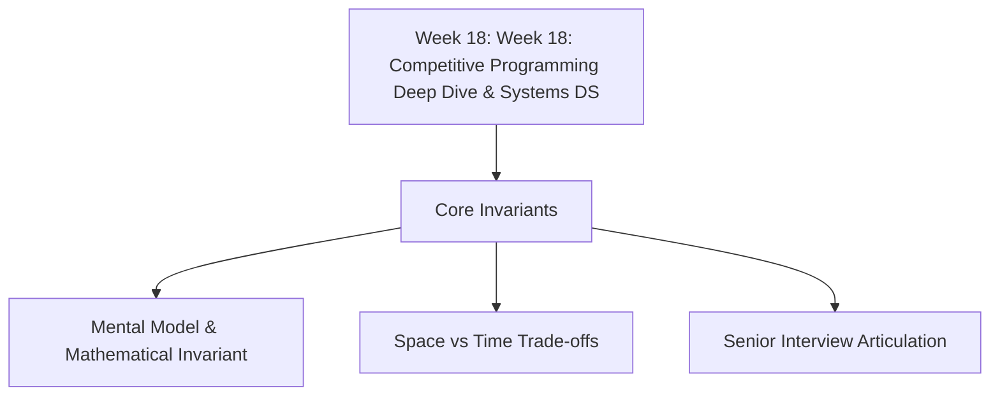

# 📘 Week 18 Complete Playbook: Week 18: Competitive Programming Deep Dive & Systems DS

> 🧭 **Navigation:** [🏠 Week Overview](README.md) • [📘 Curriculum Syllabus](../COMPLETE_SYLLABUS_v13.md)
> 
> 💡 **Instructor Note:** *Not all sections or topics are mandatory. Use this playbook as a fast, high-density reference to review key invariants and trade-offs.*

---

## 🎯 Executive Summary & Pattern Map

**Theme:** Meet-in-the-Middle, Sqrt Decomposition, Heavy-Light Decomposition, and Probabilistic Structures

---

## 🧠 Pattern Decision Matrix

| Problem Indicator | Recommended Approach | Time Complexity | Auxiliary Space |
| :--- | :--- | :--- | :--- |
| Range queries with updates | Segment Tree / Fenwick | O(log N) | O(N) |
| Non-crossing matching / flow | Residual Flow Graph | O(V * E^2) | O(V + E) |
| Exponential search space N <= 40 | Meet-in-the-Middle | O(2^(N/2)) | O(2^(N/2)) |
| Tree path aggregate queries | Heavy-Light Decomposition | O(log^2 N) | O(N) |

---

## 🛠️ Senior Trade-offs & Production Guards

1. **Memory Locality:** Cache misses often dominate asymptotic bounds on small-to-medium inputs. Flatten dynamic tree pointers into flat array buffers when possible.
2. **Recursion Limits:** Guard deep recursion against stack overflow by using explicit iterative stack loops or tail-call restructuring.
3. **Concurrency:** When multiple threads read and write concurrently, ensure snapshot isolation or lock-free atomics rather than coarse synchronization.

---

> 🧭 **Navigation:** [🏠 Week Overview](README.md) • [📘 Curriculum Syllabus](../COMPLETE_SYLLABUS_v13.md)
