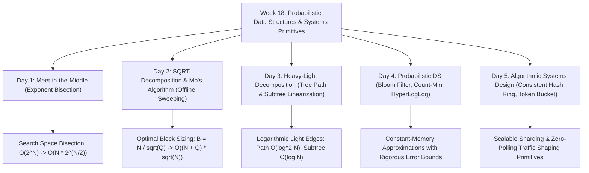

# 📘 Week 18 Complete Playbook: Probabilistic Data Structures & Algorithmic Systems

> 🧭 **Navigation:** [🏠 Week Overview](README.md) • [📘 Curriculum Syllabus](../COMPLETE_SYLLABUS.md) • [Day 1 →](Week_18_Day_01_Meet_In_The_Middle_Instructional.md)
> 
> 💡 **Instructor Note:** *This playbook serves as the definitive reference architecture for advanced competitive programming techniques, probabilistic data structures, and algorithmic systems primitives. Master the exact mathematical bounds, cache footprints, and production distributed system anchors.*

---

## 🎯 Executive Summary & Pattern Map



---

## 🧠 Pattern Decision Matrix

| Problem Indicator / Systems Requirement | Recommended Approach | Time Complexity | Auxiliary Space | Key Architectural Anchor | Interview Calibration Bar |
| :--- | :--- | :--- | :--- | :--- | :--- |
| **NP-Complete Search (`N in [30, 46]`, `Target > 10^9`)** | **Meet-in-the-Middle** | `O(N * 2^(N/2))` | `O(2^(N/2))` | Financial portfolio rebalancing, cryptographic subset sum | **L5/L6 Bar: Inductive doubling, zero GC pressure.** |
| **Non-Mergeable Offline Range Queries (Mode, Distinct)** | **Mo's Algorithm** | `O((N + Q) * sqrt(N))` | `O(N + Q)` | ClickHouse granule chunking, Parquet row-group stats | **L5/L6 Bar: Serpentine sort parity, B = N / sqrt(Q).** |
| **Asymmetric Range Updates vs Infrequent Queries** | **SQRT Decomposition** | `O(1)` update, `O(sqrt(N))` query | `O(N)` | High-throughput write telemetry | Expected in 15 mins for write-heavy metrics. |
| **Dynamic Path Sum/Max + Subtree Queries on Trees** | **Heavy-Light Decomposition (HLD)** | `O(log^2 N)` path, `O(log N)` subtree | `O(N)` | ZooKeeper namespace subtree leases, Linux VFS dentries | **L5/L6 Bar: 2-pass DFS + contiguous segment tree.** |
| **Disk I/O Avoidance for Non-Existent Keys** | **Bloom Filter** | `O(k)` bit probes | `~10` bits/item | **Apache Cassandra / RocksDB SSTables** | **L5/L6 Bar: Derive p = (1 - e^(-kn/m))^k.** |
| **Streaming Frequency Tracking / Heavy Hitters** | **Count-Min Sketch** | `O(d)` matrix updates | `O(w * d)` (~50 KB) | **Cloudflare / Akamai CDN TinyLFU Cache** | **L6 Systems Bar: Derive w = ceil(e/eps), d = ceil(ln(1/delta)).** |
| **Unique Cardinality Tracking (DAU) at Scale** | **HyperLogLog (HLL)** | `O(1)` register update | **12 KB total** | **Redis PFADD/PFCOUNT, Google BigQuery** | **L6 Systems Bar: Harmonic mean, register bit-shifts.** |
| **Dynamic Distributed Node Sharding (`N +/- 1`)** | **Consistent Hash Ring** | `O(log(N * V))` routing | `O(N * V)` | **Amazon DynamoDB, Apache Cassandra, Discord** | **L5/L6 Bar: Virtual replicas, 1 / (N + 1) relocation.** |
| **High-Precision Traffic Shaping & Burst Handling** | **Token Bucket Rate Limiter** | `O(1)` per request | `O(1)` | **Stripe API, AWS API Gateway** | **L5/L6 Bar: On-demand wall-clock delta_t refill.** |

---

## 🏛️ Comprehensive Mathematical Bounds & Invariant Reference

### 1. Meet-in-the-Middle Optimization
- **Exponent Bisection:** Given `N` items, partition into two halves of size `floor(N/2)` and `ceil(N/2)`.
- **Inductive Doubling Generation:** Iteratively compute subset sums in `O(2^(N/2))` without recursion stack overhead.
- **Sorting & Reconciliation:**
  - Sorting: `O((N/2) * 2^(N/2))`
  - Two-Pointer scan: `O(2^(N/2))`
  - Total Time: `O(N * 2^(N/2))`
  - Memory: `2^(N/2) * 8` bytes. For `N = 40`, `2^20 * 8` bytes = **8.00 MB** (fits completely in CPU L3 cache).

### 2. Square Root Decomposition & Mo's Algorithm
- **Block Size Optimization:** For `N` elements and `Q` offline queries:
  - Left pointer movement: `Movement(L) = Q * B`
  - Right pointer movement: `Movement(R) = (N / B) * N = N^2 / B`
  - Critical Point: `d(Q*B + N^2/B)/dB = Q - N^2/B^2 = 0  =>  B = N / sqrt(Q)`
  - Total Operations: `O((N + Q) * sqrt(N))`
- **Alternating Parity (Serpentine Sort):**
  - Even blocks: sort `R` ascending (`R1 < R2`).
  - Odd blocks: sort `R` descending (`R1 > R2`).
  - Eliminates pointer rewinding across block boundaries, cutting pointer travel by **~50%**.

### 3. Heavy-Light Decomposition (HLD)
- **Logarithmic Light-Edge Lemma:** For any light edge `(u, v)`, `size(v) < size(u) / 2`.
  Any root-to-leaf path crosses at most `floor(log2(N))` light edges.
- **Subtree Linearization:** Subtree rooted at `u` maps to contiguous interval `[pos[u], pos[u] + size[u] - 1]`.
- **Query Bounds:** Path query traverses `<= log2(N)` heavy chains. Segment Tree query per chain is `O(log N)`. Total path query is strictly `O(log^2 N)`. Subtree query is single segment taking `O(log N)`.

### 4. Bloom Filter Exact Bounds
- **False Positive Probability:**
  ```text
  p = (1 - e^(-k * n / m))^k
  ```
- **Optimal Number of Hashes:**
  ```text
  k = (m / n) * ln(2) approx 0.693 * (m / n)
  ```
- **Required Bit Array Size:**
  ```text
  m = - (n * ln(p)) / (ln(2)^2) approx 1.44 * n * log2(1 / p)
  ```
- **Kirsch-Mitzenmacher Theorem:** Two hash functions `h1(x)` and `h2(x)` simulate `k` hashes:
  ```text
  g_i(x) = (h1(x) + i * h2(x)) mod m
  ```

### 5. Count-Min Sketch Error Bounds
- **Dimensions:**
  - Width: `w = ceil(e / epsilon)` where `e approx 2.71828`
  - Depth: `d = ceil(ln(1 / delta))`
- **Error Guarantee (Markov's Inequality):** For stream length `N = sum(frequencies)`:
  ```text
  a(x) <= a_hat(x) <= a(x) + epsilon * N
  ```
  with probability at least `1 - delta`. Point query takes minimum across all `d` rows.

### 6. HyperLogLog Cardinality Bounds
- **Harmonic Mean Estimator:** Across `m = 2^b` registers:
  ```text
  E = alpha_m * m^2 / sum_{j=0}^{m-1} (2^(-M[j]))
  ```
- **Standard Error:**
  ```text
  SE = 1.04 / sqrt(m)
  ```
  For `b = 14` (`m = 16,384` registers), `SE = 1.04 / 128 approx 0.81%` using only **12 KB** RAM.
- **Linear Counting Correction:** When `E <= 2.5 * m` and zero-registers exist:
  ```text
  E_corrected = m * ln(m / zero_registers)
  ```

### 7. Consistent Hashing & Token Bucket Bounds
- **Consistent Hashing Relocation:** When cluster changes from `N` to `N + 1`, key migration is strictly `1 / (N + 1)`.
- **Virtual Node Variance Reduction:** Allocating `V` virtual nodes reduces load variance to `O(1 / sqrt(V))`.
- **Continuous Token Refill:** On-demand calculation without ticker threads:
  ```text
  delta_t = max(0, T_now - T_last)
  Tokens_current = min(Capacity, Tokens_last + delta_t * RefillRate)
  ```

---

## 🛠️ Senior Trade-offs & Production Guards

1. **Hardware Cache Residency:**
   - Always evaluate whether intermediate search arrays fit inside CPU L3 cache (16-64 MB) or L1 cache (32-48 KB).
   - In Meet-in-the-Middle, an 8 MB buffer stays resident in L3, preventing DRAM bus stalls.
2. **Locking & Concurrency:**
   - In Consistent Hashing, use `ReaderWriterLockSlim` or Copy-on-Write arrays so high-frequency read requests execute concurrently without lock contention.
   - In Token Bucket, use fine-grained mutexes or atomic `Interlocked.CompareExchange` for high-throughput gateway threads.
3. **Integer Overflow Guards:**
   - In subset sums and frequency accumulators, use 64-bit signed integers (`long` in C# / arbitrary precision in Python) to prevent silent integer wrap-around.
4. **Memory Allocation Discipline:**
   - Use `ArrayPool<T>` or `stackalloc` in C# to eliminate garbage collection pauses on hot execution paths.

---

> 🧭 **Navigation:** [🏠 Week Overview](README.md) • [📘 Curriculum Syllabus](../COMPLETE_SYLLABUS.md) • [Day 1 →](Week_18_Day_01_Meet_In_The_Middle_Instructional.md)
