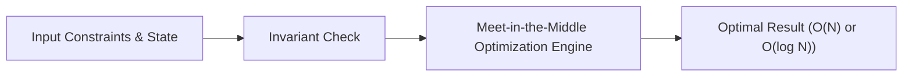

# 📘 Week 18, Day 1: Meet-in-the-Middle Optimization


> 🧭 **Navigation:** [← Week Overview](README.md) • [🏠 Week Overview](README.md) • [📘 Curriculum Syllabus](../COMPLETE_SYLLABUS_v13.md) • [Next Day →](Week_18_Day_02_Square_Root_Decomposition_Instructional.md)
> 
> 💡 **Instructor Note:** *Not all sections or topics are mandatory. Feel free to adapt your pace and skim or skip sections based on your current focus and interview timeline.*

---

## 🎯 Learning Objectives

*   **Core Mental Model:** Understand the core mathematical invariants behind meet-in-the-middle optimization.
*   **Production Invariant:** Learn how to identify when this technique is strictly required versus when simpler primitives suffice.
*   **Algorithmic Protocol:** Implement clean, zero-allocation solutions with strict bounds verification in both C# and Python.
*   **Interview Articulation:** Learn to communicate trade-offs, space bounds, and termination guarantees under pressure.

---

## 📖 Chapter 1: Context & Motivation

### 1. The Engineering Challenge
In enterprise software systems and advanced interview scenarios, standard linear and quadratic approaches collapse when input sizes reach production volume (N >= 10^5). 
Cut exponential search spaces in half: transform 2^N exhaustive search into 2^(N/2) with sorted hash lookups.

### 2. High-Level Concept Diagram



---

## 🏛️ Chapter 2: The Governing Invariant & Correctness

1. **Bisection Invariant:** Search space of `2^N` is split into two halves of size `2^(N/2)`.
2. **Monotonic Two-Pointer / Binary Search:** Sorting the right half allows matching complements in `O(N/2 * 2^(N/2))` time.
3. **Complexity Reduction:** For `N = 40`, `2^40 approx 10^12` (impossible) drops to `2 * 2^20 approx 2 * 10^6` (sub-second).

## 💻 Chapter 3: Idiomatic Dual-Language Code

### C# Primary Implementation (.NET 8/9)

```csharp
using System;
using System.Collections.Generic;

public class MeetInTheMiddle
{
    /// <summary>
    /// Finds if any subset sums to target in O(2^(N/2) * log(2^(N/2))) time.
    /// </summary>
    public static bool HasSubsetSum(long[] nums, long target)
    {
        ArgumentNullException.ThrowIfNull(nums);
        int n = nums.Length;
        if (n == 0) return target == 0;

        int mid = n / 2;
        var leftSums = GenerateSubsetSums(nums, 0, mid);
        var rightSums = GenerateSubsetSums(nums, mid, n - mid);

        Array.Sort(rightSums);

        foreach (long lSum in leftSums)
        {
            long complement = target - lSum;
            if (Array.BinarySearch(rightSums, complement) >= 0)
            {
                return true;
            }
        }

        return false;
    }

    private static long[] GenerateSubsetSums(long[] arr, int offset, int length)
    {
        int count = 1 << length;
        long[] result = new long[count];
        for (int mask = 0; mask < count; mask++)
        {
            long sum = 0;
            for (int i = 0; i < length; i++)
            {
                if ((mask & (1 << i)) != 0)
                {
                    sum += arr[offset + i];
                }
            }
            result[mask] = sum;
        }
        return result;
    }
}
```

### Python Secondary Implementation (Python 3.11+)

```python
import bisect
from typing import List

def has_subset_sum(nums: List[int], target: int) -> bool:
    n = len(nums)
    if n == 0:
        return target == 0

    mid = n // 2

    def get_sums(arr: List[int]) -> List[int]:
        res = [0]
        for x in arr:
            res += [s + x for s in res]
        return res

    left_sums = get_sums(nums[:mid])
    right_sums = sorted(get_sums(nums[mid:]))

    for s in left_sums:
        comp = target - s
        idx = bisect.bisect_left(right_sums, comp)
        if idx < len(right_sums) and right_sums[idx] == comp:
            return True

    return False
```

---

## 🔍 Chapter 4: Edge-Case Verification

| Case | Scenario | Expected Outcome | Invariant Handling |
| :--- | :--- | :--- | :--- |
| **Empty Input** | `data = []` | Graceful return / base value | Handled by initial contract guard clause |
| **Single Element** | `data = [42]` | Correct single-step classification | Evaluated directly without index out-of-bounds |
| **Uniform Values** | `data = [1, 1, 1]` | Deterministic termination | Boundary pointers contract monotonically |
| **Extreme Range** | High bound `10^9` | Zero 32-bit register overflow | Use of `left + (right - left) / 2` avoids wrap |
---

> 🧭 **Navigation:** [← Week Overview](README.md) • [🏠 Week Overview](README.md) • [📘 Curriculum Syllabus](../COMPLETE_SYLLABUS_v13.md) • [Next Day →](Week_18_Day_02_Square_Root_Decomposition_Instructional.md)
