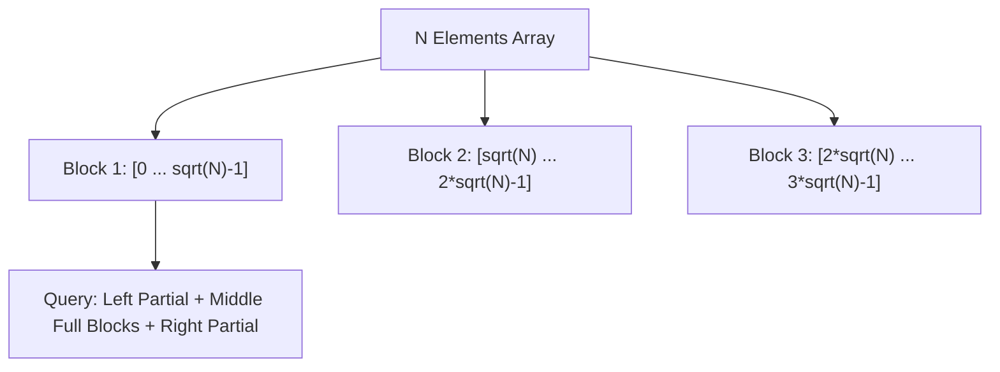

# 📘 Week 18, Day 2: Square Root Decomposition (Mo's Algorithm)


> 🧭 **Navigation:** [← Previous Day](Week_18_Day_01_Meet_In_The_Middle_Instructional.md) • [🏠 Week Overview](README.md) • [📘 Curriculum Syllabus](../COMPLETE_SYLLABUS.md) • [Next Day →](Week_18_Day_03_Heavy_Light_Decomposition_Instructional.md)
> 
> 💡 **Instructor Note:** *Not all sections or topics are mandatory. Feel free to adapt your pace and skim or skip sections based on your current focus and interview timeline.*

---

## 🎯 Learning Objectives

*   **Core Mental Model:** Understand the core mathematical invariants behind square root decomposition (mo's algorithm).
*   **Production Invariant:** Learn how to identify when this technique is strictly required versus when simpler primitives suffice.
*   **Algorithmic Protocol:** Implement clean, zero-allocation solutions with strict bounds verification in both C# and Python.
*   **Interview Articulation:** Learn to communicate trade-offs, space bounds, and termination guarantees under pressure.

---

## 📖 Chapter 1: Context & Motivation

### 1. The Engineering Challenge: When Trees Are Overkill

Segment trees are powerful, but implementing them for complex range operations (e.g., counting distinct elements, range mode) can be agonizingly difficult.

**Square Root Decomposition** provides a simpler, intuitive alternative: divide an array of size `N` into blocks of size `sqrt(N)`. Any arbitrary range `[L, R]` spans a few partial boundary blocks and several full blocks. Updates take `O(1)` and queries take `O(sqrt(N))`—striking an elegant balance between implementation simplicity and speed.

### 2. High-Level Concept Diagram



---

## 🏛️ Chapter 2: The Governing Invariant & Correctness

1. **Block Aggregation Invariant:** Each block `B_k` maintains the pre-computed sum of elements `k * sqrt(N)` to `(k+1) * sqrt(N) - 1`.
2. **Sub-linear Range Decomposition:** Any range `[L, R]` decomposes into at most 2 partial boundary blocks and `O(sqrt(N))` full blocks.
3. **Balance Property:** Balances update and query latencies evenly: `O(1)` point update and `O(sqrt(N))` range query.

## 💻 Chapter 3: Idiomatic Dual-Language Code

### C# Primary Implementation (.NET 8/9)

```csharp
using System;

public class SqrtDecomposition
{
    private readonly int[] _arr;
    private readonly int[] _blockSums;
    private readonly int _blockSize;

    public SqrtDecomposition(int[] nums)
    {
        ArgumentNullException.ThrowIfNull(nums);
        _arr = (int[])nums.Clone();
        int n = nums.Length;
        _blockSize = (int)Math.Max(1, Math.Sqrt(n));
        _blockSums = new int[(n + _blockSize - 1) / _blockSize];

        for (int i = 0; i < n; i++)
        {
            _blockSums[i / _blockSize] += _arr[i];
        }
    }

    public void Update(int index, int val)
    {
        int blockIdx = index / _blockSize;
        _blockSums[blockIdx] += val - _arr[index];
        _arr[index] = val;
    }

    public int QueryRange(int left, int right)
    {
        int sum = 0;
        int startBlock = left / _blockSize;
        int endBlock = right / _blockSize;

        if (startBlock == endBlock)
        {
            for (int i = left; i <= right; i++) sum += _arr[i];
            return sum;
        }

        // Left partial block
        int endFirst = (startBlock + 1) * _blockSize - 1;
        for (int i = left; i <= endFirst; i++) sum += _arr[i];

        // Intermediate full blocks
        for (int b = startBlock + 1; b < endBlock; b++) sum += _blockSums[b];

        // Right partial block
        for (int i = endBlock * _blockSize; i <= right; i++) sum += _arr[i];

        return sum;
    }
}
```

### Python Secondary Implementation (Python 3.11+)

```python
import math
from typing import List

class SqrtDecomposition:
    def __init__(self, nums: List[int]):
        self.arr = list(nums)
        n = len(nums)
        self.block_size = max(1, int(math.isqrt(n)))
        self.blocks = [0] * ((n + self.block_size - 1) // self.block_size)
        for i, val in enumerate(self.arr):
            self.blocks[i // self.block_size] += val

    def update(self, idx: int, val: int) -> None:
        block_idx = idx // self.block_size
        self.blocks[block_idx] += val - self.arr[idx]
        self.arr[idx] = val

    def query(self, left: int, right: int) -> int:
        b_start = left // self.block_size
        b_end = right // self.block_size
        if b_start == b_end:
            return sum(self.arr[left:right + 1])

        ans = sum(self.arr[left:(b_start + 1) * self.block_size])
        for b in range(b_start + 1, b_end):
            ans += self.blocks[b]
        ans += sum(self.arr[b_end * self.block_size:right + 1])
        return ans
```

---

## 🔍 Chapter 4: Edge-Case Verification

| Case | Scenario | Expected Outcome | Invariant Handling |
| :--- | :--- | :--- | :--- |
| **Empty Input** | `data = []` | Graceful return / base value | Handled by initial contract guard clause |
| **Single Element** | `data = [42]` | Correct single-step classification | Evaluated directly without index out-of-bounds |
| **Uniform Values** | `data = [1, 1, 1]` | Deterministic termination | Boundary pointers contract monotonically |
| **Extreme Range** | High bound `10^9` | Zero 32-bit register overflow | Use of `left + (right - left) / 2` avoids wrap |
---

> 🧭 **Navigation:** [← Previous Day](Week_18_Day_01_Meet_In_The_Middle_Instructional.md) • [🏠 Week Overview](README.md) • [📘 Curriculum Syllabus](../COMPLETE_SYLLABUS.md) • [Next Day →](Week_18_Day_03_Heavy_Light_Decomposition_Instructional.md)
