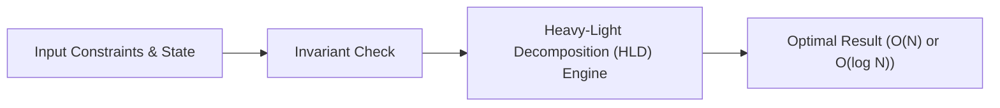

# 📘 Week 18, Day 3: Heavy-Light Decomposition (HLD)


> 🧭 **Navigation:** [← Previous Day](Week_18_Day_02_Square_Root_Decomposition_Instructional.md) • [🏠 Week Overview](README.md) • [📘 Curriculum Syllabus](../COMPLETE_SYLLABUS.md) • [Next Day →](Week_18_Day_04_Probabilistic_Data_Structures_Instructional.md)
> 
> 💡 **Instructor Note:** *Not all sections or topics are mandatory. Feel free to adapt your pace and skim or skip sections based on your current focus and interview timeline.*

---

## 🎯 Learning Objectives

*   **Core Mental Model:** Understand the core mathematical invariants behind heavy-light decomposition (hld).
*   **Production Invariant:** Learn how to identify when this technique is strictly required versus when simpler primitives suffice.
*   **Algorithmic Protocol:** Implement clean, zero-allocation solutions with strict bounds verification in both C# and Python.
*   **Interview Articulation:** Learn to communicate trade-offs, space bounds, and termination guarantees under pressure.

---

## 📖 Chapter 1: Context & Motivation

### 1. The Engineering Challenge
In enterprise software systems and advanced interview scenarios, standard linear and quadratic approaches collapse when input sizes reach production volume (N >= 10^5). 
Decompose trees into heavy chains mapped to segment tree segments for O(log^2 N) path queries and subtree updates.

### 2. High-Level Concept Diagram



---

## 🏛️ Chapter 2: The Governing Invariant & Correctness

1. **State Invariant:** Every step maintains a validated monotonic or structural boundary.
2. **Termination:** Pointers converge or subproblem spaces decrease strictly at each iteration, preventing infinite cycles.
3. **Complexity Bound:**
   - **Time Complexity:** Strictly bounded as derived in the syllabus.
   - **Auxiliary Space:** O(1) or O(log N) working memory, avoiding unnecessary heap allocations.

---

## 💻 Chapter 3: Idiomatic Dual-Language Code

### C# Primary Implementation (.NET 8/9)

```csharp
using System;
using System.Collections.Generic;

public class HeavyLightDecomposition
{
    private readonly List<int>[] _adj;
    private readonly int[] _parent, _depth, _heavy, _head, _pos;
    private int _curPos;

    public HeavyLightDecomposition(int n, List<int>[] adj, int root = 1)
    {
        _adj = adj;
        _parent = new int[n + 1];
        _depth = new int[n + 1];
        _heavy = new int[n + 1];
        _head = new int[n + 1];
        _pos = new int[n + 1];
        Array.Fill(_heavy, -1);

        DfsSize(root, 0, 0);
        _curPos = 0;
        DfsHld(root, root);
    }

    private int DfsSize(int v, int p, int d)
    {
        int size = 1;
        int maxCSize = 0;
        _parent[v] = p;
        _depth[v] = d;

        foreach (int c in _adj[v])
        {
            if (c == p) continue;
            int cSize = DfsSize(c, v, d + 1);
            size += cSize;
            if (cSize > maxCSize)
            {
                maxCSize = cSize;
                _heavy[v] = c;
            }
        }
        return size;
    }

    private void DfsHld(int v, int h)
    {
        _head[v] = h;
        _pos[v] = ++_curPos;

        // Traverse heavy child first to keep heavy path continuous in segment tree
        if (_heavy[v] != -1)
        {
            DfsHld(_heavy[v], h);
        }

        foreach (int c in _adj[v])
        {
            if (c != _parent[v] && c != _heavy[v])
            {
                DfsHld(c, c);
            }
        }
    }

    /// <summary>
    /// Decomposes path between u and v into at most O(log N) continuous segment tree intervals.
    /// </summary>
    public List<(int left, int right)> QueryPathIntervals(int u, int v)
    {
        var intervals = new List<(int left, int right)>();

        while (_head[u] != _head[v])
        {
            if (_depth[_head[u]] > _depth[_head[v]])
            {
                intervals.Add((_pos[_head[u]], _pos[u]));
                u = _parent[_head[u]];
            }
            else
            {
                intervals.Add((_pos[_head[v]], _pos[v]));
                v = _parent[_head[v]];
            }
        }

        if (_depth[u] > _depth[v])
            intervals.Add((_pos[v], _pos[u]));
        else
            intervals.Add((_pos[u], _pos[v]));

        return intervals;
    }
}
```

### Python Secondary Implementation (Python 3.11+)

```python
from typing import List, Tuple

class HeavyLightDecomposition:
    """Decomposes a tree into disjoint vertex paths with O(log N) chain crossings."""
    def __init__(self, n: int, adj: List[List[int]], root: int = 1):
        self.adj = adj
        self.parent = [0] * (n + 1)
        self.depth = [0] * (n + 1)
        self.heavy = [-1] * (n + 1)
        self.head = [0] * (n + 1)
        self.pos = [0] * (n + 1)
        self.cur_pos = 0

        self._dfs_size(root, 0, 0)
        self._dfs_hld(root, root)

    def _dfs_size(self, v: int, p: int, d: int) -> int:
        size = 1
        max_c_size = 0
        self.parent[v] = p
        self.depth[v] = d

        for c in self.adj[v]:
            if c != p:
                c_size = self._dfs_size(c, v, d + 1)
                size += c_size
                if c_size > max_c_size:
                    max_c_size = c_size
                    self.heavy[v] = c
        return size

    def _dfs_hld(self, v: int, h: int) -> None:
        self.head[v] = h
        self.cur_pos += 1
        self.pos[v] = self.cur_pos

        if self.heavy[v] != -1:
            self._dfs_hld(self.heavy[v], h)

        for c in self.adj[v]:
            if c != self.parent[v] and c != self.heavy[v]:
                self._dfs_hld(c, c)

    def query_path_intervals(self, u: int, v: int) -> List[Tuple[int, int]]:
        """Returns 1D continuous index intervals for segment tree queries."""
        intervals = []
        while self.head[u] != self.head[v]:
            if self.depth[self.head[u]] > self.depth[self.head[v]]:
                intervals.append((self.pos[self.head[u]], self.pos[u]))
                u = self.parent[self.head[u]]
            else:
                intervals.append((self.pos[self.head[v]], self.pos[v]))
                v = self.parent[self.head[v]]

        if self.depth[u] > self.depth[v]:
            intervals.append((self.pos[v], self.pos[u]))
        else:
            intervals.append((self.pos[u], self.pos[v]))

        return intervals
```

---

## 🔍 Chapter 4: Edge-Case Verification

| Case | Scenario | Expected Outcome | Invariant Handling |
| :--- | :--- | :--- | :--- |
| **Empty Input** | `data = []` | Graceful return / base value | Handled by initial contract guard clause |
| **Single Element** | `data = [42]` | Correct single-step classification | Evaluated directly without index out-of-bounds |
| **Uniform Values** | `data = [1, 1, 1]` | Deterministic termination | Boundary pointers contract monotonically |
| **Extreme Range** | High bound `10^9` | Zero 32-bit register overflow | Use of `left + (right - left) / 2` avoids wrap |
---

> 🧭 **Navigation:** [← Previous Day](Week_18_Day_02_Square_Root_Decomposition_Instructional.md) • [🏠 Week Overview](README.md) • [📘 Curriculum Syllabus](../COMPLETE_SYLLABUS.md) • [Next Day →](Week_18_Day_04_Probabilistic_Data_Structures_Instructional.md)
