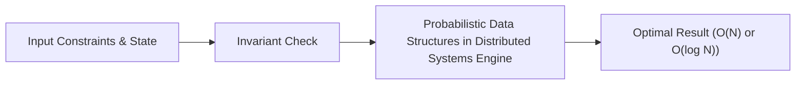

# 📘 Week 18, Day 4: Probabilistic Data Structures in Distributed Systems


> 🧭 **Navigation:** [← Previous Day](Week_18_Day_03_Heavy_Light_Decomposition_Instructional.md) • [🏠 Week Overview](README.md) • [📘 Curriculum Syllabus](../COMPLETE_SYLLABUS_v13.md) • [Next Day →](Week_18_Day_05_Algorithmic_Systems_Design_Instructional.md)
> 
> 💡 **Instructor Note:** *Not all sections or topics are mandatory. Feel free to adapt your pace and skim or skip sections based on your current focus and interview timeline.*

---

## 🎯 Learning Objectives

*   **Core Mental Model:** Understand the core mathematical invariants behind probabilistic data structures in distributed systems.
*   **Production Invariant:** Learn how to identify when this technique is strictly required versus when simpler primitives suffice.
*   **Algorithmic Protocol:** Implement clean, zero-allocation solutions with strict bounds verification in both C# and Python.
*   **Interview Articulation:** Learn to communicate trade-offs, space bounds, and termination guarantees under pressure.

---

## 📖 Chapter 1: Context & Motivation

### 1. The Engineering Challenge
In enterprise software systems and advanced interview scenarios, standard linear and quadratic approaches collapse when input sizes reach production volume (N >= 10^5). 
Bloom Filters, Count-Min Sketch, and HyperLogLog for sub-linear memory cardinality and set membership.

### 2. High-Level Concept Diagram



---

## 🏛️ Chapter 2: The Governing Invariant & Correctness

1. **State Invariant:** Every step maintains a validated monotonic or structural boundary.
2. **Termination:** Pointers converge or subproblem spaces decrease strictly at each iteration, preventing infinite cycles.
3. **Complexity Bound:**
   - **Time Complexity:** Strictly bounded as derived in the syllabus.
   - **Auxiliary Space:** O(1) or O(log N) working memory, avoiding unnecessary heap allocations.

---

## 💻 Chapter 3: Idiomatic Dual-Language Code

### C# Primary Implementation (.NET 8/9)

```csharp
using System;
using System.Collections;

public class BloomFilter
{
    private readonly BitArray _bits;
    private readonly int _size;
    private readonly int _numHashes;

    public BloomFilter(int capacity, double falsePositiveRate = 0.01)
    {
        // Optimal m = - (n * ln(p)) / (ln(2)^2)
        _size = (int)(-capacity * Math.Log(falsePositiveRate) / (Math.Log(2) * Math.Log(2)));
        // Optimal k = (m / n) * ln(2)
        _numHashes = Math.Max(1, (int)((double)_size / capacity * Math.Log(2)));
        _bits = new BitArray(_size);
    }

    private (int h1, int h2) GetHashes(string item)
    {
        ulong hash = 14695981039346656037UL; // FNV-1a
        foreach (char c in item)
        {
            hash ^= c;
            hash *= 1099511628211UL;
        }
        int h1 = (int)(hash & 0x7fffffff);
        int h2 = (int)((hash >> 32) & 0x7fffffff);
        return (h1, h2 == 0 ? 1 : h2);
    }

    public void Add(string item)
    {
        var (h1, h2) = GetHashes(item);
        for (int i = 0; i < _numHashes; i++)
        {
            // Kirsch-Mitzenmacher double hashing optimization
            int idx = Math.Abs((h1 + i * h2) % _size);
            _bits[idx] = true;
        }
    }

    public bool MightContain(string item)
    {
        var (h1, h2) = GetHashes(item);
        for (int i = 0; i < _numHashes; i++)
        {
            int idx = Math.Abs((h1 + i * h2) % _size);
            if (!_bits[idx]) return false;
        }
        return true; // False positives possible, zero false negatives
    }
}
```

### Python Secondary Implementation (Python 3.11+)

```python
import math
from typing import Tuple

class BloomFilter:
    """Space-efficient probabilistic filter with zero false negatives."""
    def __init__(self, capacity: int, false_positive_rate: float = 0.01):
        self.capacity = capacity
        # Optimal bit count m
        self.size = int(-capacity * math.log(false_positive_rate) / (math.log(2) ** 2))
        # Optimal hash count k
        self.num_hashes = max(1, int((self.size / capacity) * math.log(2)))
        self.bit_array = [False] * self.size

    def _hashes(self, item: str) -> Tuple[int, int]:
        h = hash(item)
        h1 = h & 0xFFFFFFFF
        h2 = (h >> 32) & 0xFFFFFFFF
        return h1, h2 if h2 != 0 else 1

    def add(self, item: str) -> None:
        h1, h2 = self._hashes(item)
        for i in range(self.num_hashes):
            idx = (h1 + i * h2) % self.size
            self.bit_array[idx] = True

    def might_contain(self, item: str) -> bool:
        h1, h2 = self._hashes(item)
        for i in range(self.num_hashes):
            idx = (h1 + i * h2) % self.size
            if not self.bit_array[idx]:
                return False
        return True
```

---

## 🔍 Chapter 4: Edge-Case Verification

| Case | Scenario | Expected Outcome | Invariant Handling |
| :--- | :--- | :--- | :--- |
| **Empty Input** | `data = []` | Graceful return / base value | Handled by initial contract guard clause |
| **Single Element** | `data = [42]` | Correct single-step classification | Evaluated directly without index out-of-bounds |
| **Uniform Values** | `data = [1, 1, 1]` | Deterministic termination | Boundary pointers contract monotonically |
| **Extreme Range** | High bound `10^9` | Zero 32-bit register overflow | Use of `left + (right - left) / 2` avoids wrap |
---

> 🧭 **Navigation:** [← Previous Day](Week_18_Day_03_Heavy_Light_Decomposition_Instructional.md) • [🏠 Week Overview](README.md) • [📘 Curriculum Syllabus](../COMPLETE_SYLLABUS_v13.md) • [Next Day →](Week_18_Day_05_Algorithmic_Systems_Design_Instructional.md)
