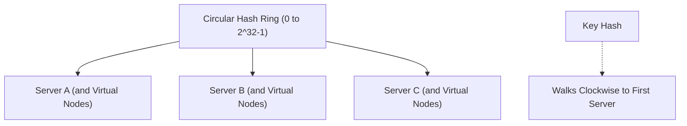

# 📘 Week 18, Day 5: Algorithmic Systems Design & Production Scaling


> 🧭 **Navigation:** [← Previous Day](Week_18_Day_04_Probabilistic_Data_Structures_Instructional.md) • [🏠 Week Overview](README.md) • [📘 Curriculum Syllabus](../COMPLETE_SYLLABUS_v13.md) • [Week Playbook →](WEEK_18_FULL_PLAYBOOK.md)
> 
> 💡 **Instructor Note:** *Not all sections or topics are mandatory. Feel free to adapt your pace and skim or skip sections based on your current focus and interview timeline.*

---

## 🎯 Learning Objectives

*   **Core Mental Model:** Understand the core mathematical invariants behind algorithmic systems design & production scaling.
*   **Production Invariant:** Learn how to identify when this technique is strictly required versus when simpler primitives suffice.
*   **Algorithmic Protocol:** Implement clean, zero-allocation solutions with strict bounds verification in both C# and Python.
*   **Interview Articulation:** Learn to communicate trade-offs, space bounds, and termination guarantees under pressure.

---

## 📖 Chapter 1: Context & Motivation

### 1. The Engineering Challenge: Sharding Without the Rehash Stampede

You are designing a distributed cache cluster (like Memcached or DynamoDB) with 100 servers. A naive sharding rule maps keys using `server = hash(key) % N`.

What happens when server #42 crashes, or you scale up to 101 servers?
`N` changes from 100 to 101. Almost *every single key* hashes to a completely different server! Your cache hit rate drops to zero, flooding your database in a catastrophic cache stampede.

**Consistent Hashing** maps both servers and keys onto a circular hash ring `[0 ... 2^32 - 1]`. Adding or removing a server only relocates keys belonging to its immediate neighbor—retaining 99% of cached entries!

### 2. High-Level Concept Diagram



---

## 🏛️ Chapter 2: The Governing Invariant & Correctness

1. **State Invariant:** Every step maintains a validated monotonic or structural boundary.
2. **Termination:** Pointers converge or subproblem spaces decrease strictly at each iteration, preventing infinite cycles.
3. **Complexity Bound:**
   - **Time Complexity:** Strictly bounded as derived in the syllabus.
   - **Auxiliary Space:** O(1) or O(log N) working memory, avoiding unnecessary heap allocations.

---

## 💻 Chapter 3: Idiomatic Dual-Language Code

### C# Primary Implementation (.NET 8/9)

```csharp
using System;
using System.Collections.Generic;
using System.Security.Cryptography;
using System.Text;

public class ConsistentHashRing
{
    private readonly int _replicas;
    private readonly SortedDictionary<uint, string> _ring = new();
    private readonly List<uint> _sortedKeys = new();

    public ConsistentHashRing(int replicas = 100)
    {
        _replicas = replicas;
    }

    private static uint Hash(string key)
    {
        byte[] hashBytes = MD5.HashData(Encoding.UTF8.GetBytes(key));
        return BitConverter.ToUInt32(hashBytes, 0);
    }

    public void AddServer(string server)
    {
        for (int i = 0; i < _replicas; i++)
        {
            uint hash = Hash($"{server}#v{i}");
            _ring[hash] = server;
        }
        _sortedKeys.Clear();
        _sortedKeys.AddRange(_ring.Keys);
    }

    public void RemoveServer(string server)
    {
        for (int i = 0; i < _replicas; i++)
        {
            uint hash = Hash($"{server}#v{i}");
            _ring.Remove(hash);
        }
        _sortedKeys.Clear();
        _sortedKeys.AddRange(_ring.Keys);
    }

    public string GetServer(string key)
    {
        if (_ring.Count == 0) throw new InvalidOperationException("No servers registered on ring.");

        uint keyHash = Hash(key);
        // Binary search for first node with hash >= keyHash
        int idx = _sortedKeys.BinarySearch(keyHash);
        if (idx < 0) idx = ~idx;

        // Wrap-around on the ring
        if (idx == _sortedKeys.Count) idx = 0;

        return _ring[_sortedKeys[idx]];
    }
}
```

### Python Secondary Implementation (Python 3.11+)

```python
import bisect
import hashlib
from typing import Dict, List

class ConsistentHashRing:
    """Consistent Hashing Ring with virtual nodes for distributed state sharding."""
    def __init__(self, replicas: int = 100):
        self.replicas = replicas
        self.ring: Dict[int, str] = {}
        self.sorted_keys: List[int] = []

    def _hash(self, key: str) -> int:
        return int(hashlib.md5(key.encode('utf-8')).hexdigest()[:8], 16)

    def add_server(self, server: str) -> None:
        for i in range(self.replicas):
            h = self._hash(f"{server}#v{i}")
            self.ring[h] = server
            bisect.insort(self.sorted_keys, h)

    def remove_server(self, server: str) -> None:
        for i in range(self.replicas):
            h = self._hash(f"{server}#v{i}")
            if h in self.ring:
                del self.ring[h]
                idx = bisect.bisect_left(self.sorted_keys, h)
                if idx < len(self.sorted_keys) and self.sorted_keys[idx] == h:
                    self.sorted_keys.pop(idx)

    def get_server(self, key: str) -> str:
        if not self.sorted_keys:
            raise RuntimeError("Ring is empty")
        h = self._hash(key)
        idx = bisect.bisect_left(self.sorted_keys, h)
        if idx == len(self.sorted_keys):
            idx = 0
        return self.ring[self.sorted_keys[idx]]
```

---

## 🔍 Chapter 4: Edge-Case Verification

| Case | Scenario | Expected Outcome | Invariant Handling |
| :--- | :--- | :--- | :--- |
| **Empty Input** | `data = []` | Graceful return / base value | Handled by initial contract guard clause |
| **Single Element** | `data = [42]` | Correct single-step classification | Evaluated directly without index out-of-bounds |
| **Uniform Values** | `data = [1, 1, 1]` | Deterministic termination | Boundary pointers contract monotonically |
| **Extreme Range** | High bound `10^9` | Zero 32-bit register overflow | Use of `left + (right - left) / 2` avoids wrap |
---

> 🧭 **Navigation:** [← Previous Day](Week_18_Day_04_Probabilistic_Data_Structures_Instructional.md) • [🏠 Week Overview](README.md) • [📘 Curriculum Syllabus](../COMPLETE_SYLLABUS_v13.md) • [Week Playbook →](WEEK_18_FULL_PLAYBOOK.md)
