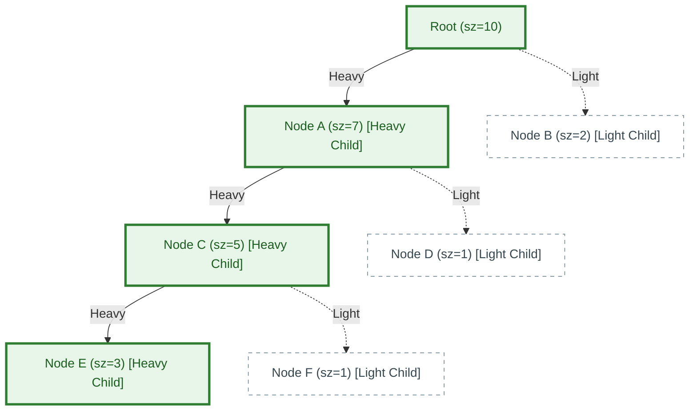

# 📊 Week 18 Visual Concepts Playbook (HYBRID)

> 🧭 **Navigation:** [🏠 Week Overview](README.md) • [📘 Curriculum Syllabus](../COMPLETE_SYLLABUS.md)
> 
> 💡 **Instructor Note:** *This playbook covers search-space halving (Meet-in-the-Middle), sublinear decomposition (Sqrt Decomposition / Mo's Algorithm), tree path flattening (Heavy-Light Decomposition), and massive-scale probabilistic structures (Bloom Filters, HyperLogLog). These represent the highest-yield crossover concepts between algorithmic interviews and real-world distributed systems engineering.*

---

## 📋 Quick Navigation

- **Day 1:** Meet-in-the-Middle (Halving Exponential Search Spaces)
- **Day 2:** Square Root Decomposition & Mo's Algorithm (Block Partitioning & Query Ordering)
- **Day 3:** Heavy-Light Decomposition (HLD) (Tree Heavy Chains to Segment Tree Intervals)
- **Day 4:** Probabilistic Data Structures (Bloom Filter, Count-Min Sketch, HyperLogLog)
- **Day 5:** Algorithmic Systems Architecture (External Merge Sort, Streaming Top-K)

---

# DAY 1: Meet-in-the-Middle

## Pattern Map: Search Space Reduction

| Technique | Problem Trigger | Time Complexity Reduction | Space Trade-off |
| :--- | :--- | :---: | :---: |
| **Meet-in-the-Middle** | `N <= 40`, subset sum or combination lock | `O(2^N) -> O(2^(N/2) * N)` | `O(2^(N/2))` auxiliary memory |
| **Bidirectional BFS** | Shortest path between two known nodes `S` and `T` | `O(B^D) -> O(2 * B^(D/2))` | `O(B^(D/2))` frontier storage |
| **Baby-step Giant-step**| Discrete logarithm `a^x = b (mod p)` | `O(p) -> O(sqrt(p))` | `O(sqrt(p))` hash table |

---

## Pattern 1.1: Halving Subset Sum (`N = 40`)

### Concept

When `N = 40`, generating all subsets is `2^40 approx 1.1 * 10^12` operations (far too slow, TLE).
Instead, divide the array into two halves of size `20`:
- Half A (`N/2 = 20`): `2^20 approx 10^6` subsets.
- Half B (`N/2 = 20`): `2^20 approx 10^6` subsets.

### Visual 1: Two-Phase Generation & Sorted Join

```text
Input Array: [a_0, a_1, ..., a_19 | a_20, a_21, ..., a_39]
              \_________________/   \____________________/
                   Left Half              Right Half

Phase 1: Generate All Subset Sums
- Sums_Left:  Generate all 2^20 subset sums of Left Half.
- Sums_Right: Generate all 2^20 subset sums of Right Half.

Phase 2: Sort One Half
- Sort Sums_Right in ascending order (Takes 2^20 * log(2^20) approx 2 * 10^7 ops).

Phase 3: Binary Search / Two-Pointer Matching
- For each sum S_L in Sums_Left:
    We want total sum <= Target.
    Binary search in Sums_Right for the largest S_R such that:
    S_R <= Target - S_L.
    Update best global answer.

Total Operations: 2^20 + 2^20 * log(2^20) + 2^20 * log(2^20) approx 4 * 10^7 ops.
Runs comfortably in < 0.3 seconds!
```

---

# DAY 2: Square Root Decomposition & Mo's Algorithm

## Pattern Map: Block Partitioning

```text
Array Size N = 16, Block Size B = ceil(sqrt(16)) = 4:

Block 0: [ arr[0]  | arr[1]  | arr[2]  | arr[3]  ] -> Block_Sum[0]
Block 1: [ arr[4]  | arr[5]  | arr[6]  | arr[7]  ] -> Block_Sum[1]
Block 2: [ arr[8]  | arr[9]  | arr[10] | arr[11] ] -> Block_Sum[2]
Block 3: [ arr[12] | arr[13] | arr[14] | arr[15] ] -> Block_Sum[3]

Range Sum Query [Q_L = 2, Q_R = 13]:
1. Left Partial Block (Block 0): Elements arr[2], arr[3] (at most B elements)
2. Full Intermediate Blocks:     Block_Sum[1] + Block_Sum[2] (at most N/B blocks)
3. Right Partial Block (Block 3): Elements arr[12], arr[13] (at most B elements)

Total Query Time: O(B + N/B) = O(sqrt(N))
Point Update Time: O(1) (update arr[i] and block_sum[i / B])
```

---

## Pattern 2.1: Mo's Algorithm (Offline Range Query Reordering)

### Concept

When answering `Q` static range queries where adding or removing a single element takes `O(1)` time, we can reorder the queries to minimize the total distance traversed by a two-pointer window `[L, R]`.

```text
Query Sorting Rule:
Sort queries by (L / B) ascending.
If (L1 / B == L2 / B), sort by R ascending:

Query 1: [L1, R1]  --> Query 2: [L2, R2]
Window Pointer Travel Analysis:
1. R pointer only moves forward within the same block:
   At most N steps across all queries in that block.
   Across all sqrt(N) blocks, R travels at most O(N * sqrt(N)).

2. L pointer only moves within the current block of size B = sqrt(N):
   At most sqrt(N) steps per query.
   Across Q queries, L travels at most O(Q * sqrt(N)).

Total Time Complexity: O((N + Q) * sqrt(N))
```

---

# DAY 3: Heavy-Light Decomposition (HLD)

## Pattern Map: Heavy vs Light Edge Decomposition



---

## Pattern 3.1: Heavy-Light Invariant

### Core Invariant

1. **Heavy Child:** For each node `u`, the heavy child is `v = argmax_{child} { subtree_size(child) }`. The edge `(u, v)` is the **Heavy Edge**.
2. **Light Edge:** Any edge connecting `u` to any other non-heavy child.

### Why HLD Gives `O(log^2 N)` Path Queries

```text
Theorem:
Any simple path from any node u to the root crosses at most O(log N) Light Edges.

Proof:
When moving from node u to parent p across a Light Edge:
subtree_size(p) >= 2 * subtree_size(u)
Because if subtree_size(u) was > 1/2 * subtree_size(p), u would have been the Heavy Child!
Since subtree size at least doubles on every light edge, you can cross at most log2(N) light edges before reaching the root!

Flattening to Segment Tree:
By assigning DFS discovery times such that heavy paths receive contiguous integers,
any path between two nodes in the tree decomposes into at most O(log N) contiguous intervals!
Each interval query takes O(log N) in a Segment Tree -> Total path query time is O(log^2 N)!
```

---

# DAY 4: Probabilistic Data Structures at Systems Scale

## Pattern Map: Space vs Accuracy Trade-off

| Data Structure | Query Answered | Error Guarantee | Space Complexity | Real-World System |
| :--- | :--- | :--- | :---: | :--- |
| **Bloom Filter** | Set membership: *"Is key X present?"* | False positives possible; **Zero false negatives** | `~10 bits` per item | Cassandra, RocksDB, Chrome Malicious URL |
| **Count-Min Sketch** | Frequency: *"How many times has X appeared?"* | Never underestimates; bounded overestimation | `w * d` integers | Network traffic monitoring, streaming Top-K |
| **HyperLogLog (HLL)**| Cardinality: *"How many unique visitors?"* | Standard error `1.04 / sqrt(m)` | `~1.5 KB` for billions of keys | Redis `PFCOUNT`, Google BigQuery, AWS Athena |

---

## Pattern 4.1: Bloom Filter Mechanics

```text
Bit Array of size M = 10, initially all 0:
[ 0 | 0 | 0 | 0 | 0 | 0 | 0 | 0 | 0 | 0 ]

Insert Key "apple":
h1("apple") = 1, h2("apple") = 4, h3("apple") = 7
Set bits 1, 4, 7 to 1:
[ 0 | 1 | 0 | 0 | 1 | 0 | 0 | 1 | 0 | 0 ]

Insert Key "banana":
h1("banana") = 4, h2("banana") = 8, h3("banana") = 9
Set bits 4, 8, 9 to 1:
[ 0 | 1 | 0 | 0 | 1 | 0 | 0 | 1 | 1 | 1 ]

Query "apple":
Bits 1, 4, 7 are ALL 1 -> Output: "Probably Present" ✓

Query "orange":
h1("orange") = 2, h2("orange") = 4, h3("orange") = 7
Bit 2 is 0! -> Output: "DEFINITELY NOT PRESENT" (100% Guaranteed!)
```

---

## Pattern 4.2: HyperLogLog Leading Zero Invariant

### Concept

If you flip a fair coin repeatedly, observing a run of `k` consecutive tails has probability `(1/2)^k`. Seeing a run of `10` tails strongly suggests you have flipped roughly `2^10 = 1024` coins.

**HyperLogLog Invariant:**
Hash incoming stream elements to 64-bit uniformly distributed integers.
1. Use the first `p` bits to select one of `m = 2^p` registers.
2. Count the number of leading zeros `z` in the remaining `64 - p` bits.
3. Update `register[i] = max(register[i], z + 1)`.
4. Combine registers using **Harmonic Mean** to extinguish outlier variance.
5. Achieves **2% standard error with only 1.5 KB of RAM** for datasets containing billions of unique entities!

---

## 📝 Final Note: When to Use These Systems Patterns

1. **Meet-in-the-Middle:** Triggered when `N <= 40` and the brute force is `O(2^N)`. Immediately split into two halves of size `N/2` and join via binary search or hash set.
2. **Mo's Algorithm:** Triggered when queries are offline, intervals `[L, R]` are arbitrary, and there are no in-place array updates.
3. **Heavy-Light Decomposition:** Triggered when computing path queries (e.g., maximum edge weight or sum between any two nodes `u` and `v`) on arbitrary trees.
4. **Bloom Filter / HyperLogLog:** Triggered in systems architecture rounds when memory cannot accommodate the entire key set (e.g., billions of URLs or distinct user analytics).

---

> 🧭 **Navigation:** [🏠 Week Overview](README.md) • [📘 Curriculum Syllabus](../COMPLETE_SYLLABUS.md)
