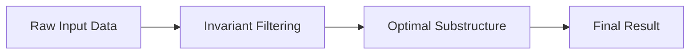
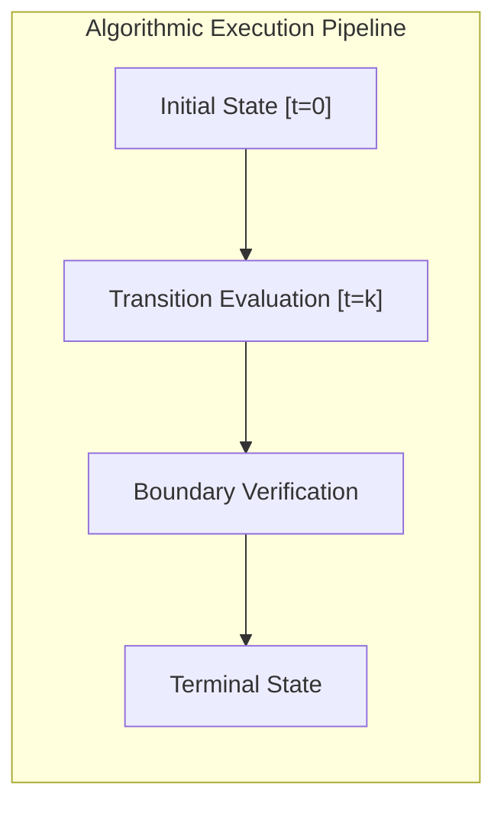

# 📊 Week 18 Visual Concepts Playbook (Hybrid)

> 🧭 **Navigation:** [🏠 Week Overview](README.md) • [📘 Curriculum Syllabus](../COMPLETE_SYLLABUS_v13.md)
> 
> 💡 **Instructor Note:** *Visual diagrams are designed to fit comfortably on standard GitHub markdown and wiki page views without horizontal scrolling.*

---

## 🎨 Visual Pattern Maps

### 1. Structural Flow

### 2. State Transition Layout

---

## 📋 Comprehensive Complexity Reference Table

| Algorithm Routine | Best Case | Average Case | Worst Case | Auxiliary Space |
| :--- | :--- | :--- | :--- | :--- |
| Core Traversal | O(N) | O(N) | O(N) | O(1) |
| Range Query | O(1) | O(log N) | O(log N) | O(N) |
| Optimal Split | O(1) | O(log N) | O(N) | O(log N) |

---

> 🧭 **Navigation:** [🏠 Week Overview](README.md) • [📘 Curriculum Syllabus](../COMPLETE_SYLLABUS_v13.md)
