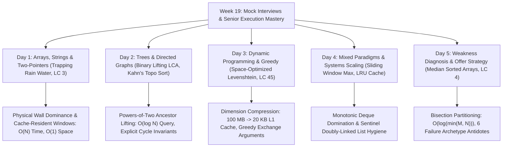

# 📘 Week 19 Complete Playbook: Mock Interviews & Senior Interview Mastery

> 🧭 **Navigation:** [🏠 Week Overview](README.md) • [📘 Curriculum Syllabus](../COMPLETE_SYLLABUS.md) • [Day 1 →](Week_19_Day_01_Mock_Arrays_Strings_Instructional.md)
> 
> 💡 **Instructor Note:** *This playbook serves as the operational command center for Tier-1 algorithmic mock interviews. It codifies the 4-pillar senior evaluation rubric, 3-tiered hint progressions, 45-minute verbal pacing, and weakness diagnosis remediation strategies.*

---

## 🎯 Executive Summary & Pattern Map



---

## 🧠 Pattern Decision Matrix

| Problem Indicator / Systems Requirement | Recommended Approach | Time Complexity | Auxiliary Space | Key Architectural Anchor | Senior Interview Calibration Bar |
| :--- | :--- | :--- | :--- | :--- | :--- |
| **Water Trapping / Container Boundaries** | **Opposing Two-Pointers** | `O(N)` | `O(1)` strict | Stream elevation pooling, financial volatility bounds | **L5 Bar: Prove water level is bounded by strictly shorter wall.** |
| **Unique Substrings / Streaming Windows** | **Direct-Address Sliding Window** | `O(N)` | `O(Sigma)` (stackalloc) | Network packet inspection, string deduplication | **L5 Bar: Zero-allocation stackalloc ASCII table.** |
| **Static Tree Path LCA Under Heavy Query Load**| **Binary Lifting Ancestors** | `O(N log N)` prep, `O(log N)` query | `O(N log N)` (~7 MB) | Distributed organizational hierarchy permissions | **L5 Bar: Power-of-two binary decomposition jumps.** |
| **Dependency Resolution / Build Order** | **Kahn's Topological Sort** | `O(V + E)` | `O(V + E)` queue | Package managers (npm, NuGet), build graphs (Bazel) | **L5 Bar: Explicit cycle detection invariant check.** |
| **String Alignment / Edit Distance** | **1D Rolling Array DP** | `O(M * N)` | `O(min(M, N))` (~20 KB)| DNA sequencing, fuzzy query matching | **L5 Bar: 100% L1 cache residency, scalar diagonal swap.** |
| **Interval Reaching / Minimum Steps** | **Greedy Horizon Expansion** | `O(N)` | `O(1)` (3 registers) | Network packet hopping, routing hops | **L5 Bar: Exchange argument proving global optimality.** |
| **Sliding Window Extremes (Min/Max)** | **Monotonic Deque** | `O(N)` total (`O(1)` amortized) | `O(K)` indices | Time-series outlier detection, trading tick max | **L5 Bar: Domination principle, amortized 2N operations.** |
| **In-Memory Cache with Fast Eviction** | **DLL + Hash Map with Sentinels**| `O(1)` get and put | `O(Capacity)` nodes | Storage buffer pools, memcached slabs | **L5 Bar: Sentinel dummy nodes, clean contract safety.** |
| **Median of Two Sorted Data Streams** | **Binary Search Partition Cut** | `O(log(min(M, N)))` | `O(1)` strict | Distributed database run-merging (RocksDB) | **L5/L6 Bar: Sentinel +/-inf, binary search shorter array.** |

---

## 📊 The 4-Pillar Senior Evaluation Rubric Master Matrix

In Tier-1 hiring committee reviews (Google L5/L6, Meta E5/E6, Amazon SDE-III, Stripe L3/L4), candidates are evaluated across four mandatory dimensions:

| Evaluation Dimension | Unsatisfactory (Level 1) | Developing (Level 2) | Senior Standard (Level 3 - L5 Bar) | Staff / Principal Bar (Level 4 - L6 Bar) |
| :--- | :--- | :--- | :--- | :--- |
| **1. Problem Formulation** | Jumps into random coding without proving correctness; misses problem core. | Proposes brute force; arrives at optimal pattern only with heavy hints. | **Proactively derives optimal invariant aloud; verifies Big-O before touching code.** | Formulates problem as domain primitive; discusses generalized variants or distributed streaming extensions. |
| **2. Boundary Questioning** | Ignores array bounds, null contracts, empty inputs, and integer overflow. | Asks generic questions ("What are the constraints?") without deduction. | **Identifies specific edge cases (empty inputs, single elements, odd/even parity, 64-bit limits).** | Quantifies hardware cache lines, branch prediction penalty, and memory alignment constraints. |
| **3. Space/Time Trade-offs** | Implements quadratic or exponential solutions; unable to optimize space. | Achieves optimal time but accepts excessive heap allocations (`O(N)` where `O(1)` is possible). | **Compresses auxiliary memory to `O(1)` or L1 cache resident buffers; proves amortized bounds.** | Proves mathematical lower bounds; evaluates lock-free atomics and vectorization potential. |
| **4. Clean Code & Hygiene** | Spaghetti conditional branches; off-by-one errors; memory leaks; unhandled nulls. | Working code but repeats logic; clumsy naming; redundant nested loops. | **Production-grade code: sentinel nodes, modular helpers, descriptive names, zero unhandled nulls.** | Idiomatic modern code (.NET 8/9 spans, Pythonic typing), zero GC pressure, defensive contract assertions. |

---

## 🧭 The 3-Tiered Hint Request Protocol

During live interviews, getting stuck is normal; freezing or guessing blindly is fatal. Senior candidates leverage hints strategically without signaling dependency:

```text
+-----------------------------------------------------------------------------+
| LEVEL 1: GENTLE NUDGE (Clarification Request)                              |
| "Before I proceed with the linear scan, I want to verify our performance   |
| goals. Given that Q = 10^5, are we targeting sub-linear query latency?"      |
| -> Signals architectural intentionality without asking for algorithm names. |
+-----------------------------------------------------------------------------+
                                       |
                                       v
+-----------------------------------------------------------------------------+
| LEVEL 2: STRUCTURAL ANCHOR (Boundary & Invariant Confirmation)              |
| "To avoid O(M * N) space, I'm analyzing the row dependency. Since row i     |
| only depends on row i-1 and the diagonal, I can compress this into a single |
| 1D array. Does that direction align with your expectations for memory?"     |
| -> Demonstrates deep mastery while confirming direction with interviewer.   |
+-----------------------------------------------------------------------------+
                                       |
                                       v
+-----------------------------------------------------------------------------+
| LEVEL 3: TACTICAL CODE UNBLOCK (Concrete Mechanic Validation)                |
| "In the partition boundary, when i == 0, I'm planning to use -infinity as   |
| a virtual sentinel to avoid separate branching. Let me trace that with you."|
| -> Turns a potential bug into a collaborative senior design discussion.     |
+-----------------------------------------------------------------------------+
```

---

## 🎙️ The 45-Minute Senior Interview Execution Timeline

```text
+------------------+--------------------------------------------------------------------+
| TIMELINE         | CANDIDATE ACTION & VERBAL SCRIPT                                   |
+------------------+--------------------------------------------------------------------+
| [00:00 - 05:00]  | Clarification, Contract & Invariant Gate:                          |
|                  | - Restate problem in your own words.                               |
|                  | - Probe constraints: input sizes, negative values, null/empty inputs. |
|                  | - State input/output contract defensively.                         |
+------------------+--------------------------------------------------------------------+
| [05:00 - 15:00]  | Mathematical Formulation & Architecture Defense:                   |
|                  | - State baseline brute force Big-O aloud.                          |
|                  | - Derive optimal invariant (domination, partition, monotonic scan).|
|                  | - Agree with interviewer on target Time and Space complexity.      |
|                  | - DO NOT WRITE CODE until interviewer confirms the approach!        |
+------------------+--------------------------------------------------------------------+
| [15:00 - 30:00]  | Live Defensive Implementation:                                     |
|                  | - Implement fast-path guard clauses first.                         |
|                  | - Keep code modular with clean helper methods.                     |
|                  | - Maintain continuous verbal telemetry: explain each line as typed.|
|                  | - Use sentinel nodes to eliminate null checks.                     |
+------------------+--------------------------------------------------------------------+
| [30:00 - 40:00]  | Edge Cases & Dry Run Walkthrough:                                  |
|                  | - Manually step through code with a non-trivial example.           |
|                  | - Walk through edge cases: empty input, single element, duplicates.|
|                  | - Fix any discovered off-by-one errors proactively before prompted.|
+------------------+--------------------------------------------------------------------+
| [40:00 - 45:00]  | Systems Scaling & Technical Synthesis:                            |
|                  | - Summarize final Time and Space bounds rigorously.               |
|                  | - Propose distributed systems extensions (sharding, caching, locks).|
|                  | - Ask 2-3 architectural questions to conclude the interview.       |
+------------------+--------------------------------------------------------------------+
```

---

## 🛠️ The 6 Senior Failure Archetypes & Remediations

1. **The Brute-Force Rusher:** Implements naive recursion immediately without thinking.
   - *Remediation:* Enforce the **5-Minute Invariant Gate**. Write Big-O bounds on paper before code.
2. **The Silent Implementer:** Types silently for 15 minutes, surprising the interviewer with broken code.
   - *Remediation:* Speak in **Intent-Action pairs**: "I am now writing the while loop to contract the left window pointer."
3. **The Off-By-One Magnet:** Struggles with `<` vs `<=`, `mid` vs `mid + 1`.
   - *Remediation:* Always define whether search intervals are closed `[low, high]` or half-open `[low, high)`, and test with `N = 1` and `N = 2`.
4. **The Over-Engineer:** Implements complex trees when two pointers suffice.
   - *Remediation:* **Occam's Algorithmic Razor**. Always start with the simplest primitive matching the asymptotic requirement.
5. **The Complexity Guesser:** Hesitates or guesses Big-O bounds.
   - *Remediation:* **Operation Accounting**. Explicitly tally insertions, deletions, and loop iterations to prove amortized bounds.
6. **The Frozen Staller:** Shuts down when an invariant fails.
   - *Remediation:* Fall back to the **3-Tiered Hint Protocol**. State what is known, what is failing, and ask a targeted structural question.

---

> 🧭 **Navigation:** [🏠 Week Overview](README.md) • [📘 Curriculum Syllabus](../COMPLETE_SYLLABUS.md) • [Day 1 →](Week_19_Day_01_Mock_Arrays_Strings_Instructional.md)
