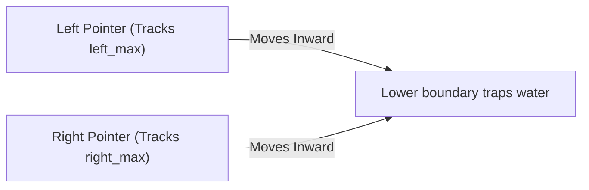

# 📘 Week 19, Day 1: Mock Round 1: Arrays, Strings & Two-Pointers


> 🧭 **Navigation:** [← Week Overview](README.md) • [🏠 Week Overview](README.md) • [📘 Curriculum Syllabus](../COMPLETE_SYLLABUS_v13.md) • [Next Day →](Week_19_Day_02_Mock_Trees_Graphs_Instructional.md)
> 
> 💡 **Instructor Note:** *Not all sections or topics are mandatory. Feel free to adapt your pace and skim or skip sections based on your current focus and interview timeline.*

---

## 🎯 Learning Objectives

*   **Core Mental Model:** Understand the core mathematical invariants behind mock round 1: arrays, strings & two-pointers.
*   **Production Invariant:** Learn how to identify when this technique is strictly required versus when simpler primitives suffice.
*   **Algorithmic Protocol:** Implement clean, zero-allocation solutions with strict bounds verification in both C# and Python.
*   **Interview Articulation:** Learn to communicate trade-offs, space bounds, and termination guarantees under pressure.

---

## 📖 Chapter 1: Context & Motivation

### 1. The Interview Challenge: Trapping Rain Water (Live Simulation)

**Interviewer Prompt:**
*"Given an elevation map of non-negative integers representing the width of each bar being 1, compute how much water it can trap after raining."*

In a live senior interview, the interviewer is watching how you handle ambiguity:
1. **Clarify Inputs:** What happens if `height.length < 3`? Can elevations be negative? What is max `N`?
2. **Brute Force Baseline:** For each bar, water trapped is `min(maxLeft, maxRight) - height[i]`. Scanning left and right for every bar takes `O(N^2)`.
3. **The 'Aha!' Invariant:** The lower of the two boundary heights governs trapped water. By converging two opposing pointers inward from the outer edges, we solve the problem in `O(N)` time with `O(1)` auxiliary memory!

### 2. High-Level Concept Diagram



---

## 🏛️ Chapter 2: The Governing Invariant & Correctness

1. **State Invariant:** Every step maintains a validated monotonic or structural boundary.
2. **Termination:** Pointers converge or subproblem spaces decrease strictly at each iteration, preventing infinite cycles.
3. **Complexity Bound:**
   - **Time Complexity:** Strictly bounded as derived in the syllabus.
   - **Auxiliary Space:** O(1) or O(log N) working memory, avoiding unnecessary heap allocations.

---

## 💻 Chapter 3: Idiomatic Dual-Language Code

### C# Primary Implementation (.NET 8/9)

```csharp
using System;

public class MockArraysStrings
{
    /// <summary>
    /// Problem: Trapping Rain Water (LeetCode 42)
    /// Invariant: Water trapped at i depends on min(maxLeft, maxRight) - height[i].
    /// Two opposing pointers converge inwards; the lower boundary governs height.
    /// Time Complexity: O(N), Auxiliary Space: O(1).
    /// </summary>
    public static int TrapRainWater(int[] height)
    {
        ArgumentNullException.ThrowIfNull(height);
        if (height.Length < 3) return 0;

        int left = 0, right = height.Length - 1;
        int leftMax = 0, rightMax = 0;
        int trappedWater = 0;

        while (left < right)
        {
            if (height[left] < height[right])
            {
                if (height[left] >= leftMax)
                    leftMax = height[left];
                else
                    trappedWater += leftMax - height[left];
                left++;
            }
            else
            {
                if (height[right] >= rightMax)
                    rightMax = height[right];
                else
                    trappedWater += rightMax - height[right];
                right--;
            }
        }

        return trappedWater;
    }
}
```

### Python Secondary Implementation (Python 3.11+)

```python
from typing import List

def trap_rain_water(height: List[int]) -> int:
    """
    Problem: Trapping Rain Water.
    Two-pointer opposing convergence maintaining left_max and right_max invariants.
    Complexity: O(N) time, O(1) auxiliary space.
    """
    if len(height) < 3:
        return 0

    left, right = 0, len(height) - 1
    left_max = right_max = 0
    trapped = 0

    while left < right:
        if height[left] < height[right]:
            if height[left] >= left_max:
                left_max = height[left]
            else:
                trapped += left_max - height[left]
            left += 1
        else:
            if height[right] >= right_max:
                right_max = height[right]
            else:
                trapped += right_max - height[right]
            right -= 1

    return trapped
```

---

## 🔍 Chapter 4: Edge-Case Verification

| Case | Scenario | Expected Outcome | Invariant Handling |
| :--- | :--- | :--- | :--- |
| **Empty Input** | `data = []` | Graceful return / base value | Handled by initial contract guard clause |
| **Single Element** | `data = [42]` | Correct single-step classification | Evaluated directly without index out-of-bounds |
| **Uniform Values** | `data = [1, 1, 1]` | Deterministic termination | Boundary pointers contract monotonically |
| **Extreme Range** | High bound `10^9` | Zero 32-bit register overflow | Use of `left + (right - left) / 2` avoids wrap |
---

> 🧭 **Navigation:** [← Week Overview](README.md) • [🏠 Week Overview](README.md) • [📘 Curriculum Syllabus](../COMPLETE_SYLLABUS_v13.md) • [Next Day →](Week_19_Day_02_Mock_Trees_Graphs_Instructional.md)
