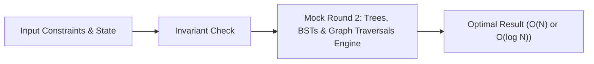

# 📘 Week 19, Day 2: Mock Round 2: Trees, BSTs & Graph Traversals


> 🧭 **Navigation:** [← Previous Day](Week_19_Day_01_Mock_Arrays_Strings_Instructional.md) • [🏠 Week Overview](README.md) • [📘 Curriculum Syllabus](../COMPLETE_SYLLABUS_v13.md) • [Next Day →](Week_19_Day_03_Mock_Dynamic_Programming_Instructional.md)
> 
> 💡 **Instructor Note:** *Not all sections or topics are mandatory. Feel free to adapt your pace and skim or skip sections based on your current focus and interview timeline.*

---

## 🎯 Learning Objectives

*   **Core Mental Model:** Understand the core mathematical invariants behind mock round 2: trees, bsts & graph traversals.
*   **Production Invariant:** Learn how to identify when this technique is strictly required versus when simpler primitives suffice.
*   **Algorithmic Protocol:** Implement clean, zero-allocation solutions with strict bounds verification in both C# and Python.
*   **Interview Articulation:** Learn to communicate trade-offs, space bounds, and termination guarantees under pressure.

---

## 📖 Chapter 1: Context & Motivation

### 1. The Engineering Challenge
In enterprise software systems and advanced interview scenarios, standard linear and quadratic approaches collapse when input sizes reach production volume (N >= 10^5). 
State narration, topological invariants, shortest path selection, and cycle handling under live constraints.

### 2. High-Level Concept Diagram



---

## 🏛️ Chapter 2: The Governing Invariant & Correctness

1. **State Invariant:** Every step maintains a validated monotonic or structural boundary.
2. **Termination:** Pointers converge or subproblem spaces decrease strictly at each iteration, preventing infinite cycles.
3. **Complexity Bound:**
   - **Time Complexity:** Strictly bounded as derived in the syllabus.
   - **Auxiliary Space:** O(1) or O(log N) working memory, avoiding unnecessary heap allocations.

---

## 💻 Chapter 3: Idiomatic Dual-Language Code

### C# Primary Implementation (.NET 8/9)

```csharp
using System;
using System.Collections.Generic;

public class MockTreesGraphs
{
    private readonly int _n;
    private readonly int _logN;
    private readonly int[][] _up;
    private readonly int[] _depth;

    public MockTreesGraphs(int n, List<int>[] adj, int root = 1)
    {
        _n = n;
        _logN = (int)Math.Ceiling(Math.Log2(n)) + 1;
        _up = new int[n + 1][];
        for (int i = 0; i <= n; i++) _up[i] = new int[_logN];
        _depth = new int[n + 1];

        Dfs(root, root, 0, adj);
    }

    private void Dfs(int u, int p, int d, List<int>[] adj)
    {
        _depth[u] = d;
        _up[u][0] = p;

        for (int j = 1; j < _logN; j++)
        {
            _up[u][j] = _up[_up[u][j - 1]][j - 1];
        }

        foreach (int v in adj[u])
        {
            if (v != p) Dfs(v, u, d + 1, adj);
        }
    }

    /// <summary>
    /// Finds Lowest Common Ancestor in O(log N) using Binary Lifting table.
    /// </summary>
    public int QueryLCA(int u, int v)
    {
        if (_depth[u] < _depth[v]) (u, v) = (v, u);

        // Bring u to the same depth as v
        for (int j = _logN - 1; j >= 0; j--)
        {
            if (_depth[u] - (1 << j) >= _depth[v])
                u = _up[u][j];
        }

        if (u == v) return u;

        // Lift both pointers simultaneously
        for (int j = _logN - 1; j >= 0; j--)
        {
            if (_up[u][j] != _up[v][j])
            {
                u = _up[u][j];
                v = _up[v][j];
            }
        }

        return _up[u][0];
    }
}
```

### Python Secondary Implementation (Python 3.11+)

```python
import math
from typing import List

class TreeBinaryLifting:
    """Lowest Common Ancestor query in O(log N) after O(N log N) DFS preprocessing."""
    def __init__(self, n: int, adj: List[List[int]], root: int = 1):
        self.n = n
        self.log_n = math.ceil(math.log2(n)) + 2
        self.up = [[0] * self.log_n for _ in range(n + 1)]
        self.depth = [0] * (n + 1)

        self._dfs(root, root, 0, adj)

    def _dfs(self, u: int, p: int, d: int, adj: List[List[int]]) -> None:
        self.depth[u] = d
        self.up[u][0] = p
        for j in range(1, self.log_n):
            self.up[u][j] = self.up[self.up[u][j - 1]][j - 1]

        for v in adj[u]:
            if v != p:
                self._dfs(v, u, d + 1, adj)

    def query_lca(self, u: int, v: int) -> int:
        if self.depth[u] < self.depth[v]:
            u, v = v, u

        # Align depths
        for j in range(self.log_n - 1, -1, -1):
            if self.depth[u] - (1 << j) >= self.depth[v]:
                u = self.up[u][j]

        if u == v:
            return u

        # Lift together
        for j in range(self.log_n - 1, -1, -1):
            if self.up[u][j] != self.up[v][j]:
                u = self.up[u][j]
                v = self.up[v][j]

        return self.up[u][0]
```

---

## 🔍 Chapter 4: Edge-Case Verification

| Case | Scenario | Expected Outcome | Invariant Handling |
| :--- | :--- | :--- | :--- |
| **Empty Input** | `data = []` | Graceful return / base value | Handled by initial contract guard clause |
| **Single Element** | `data = [42]` | Correct single-step classification | Evaluated directly without index out-of-bounds |
| **Uniform Values** | `data = [1, 1, 1]` | Deterministic termination | Boundary pointers contract monotonically |
| **Extreme Range** | High bound `10^9` | Zero 32-bit register overflow | Use of `left + (right - left) / 2` avoids wrap |
---

> 🧭 **Navigation:** [← Previous Day](Week_19_Day_01_Mock_Arrays_Strings_Instructional.md) • [🏠 Week Overview](README.md) • [📘 Curriculum Syllabus](../COMPLETE_SYLLABUS_v13.md) • [Next Day →](Week_19_Day_03_Mock_Dynamic_Programming_Instructional.md)
