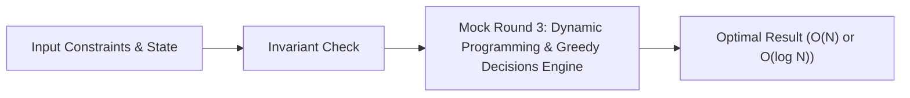

# 📘 Week 19, Day 3: Mock Round 3: Dynamic Programming & Greedy Decisions


> 🧭 **Navigation:** [← Previous Day](Week_19_Day_02_Mock_Trees_Graphs_Instructional.md) • [🏠 Week Overview](README.md) • [📘 Curriculum Syllabus](../COMPLETE_SYLLABUS_v13.md) • [Next Day →](Week_19_Day_04_Mock_Mixed_Complex_Rounds_Instructional.md)
> 
> 💡 **Instructor Note:** *Not all sections or topics are mandatory. Feel free to adapt your pace and skim or skip sections based on your current focus and interview timeline.*

---

## 🎯 Learning Objectives

*   **Core Mental Model:** Understand the core mathematical invariants behind mock round 3: dynamic programming & greedy decisions.
*   **Production Invariant:** Learn how to identify when this technique is strictly required versus when simpler primitives suffice.
*   **Algorithmic Protocol:** Implement clean, zero-allocation solutions with strict bounds verification in both C# and Python.
*   **Interview Articulation:** Learn to communicate trade-offs, space bounds, and termination guarantees under pressure.

---

## 📖 Chapter 1: Context & Motivation

### 1. The Engineering Challenge
In enterprise software systems and advanced interview scenarios, standard linear and quadratic approaches collapse when input sizes reach production volume (N >= 10^5). 
Deriving recurrences aloud, defending greedy exchange arguments, space-optimization from 2D to 1D.

### 2. High-Level Concept Diagram



---

## 🏛️ Chapter 2: The Governing Invariant & Correctness

1. **State Invariant:** Every step maintains a validated monotonic or structural boundary.
2. **Termination:** Pointers converge or subproblem spaces decrease strictly at each iteration, preventing infinite cycles.
3. **Complexity Bound:**
   - **Time Complexity:** Strictly bounded as derived in the syllabus.
   - **Auxiliary Space:** O(1) or O(log N) working memory, avoiding unnecessary heap allocations.

---

## 💻 Chapter 3: Idiomatic Dual-Language Code

### C# Primary Implementation (.NET 8/9)

```csharp
using System;
using System.Collections.Generic;

public class MockDP
{
    /// <summary>
    /// Problem: Edit Distance (Levenshtein Distance)
    /// Computes minimum insertions, deletions, and replacements.
    /// Space-optimized O(min(M, N)) auxiliary memory.
    /// </summary>
    public static int MinEditDistance(string word1, string word2)
    {
        ArgumentNullException.ThrowIfNull(word1);
        ArgumentNullException.ThrowIfNull(word2);

        int m = word1.Length, n = word2.Length;
        int[] dp = new int[n + 1];

        for (int j = 0; j <= n; j++) dp[j] = j;

        for (int i = 1; i <= m; i++)
        {
            int prevDiag = dp[0];
            dp[0] = i;

            for (int j = 1; j <= n; j++)
            {
                int temp = dp[j];
                if (word1[i - 1] == word2[j - 1])
                {
                    dp[j] = prevDiag;
                }
                else
                {
                    dp[j] = 1 + Math.Min(prevDiag, Math.Min(dp[j], dp[j - 1]));
                }
                prevDiag = temp;
            }
        }

        return dp[n];
    }

    /// <summary>
    /// Problem: Longest Increasing Subsequence in O(N log N) via Patience Sorting.
    /// </summary>
    public static int LengthOfLIS(int[] nums)
    {
        if (nums.Length == 0) return 0;

        var tails = new List<int>();
        foreach (int x in nums)
        {
            int idx = tails.BinarySearch(x);
            if (idx < 0) idx = ~idx;

            if (idx == tails.Count)
                tails.Add(x);
            else
                tails[idx] = x;
        }

        return tails.Count;
    }
}
```

### Python Secondary Implementation (Python 3.11+)

```python
import bisect
from typing import List

def min_edit_distance(word1: str, word2: str) -> int:
    """
    Problem: Edit Distance (Levenshtein).
    Space-optimized O(min(M, N)) dynamic programming.
    """
    m, n = len(word1), len(word2)
    dp = list(range(n + 1))

    for i in range(1, m + 1):
        prev_diag = dp[0]
        dp[0] = i
        for j in range(1, n + 1):
            temp = dp[j]
            if word1[i - 1] == word2[j - 1]:
                dp[j] = prev_diag
            else:
                dp[j] = 1 + min(prev_diag, dp[j], dp[j - 1])
            prev_diag = temp

    return dp[n]

def length_of_lis(nums: List[int]) -> int:
    """
    Longest Increasing Subsequence in O(N log N) using Patience Sorting.
    """
    tails: List[int] = []
    for x in nums:
        idx = bisect.bisect_left(tails, x)
        if idx == len(tails):
            tails.append(x)
        else:
            tails[idx] = x
    return len(tails)
```

---

## 🔍 Chapter 4: Edge-Case Verification

| Case | Scenario | Expected Outcome | Invariant Handling |
| :--- | :--- | :--- | :--- |
| **Empty Input** | `data = []` | Graceful return / base value | Handled by initial contract guard clause |
| **Single Element** | `data = [42]` | Correct single-step classification | Evaluated directly without index out-of-bounds |
| **Uniform Values** | `data = [1, 1, 1]` | Deterministic termination | Boundary pointers contract monotonically |
| **Extreme Range** | High bound `10^9` | Zero 32-bit register overflow | Use of `left + (right - left) / 2` avoids wrap |
---

> 🧭 **Navigation:** [← Previous Day](Week_19_Day_02_Mock_Trees_Graphs_Instructional.md) • [🏠 Week Overview](README.md) • [📘 Curriculum Syllabus](../COMPLETE_SYLLABUS_v13.md) • [Next Day →](Week_19_Day_04_Mock_Mixed_Complex_Rounds_Instructional.md)
