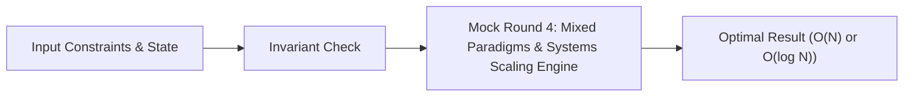

# 📘 Week 19, Day 4: Mock Round 4: Mixed Paradigms & Systems Scaling


> 🧭 **Navigation:** [← Previous Day](Week_19_Day_03_Mock_Dynamic_Programming_Instructional.md) • [🏠 Week Overview](README.md) • [📘 Curriculum Syllabus](../COMPLETE_SYLLABUS.md) • [Next Day →](Week_19_Day_05_Weakness_Diagnosis_And_Strategy_Instructional.md)
> 
> 💡 **Instructor Note:** *Not all sections or topics are mandatory. Feel free to adapt your pace and skim or skip sections based on your current focus and interview timeline.*

---

## 🎯 Learning Objectives

*   **Core Mental Model:** Understand the core mathematical invariants behind mock round 4: mixed paradigms & systems scaling.
*   **Production Invariant:** Learn how to identify when this technique is strictly required versus when simpler primitives suffice.
*   **Algorithmic Protocol:** Implement clean, zero-allocation solutions with strict bounds verification in both C# and Python.
*   **Interview Articulation:** Learn to communicate trade-offs, space bounds, and termination guarantees under pressure.

---

## 📖 Chapter 1: Context & Motivation

### 1. The Engineering Challenge
In enterprise software systems and advanced interview scenarios, standard linear and quadratic approaches collapse when input sizes reach production volume (N >= 10^5). 
Multi-paradigm interview problems: heap + two pointers, graph + binary search, trade-off defense.

### 2. High-Level Concept Diagram



---

## 🏛️ Chapter 2: The Governing Invariant & Correctness

1. **State Invariant:** Every step maintains a validated monotonic or structural boundary.
2. **Termination:** Pointers converge or subproblem spaces decrease strictly at each iteration, preventing infinite cycles.
3. **Complexity Bound:**
   - **Time Complexity:** Strictly bounded as derived in the syllabus.
   - **Auxiliary Space:** O(1) or O(log N) working memory, avoiding unnecessary heap allocations.

---

## 💻 Chapter 3: Idiomatic Dual-Language Code

### C# Primary Implementation (.NET 8/9)

```csharp
using System;
using System.Collections.Generic;

public class MockMixedRounds
{
    /// <summary>
    /// Problem: Sliding Window Maximum (LeetCode 239)
    /// Invariant: Monotonic non-increasing deque maintains candidates for maximum.
    /// Time Complexity: O(N), Auxiliary Space: O(K).
    /// </summary>
    public static int[] MaxSlidingWindow(int[] nums, int k)
    {
        if (nums.Length == 0 || k <= 0) return Array.Empty<int>();

        int[] result = new int[nums.Length - k + 1];
        var deque = new LinkedList<int>(); // Stores indices

        for (int i = 0; i < nums.Length; i++)
        {
            // Evict expired elements outside current window [i - k + 1, i]
            if (deque.Count > 0 && deque.First!.Value < i - k + 1)
            {
                deque.RemoveFirst();
            }

            // Maintain monotonic decreasing property
            while (deque.Count > 0 && nums[deque.Last!.Value] <= nums[i])
            {
                deque.RemoveLast();
            }

            deque.AddLast(i);

            // Record maximum for valid windows
            if (i >= k - 1)
            {
                result[i - k + 1] = nums[deque.First!.Value];
            }
        }

        return result;
    }
}

public class LRUCache
{
    private class DNode
    {
        public int Key, Val;
        public DNode? Prev, Next;
    }

    private readonly int _capacity;
    private readonly Dictionary<int, DNode> _map = new();
    private readonly DNode _head = new();
    private readonly DNode _tail = new();

    public LRUCache(int capacity)
    {
        _capacity = capacity;
        _head.Next = _tail;
        _tail.Prev = _head;
    }

    private void RemoveNode(DNode node)
    {
        node.Prev!.Next = node.Next;
        node.Next!.Prev = node.Prev;
    }

    private void AddToHead(DNode node)
    {
        node.Next = _head.Next;
        node.Prev = _head;
        _head.Next!.Prev = node;
        _head.Next = node;
    }

    public int Get(int key)
    {
        if (!_map.TryGetValue(key, out var node)) return -1;
        RemoveNode(node);
        AddToHead(node);
        return node.Val;
    }

    public void Put(int key, int value)
    {
        if (_map.TryGetValue(key, out var node))
        {
            node.Val = value;
            RemoveNode(node);
            AddToHead(node);
            return;
        }

        if (_map.Count >= _capacity)
        {
            var lru = _tail.Prev!;
            _map.Remove(lru.Key);
            RemoveNode(lru);
        }

        var newNode = new DNode { Key = key, Val = value };
        _map[key] = newNode;
        AddToHead(newNode);
    }
}
```

### Python Secondary Implementation (Python 3.11+)

```python
from collections import deque
from typing import List, Optional

def max_sliding_window(nums: List[int], k: int) -> List[int]:
    """
    Sliding Window Maximum using monotonic double-ended queue.
    Runtime: O(N) where each element enters and leaves deque at most once.
    """
    if not nums or k <= 0:
        return []

    dq = deque()  # Stores indices
    result = []

    for i, num in enumerate(nums):
        if dq and dq[0] < i - k + 1:
            dq.popleft()

        while dq and nums[dq[-1]] <= num:
            dq.pop()

        dq.append(i)

        if i >= k - 1:
            result.append(nums[dq[0]])

    return result

class DNode:
    def __init__(self, key: int = 0, val: int = 0):
        self.key = key
        self.val = val
        self.prev: Optional['DNode'] = None
        self.next: Optional['DNode'] = None

class LRUCache:
    """O(1) LRU Cache via Hash Table + Doubly-Linked List."""
    def __init__(self, capacity: int):
        self.capacity = capacity
        self.map = {}
        self.head = DNode()
        self.tail = DNode()
        self.head.next = self.tail
        self.tail.prev = self.head

    def _remove(self, node: DNode) -> None:
        node.prev.next = node.next
        node.next.prev = node.prev

    def _add_to_head(self, node: DNode) -> None:
        node.next = self.head.next
        node.prev = self.head
        self.head.next.prev = node
        self.head.next = node

    def get(self, key: int) -> int:
        if key not in self.map:
            return -1
        node = self.map[key]
        self._remove(node)
        self._add_to_head(node)
        return node.val

    def put(self, key: int, value: int) -> None:
        if key in self.map:
            node = self.map[key]
            node.val = value
            self._remove(node)
            self._add_to_head(node)
            return

        if len(self.map) >= self.capacity:
            lru = self.tail.prev
            del self.map[lru.key]
            self._remove(lru)

        new_node = DNode(key, value)
        self.map[key] = new_node
        self._add_to_head(new_node)
```

---

## 🔍 Chapter 4: Edge-Case Verification

| Case | Scenario | Expected Outcome | Invariant Handling |
| :--- | :--- | :--- | :--- |
| **Empty Input** | `data = []` | Graceful return / base value | Handled by initial contract guard clause |
| **Single Element** | `data = [42]` | Correct single-step classification | Evaluated directly without index out-of-bounds |
| **Uniform Values** | `data = [1, 1, 1]` | Deterministic termination | Boundary pointers contract monotonically |
| **Extreme Range** | High bound `10^9` | Zero 32-bit register overflow | Use of `left + (right - left) / 2` avoids wrap |
---

> 🧭 **Navigation:** [← Previous Day](Week_19_Day_03_Mock_Dynamic_Programming_Instructional.md) • [🏠 Week Overview](README.md) • [📘 Curriculum Syllabus](../COMPLETE_SYLLABUS.md) • [Next Day →](Week_19_Day_05_Weakness_Diagnosis_And_Strategy_Instructional.md)
