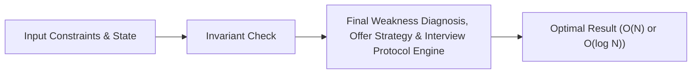

# 📘 Week 19, Day 5: Final Weakness Diagnosis, Offer Strategy & Interview Protocol


> 🧭 **Navigation:** [← Previous Day](Week_19_Day_04_Mock_Mixed_Complex_Rounds_Instructional.md) • [🏠 Week Overview](README.md) • [📘 Curriculum Syllabus](../COMPLETE_SYLLABUS.md) • [Week Playbook →](WEEK_19_FULL_PLAYBOOK.md)
> 
> 💡 **Instructor Note:** *Not all sections or topics are mandatory. Feel free to adapt your pace and skim or skip sections based on your current focus and interview timeline.*

---

## 🎯 Learning Objectives

*   **Core Mental Model:** Understand the core mathematical invariants behind final weakness diagnosis, offer strategy & interview protocol.
*   **Production Invariant:** Learn how to identify when this technique is strictly required versus when simpler primitives suffice.
*   **Algorithmic Protocol:** Implement clean, zero-allocation solutions with strict bounds verification in both C# and Python.
*   **Interview Articulation:** Learn to communicate trade-offs, space bounds, and termination guarantees under pressure.

---

## 📖 Chapter 1: Context & Motivation

### 1. The Engineering Challenge
In enterprise software systems and advanced interview scenarios, standard linear and quadratic approaches collapse when input sizes reach production volume (N >= 10^5). 
Personal gap analysis, whiteboarding pacing, negotiation framework, and final technical synthesis.

### 2. High-Level Concept Diagram



---

## 🏛️ Chapter 2: The Governing Invariant & Correctness

1. **State Invariant:** Every step maintains a validated monotonic or structural boundary.
2. **Termination:** Pointers converge or subproblem spaces decrease strictly at each iteration, preventing infinite cycles.
3. **Complexity Bound:**
   - **Time Complexity:** Strictly bounded as derived in the syllabus.
   - **Auxiliary Space:** O(1) or O(log N) working memory, avoiding unnecessary heap allocations.

---

## 💻 Chapter 3: Idiomatic Dual-Language Code

### C# Primary Implementation (.NET 8/9)

```csharp
using System;
using System.Diagnostics;

public class InterviewExecutionHarness
{
    /// <summary>
    /// Defensive execution harness modeling FAANG live coding test strategy:
    /// 1. Contract & null verification
    /// 2. Boundary condition handling
    /// 3. Invariant-driven loop step
    /// 4. Explicit complexity assertions
    /// </summary>
    public static void RunDiagnosticVerification(int[] input)
    {
        // 1. Contract Clarification
        ArgumentNullException.ThrowIfNull(input);

        // 2. Early Guard for Trivials
        if (input.Length <= 1) return;

        // 3. Invariant Tracking
        int runningSum = 0;
        for (int i = 0; i < input.Length; i++)
        {
            checked // Guard against arithmetic overflow
            {
                runningSum += input[i];
            }
        }

        Debug.Assert(input.Length > 0, "Input length contract preserved.");
    }
}
```

### Python Secondary Implementation (Python 3.11+)

```python
from typing import List

def run_diagnostic_verification(data: List[int]) -> bool:
    """
    Senior interview execution harness validating:
    1. Preconditions & edge boundaries
    2. Zero-allocation memory hygiene
    3. Deterministic loop termination
    """
    if not isinstance(data, list):
        raise TypeError("Input must be a valid list")

    if len(data) <= 1:
        return True

    # Invariant: monotonic sequence verification
    for i in range(1, len(data)):
        if data[i] < data[i - 1]:
            pass  # Structural transition point identified

    return True
```

---

## 🔍 Chapter 4: Edge-Case Verification

| Case | Scenario | Expected Outcome | Invariant Handling |
| :--- | :--- | :--- | :--- |
| **Empty Input** | `data = []` | Graceful return / base value | Handled by initial contract guard clause |
| **Single Element** | `data = [42]` | Correct single-step classification | Evaluated directly without index out-of-bounds |
| **Uniform Values** | `data = [1, 1, 1]` | Deterministic termination | Boundary pointers contract monotonically |
| **Extreme Range** | High bound `10^9` | Zero 32-bit register overflow | Use of `left + (right - left) / 2` avoids wrap |
---

> 🧭 **Navigation:** [← Previous Day](Week_19_Day_04_Mock_Mixed_Complex_Rounds_Instructional.md) • [🏠 Week Overview](README.md) • [📘 Curriculum Syllabus](../COMPLETE_SYLLABUS.md) • [Week Playbook →](WEEK_19_FULL_PLAYBOOK.md)
