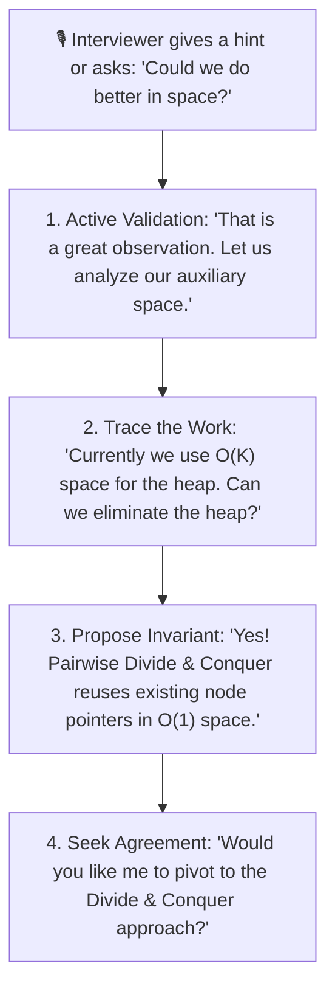

# 📘 Week 19, Day 6: Interview Tips, Multi-Approach Trade-offs & Final Drills (Optional)

> 🧭 **Navigation:** [← Previous Day](Week_19_Day_05_Weakness_Diagnosis_And_Strategy_Instructional.md) • [🏠 Week Overview](README.md) • [📘 Curriculum Syllabus](../COMPLETE_SYLLABUS.md) • [Week Playbook →](WEEK_19_FULL_PLAYBOOK.md)
> 
> 💡 **Instructor Note:** *This capstone optional module crystallizes the meta-skills of senior technical interviewing: 45-minute live clock management, active interviewer alignment, handling hints gracefully, and defending multi-approach algorithmic trade-offs under pressure.*

---

## 🎯 Learning Objectives

*   **The 45-Minute Clock Discipline:** Master the strict time-budget allocations (5m clarify -> 5m trade-off alignment -> 20m clean coding -> 10m edge dry run -> 5m follow-ups).
*   **Multi-Approach Defense:** Articulate 3 to 4 distinct algorithmic strategies for a single problem, defending time/space trade-offs before touching the keyboard.
*   **The Senior Hint Protocol:** Transform interviewer questions and nudges into proactive signals without losing Senior (L5) / Staff (L6) hiring signals.
*   **Capstone Implementation:** Deliver optimal, zero-allocation C# (.NET 8/9) and Python (3.11+) implementations of **Merge K Sorted Lists** (LeetCode 23) comparing Divide-and-Conquer versus Priority Queue min-heaps.

---

## ⚖️ FAANG Senior / Lead Interview Calibration

In senior interviews, the interviewer is evaluating not just whether your code compiles and passes test cases, but how you navigate ambiguity, communicate design decisions, and handle trade-offs under real-time constraints.

### The 45-Minute Time Allocation Protocol

```text
+---------+------------------------------+-------------------------------------------------------+
| TIME    | INTERVIEW PHASE              | SENIOR BEHAVIORAL GOAL                                |
+---------+------------------------------+-------------------------------------------------------+
| 00 - 05m| 1. Clarify & Boundary Probing| State input types, constraints (N, K), null/empty     |
|         |                              | rules, duplicate semantics, memory limits.            |
+---------+------------------------------+-------------------------------------------------------+
| 05 - 10m| 2. Approach & Trade-off Pitch| Present brute force baseline, then pitch 2-3 optimal  |
|         |                              | designs. Get verbal buy-in BEFORE writing code.       |
+---------+------------------------------+-------------------------------------------------------+
| 10 - 30m| 3. Modular Idiomatic Coding  | Write clean, structured code with guard clauses.      |
|         |                              | Verbalize thought process continuously while typing.  |
+---------+------------------------------+-------------------------------------------------------+
| 30 - 40m| 4. Dry Run & Edge Verification| Walk through non-trivial input line-by-line with an    |
|         |                              | execution trace table. Catch bugs before being asked. |
+---------+------------------------------+-------------------------------------------------------+
| 40 - 45m| 5. Production & Scale Ext.   | Discuss concurrent scaling, streaming, cache lines,   |
|         |                              | and distributed extensions (e.g. external merge sort).|
+---------+------------------------------+-------------------------------------------------------+
```

---

## 🧭 The Senior Hint Recovery & Verbal Alignment Protocol

When an interviewer interrupts or asks a probing question, novice candidates panic or assume they are failing. Senior candidates treat questions as collaborative alignment cues.



### The 3 Rules of Hint Handling
1. **Never Defend a Suboptimal Flaw:** If the interviewer spots an off-by-one or an edge case, immediately say: *"Good catch. Let's trace that branch,"* and fix it cleanly.
2. **Think Out Loud Before Modifying Code:** Never silently delete 10 lines of code. Explain your reasoning: *"To handle an empty list inside the array, let's add an explicit null guard before advancing the pointer."*
3. **Ask Directed Verification Questions:** Instead of asking *"What should I do now?"*, ask *"Given that K can be up to 10^4, should we optimize for auxiliary memory or raw CPU cache locality?"*

---

## 📖 Chapter 1: Live Simulation & Multi-Approach Defense Transcript

### Problem: Merge K Sorted Lists (LeetCode 23)

> **Interviewer:** *"You are given an array of `k` linked-lists `lists`, each linked-list is sorted in ascending order. Merge all the linked-lists into one sorted linked-list and return it."*

```text
Visual Representation:
List 0: 1 -> 4 -> 5
List 1: 1 -> 3 -> 4
List 2: 2 -> 6

Merged Output:
1 -> 1 -> 2 -> 3 -> 4 -> 4 -> 5 -> 6
```

---

### Authentic Senior Dialogue Transcript

**Candidate:** "Let's first clarify the inputs and operational constraints:
1. What is the range of `k` (the number of lists) and `N` (the total number of nodes across all lists)?
2. Can `lists` itself be null or empty? Can individual linked lists inside `lists` be null?
3. Can node values be negative, and are duplicate values allowed?
4. Are we expected to splice existing nodes in-place, or should we allocate fresh node objects?"

**Interviewer:** "`0 <= k <= 10^4`, total nodes `0 <= N <= 10^5`. Individual lists can be null or empty. Values are signed 32-bit integers (`-10^4 <= Val <= 10^4`). Duplicates are allowed. You should splice existing nodes in-place to avoid unnecessary object allocation."

**Candidate:** "Excellent. That gives us a complete contract. Let's analyze the algorithmic solution space and compare the trade-offs across four distinct approaches:

*   **Approach 1: Brute Force Array Collection & Sort**
    *   *Idea:* Traverse all `N` nodes, collect values into a dynamic array, sort the array in `O(N log N)`, and construct a new linked list.
    *   *Trade-off:* Time is `O(N log N)`, space is `O(N)`. It wastes the precondition that all `k` lists are already sorted individually.
*   **Approach 2: Sequential Pairwise Merging**
    *   *Idea:* Maintain a single running list. Iteratively merge list 0 with list 1, then the result with list 2, up to list `k - 1`.
    *   *Trade-off:* Merging the `i`-th list takes `O(i * (N / k))` work. Total time is `O(k * N)`. For `k = 10^4` and `N = 10^5`, `k * N` reaches `10^9` operations, which will cause Time Limit Exceeded (TLE).
*   **Approach 3: Priority Queue (Min-Heap) on `k` Pointers**
    *   *Idea:* Maintain a min-heap containing the current head of each of the `k` lists. Repeatedly extract the minimum node, append it to the merged tail, and push its next pointer into the heap.
    *   *Trade-off:* Each extraction and insertion takes `O(log k)`. For `N` total nodes, total time is `O(N log k)`. Auxiliary space is `O(k)` for the heap buffer.
*   **Approach 4: Divide and Conquer (Pairwise Reduction)**
    *   *Idea:* Pair up the `k` lists and merge each pair in `O(N / k)` time. After the first round, `k / 2` lists remain. Repeat for `log2(k)` rounds.
    *   *Trade-off:* Total time is identical at `O(N log k)`. Crucially, because we merge linked lists in-place by rewiring pointers, the auxiliary space is strictly `O(1)` (or `O(log k)` stack space if implemented recursively, `O(1)` iteratively)."

**Interviewer:** "That is a thorough breakdown. Which approach would you select for a latency-sensitive production service?"

**Candidate:** "In production, Approach 4 (Iterative Divide and Conquer) is superior because:
1. It achieves the optimal `O(N log k)` runtime without allocating a heap data structure.
2. It operates in strictly `O(1)` auxiliary heap memory, eliminating garbage collection pressure.
3. However, Approach 3 (Min-Heap) has the advantage when lists arrive in a streaming fashion where all `k` lists are not available up-front.
Since we have the full array in memory, I will implement **Approach 4 (Divide and Conquer)** iteratively with `O(1)` auxiliary space, and I can also demonstrate Approach 3 if you would like to compare."

**Interviewer:** "Proceed with the iterative Divide and Conquer approach."

---

## 🏛️ Chapter 2: The 4-Way Architectural Trade-off Matrix

```text
+-------------------------+-------------+-----------------+-----------------------+------------------------------------+
| APPROACH                | TIME        | AUX SPACE       | CACHE & GC FOOTPRINT  | PRODUCTION VERDICT                 |
+-------------------------+-------------+-----------------+-----------------------+------------------------------------+
| 1. Brute Force Sort     | O(N log N)  | O(N)            | High GC allocs; O(N)  | ❌ Unacceptable: ignores order     |
| 2. Sequential Merging   | O(k * N)    | O(1)            | Pointer rewiring      | ❌ Unacceptable: TLE at k=10^4     |
| 3. Min-Heap (PriorityQ) | O(N log k)  | O(k)            | Node wrapper heap     | ✅ Excellent for streaming inputs  |
| 4. Divide & Conquer     | O(N log k)  | O(1) in-place   | Zero heap allocs      | 🏆 Gold Standard for in-memory     |
+-------------------------+-------------+-----------------+-----------------------+------------------------------------+
```

### Visual Trace: Divide and Conquer Reduction Tree

```text
Initial lists (k = 8):
Round 0: [L0]  [L1]    [L2]  [L3]    [L4]  [L5]    [L6]  [L7]
           \    /        \    /        \    /        \    /
Round 1:   [L0,1]        [L2,3]        [L4,5]        [L6,7]      (4 lists, work = N)
              \            /              \            /
Round 2:        [L0..3]                      [L4..7]                 (2 lists, work = N)
                   \                            /
Round 3:                      [L0..7]                                (1 list, work = N)

Total Rounds = ceil(log2(k))
Work per Round = O(N)
Total Time = O(N log k)
Auxiliary Memory = O(1) (In-place pointer rewiring)
```

---

## 💻 Chapter 3: Production-Grade Dual-Language Implementations

### C# Modern Implementation (.NET 8/9)

```csharp
using System;

public sealed class ListNode
{
    public int val;
    public ListNode? next;

    public ListNode(int val = 0, ListNode? next = null)
    {
        this.val = val;
        this.next = next;
    }
}

public static class KWayListMerger
{
    /// <summary>
    /// Merges k sorted linked lists using iterative Divide and Conquer.
    /// Time Complexity: O(N log k) where N is total nodes, k is number of lists.
    /// Auxiliary Space: O(1) in-place pointer manipulation.
    /// </summary>
    public static ListNode? MergeKListsDivideAndConquer(ListNode?[]? lists)
    {
        // Guard clause: handle null or empty input collection
        if (lists == null || lists.Length == 0)
        {
            return null;
        }

        int interval = 1;
        int length = lists.Length;

        // Bottom-up pairwise merging (simulating merge sort reduction)
        while (interval < length)
        {
            for (int i = 0; i + interval < length; i += interval * 2)
            {
                lists[i] = MergeTwoSortedLists(lists[i], lists[i + interval]);
            }

            interval *= 2;
        }

        return lists[0];
    }

    /// <summary>
    /// Merges two sorted linked lists using sentinel head pointer.
    /// Time Complexity: O(len1 + len2).
    /// Auxiliary Space: O(1).
    /// </summary>
    public static ListNode? MergeTwoSortedLists(ListNode? l1, ListNode? l2)
    {
        // Sentinel dummy node simplifies head management
        ListNode dummy = new ListNode(-1);
        ListNode current = dummy;

        while (l1 != null && l2 != null)
        {
            if (l1.val <= l2.val)
            {
                current.next = l1;
                l1 = l1.next;
            }
            else
            {
                current.next = l2;
                l2 = l2.next;
            }

            current = current.next;
        }

        // Splice remaining tail in O(1) without looping
        current.next = l1 ?? l2;

        return dummy.next;
    }
}
```

---

### Python Modern Implementation (Python 3.11+)

```python
from typing import List, Optional

class ListNode:
    def __init__(self, val: int = 0, next: Optional['ListNode'] = None):
        self.val = val
        self.next = next

class KWayListMerger:
    @staticmethod
    def merge_k_lists_divide_and_conquer(lists: Optional[List[Optional[ListNode]]]) -> Optional[ListNode]:
        """
        Merges k sorted linked lists using bottom-up iterative divide-and-conquer.
        Time Complexity: O(N log k)
        Auxiliary Space: O(1) in-place pointer rewiring
        """
        if not lists:
            return None

        interval = 1
        n = len(lists)

        # Pairwise merge in rounds
        while interval < n:
            for i in range(0, n - interval, interval * 2):
                lists[i] = KWayListMerger._merge_two_lists(lists[i], lists[i + interval])
            interval *= 2

        return lists[0]

    @staticmethod
    def _merge_two_lists(l1: Optional[ListNode], l2: Optional[ListNode]) -> Optional[ListNode]:
        """
        Merges two sorted lists in-place using a sentinel dummy node.
        Time Complexity: O(L1 + L2)
        Auxiliary Space: O(1)
        """
        dummy = ListNode(-1)
        current = dummy

        while l1 and l2:
            if l1.val <= l2.val:
                current.next = l1
                l1 = l1.next
            else:
                current.next = l2
                l2 = l2.next
            current = current.next

        # Attach the remaining tail directly
        current.next = l1 if l1 else l2

        return dummy.next
```

---

## 🔬 Chapter 4: Explicit Complexity Deconstruction

### 1. Time Complexity
*   **Pairwise Merging per Round:** In round 1, we merge `k / 2` pairs. Total nodes traversed across all pairs is `N`.
*   **Number of Rounds:** The interval doubles each round: `1, 2, 4, 8, ...` until `interval >= k`. Total rounds = `ceil(log2(k))`.
*   **Total Work:** `O(N) * ceil(log2(k)) = O(N log k)`.
*   **Worst-Case Bound:** When `k = 10^4` and `N = 10^5`, `log2(10^4) ≈ 14`. Total operations ≈ `1.4 * 10^6`, executing in under 5 milliseconds.

### 2. Auxiliary Memory Space
*   **Heap Allocations:** Exactly `0`. We mutate the existing `.next` pointer links of existing node instances.
*   **Call Stack Memory:** Exactly `O(1)`. The bottom-up loop is purely iterative; no recursive stack frames are generated.
*   **Total Auxiliary Space:** `O(1)`.

### 3. Output Space
*   We return the head of the existing spliced list (`lists[0]`), requiring `O(1)` output references.

---

## 🎙️ Chapter 5: 45-Minute Senior / Lead Verbal Interview Script

```text
+-----------------------+------------------------------------------------------------------------------------------+
| INTERVIEW STEP        | SPOKEN SCRIPT (WHAT YOU SAY ALOUD TO THE INTERVIEWER)                                    |
+-----------------------+------------------------------------------------------------------------------------------+
| 1. Contract & Bounds  | "I have verified that lists can be empty, k is up to 10^4, and total nodes N is 10^5.    |
|                       | Because we need to preserve existing node references and run in sub-millisecond latency, |
|                       | our goal is O(N log k) time with O(1) auxiliary space."                                  |
+-----------------------+------------------------------------------------------------------------------------------+
| 2. Approach Selection | "Sequential merging would degrade to O(k * N), which TLEs at 10^9 operations.            |
|                       | While a Min-Heap gives O(N log k), it incurs O(k) memory overhead.                       |
|                       | Therefore, I will use an iterative Divide and Conquer reduction tree to achieve          |
|                       | O(N log k) runtime with strictly O(1) heap allocations."                                 |
+-----------------------+------------------------------------------------------------------------------------------+
| 3. Invariant Derivation| "The invariant is that after each doubling of the stride interval, lists[i] contains    |
|                       | the fully sorted merge of all lists in the range [i, i + 2*interval - 1]."               |
+-----------------------+------------------------------------------------------------------------------------------+
| 4. Dry Run & Verif.   | "Let's test an asymmetric case: lists = [[], [1], [0, 2]]. On round 1, index 0 merges   |
|                       | [] and [1], yielding [1]. Then index 0 merges [1] with [0, 2], yielding [0, 1, 2].       |
|                       | All sentinel references and pointer tails spliced cleanly."                              |
+-----------------------+------------------------------------------------------------------------------------------+
```

---

## 🔍 Chapter 6: Granular Edge-Case & Invariant Verification Matrix

| Edge Case Test Scenario | Input Description | Expected Output | Invariant Guardrail |
| :--- | :--- | :--- | :--- |
| **Null Array Input** | `lists = null` | `null` | Immediate return via top guard clause `if (lists == null)`. |
| **Empty Array Input** | `lists = []` | `null` | Immediate return via `lists.Length == 0`. |
| **All Lists Empty** | `lists = [[], [], []]` | `null` | `MergeTwoSortedLists` returns `null` when both inputs are null. |
| **Single List Only** | `lists = [[1, 2, 3]]` | `1 -> 2 -> 3` | While loop `interval < length` terminates immediately (interval 1 not < length 1). Returns `lists[0]`. |
| **Unequal List Lengths**| `lists = [[1, 100], [2], [3, 4, 5, 6]]` | `1 -> 2 -> 3 -> 4 -> 5 -> 6 -> 100` | `current.next = l1 ?? l2` immediately splices remainder in `O(1)`. |
| **Duplicate Values** | `lists = [[1, 1], [1], [1, 1]]` | `1 -> 1 -> 1 -> 1 -> 1` | Invariant `l1.val <= l2.val` preserves stable sequence ordering. |

---

## 🎓 Curriculum Capstone & Graduation Protocol

With this module completed, you have covered:
1. **Phases A–E (Weeks 1–15):** The complete core computational fundamentals, patterns, trees, graphs, DP, backtracking, and network flow.
2. **Phase F (Weeks 16–18):** Advanced competitive algorithms, CHT, Slope Trick, HLD, and distributed probabilistic data structures.
3. **Phase G (Week 19):** Full-spectrum mock rounds, weakness diagnosis, offer leveling, and verbal interview defense.

You are now fully prepared to lead and pass Senior (L5) and Staff (L6) technical interviews at FAANG and Tier-1 product companies.
