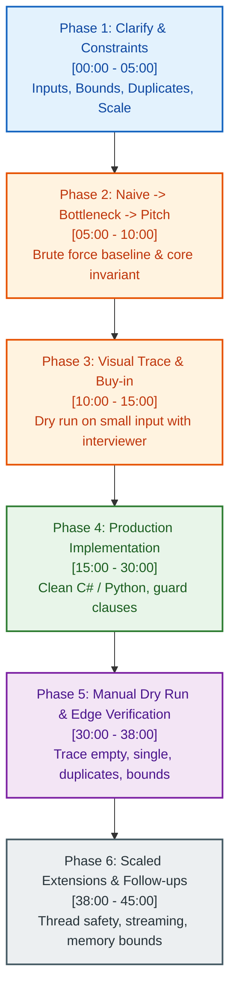
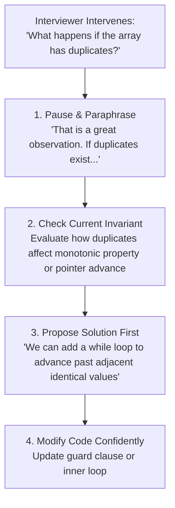

# 📊 Week 19 Visual Concepts Playbook (HYBRID)

> 🧭 **Navigation:** [🏠 Week Overview](README.md) • [📘 Curriculum Syllabus](../COMPLETE_SYLLABUS.md)
> 
> 💡 **Instructor Note:** *Week 19 is the capstone synthesis. In FAANG and Tier-1 senior interviews, knowing the algorithm is only 50% of the bar. The other 50% is time management under pressure, verbalizing architectural trade-offs, writing clean idiomatic code, and defending invariants against tricky edge cases.*

---

## 📋 Quick Navigation

- **The 45-Minute Clock:** Visual Time Management & Interview Phases
- **The Senior 4-Pillar Bar:** Scoring Rubric (Problem Solving, Code, Communication, Scaled Invariants)
- **The Hint Navigation Protocol:** How to Absorb and Leverage Interviewer Feedback
- **Modern 2026 AI-Assisted Round Protocol:** Directing, Auditing, and Verifying Code
- **The Complete 25-Pattern Quick Trigger Matrix:** Instant Pattern Identification Cheat Sheet

---

# ⏱️ The 45-Minute Live Interview Execution Blueprint

## Visual 1: Time-Boxed Interview Execution Pipeline



---

## 🎯 Phase Breakdown & Talk Tracks

### Phase 1: Clarify & Boundary Checks (Minutes 0–5)
Do NOT jump into code or even propose a complex algorithm yet. Establish the contract:
- **Scale:** *"What is the upper bound on N? If N <= 10^5, an O(N log N) or O(N) approach is required; an O(N^2) brute force will time out."*
- **Value Bounds:** *"Can values be negative? Can numbers exceed 32-bit integer limits (overflow risk)? Can elements be duplicated?"*
- **Edge Conditions:** *"Can the collection be null or empty? How should invalid input be handled?"*

### Phase 2: Naive Baseline to Intuitive Pitch (Minutes 5–10)
- Always mention the brute-force baseline first: *"The naive approach is nested loops checking all pairs in O(N^2) time and O(1) space."*
- Identify the bottleneck: *"The bottleneck is redundant rescanning of elements we've already seen."*
- Pitch the optimized pattern: *"We can reduce this to O(N) by maintaining a running seen map / monotonic stack."*

### Phase 3: Visual Alignment & Buy-In (Minutes 10–15)
- Trace a 4-to-5 element example with real numbers on a shared notepad or whiteboard.
- Explicitly ask for interviewer alignment before writing code:
  > *"Does this high-level approach look sound to you before I begin implementing the solution?"*

### Phase 4: Production-Grade Implementation (Minutes 15–30)
- Write modular, clean code with self-documenting variable names (`left`, `right`, `currentSum`, `minHeap`).
- Use guard clauses at the top for empty or null inputs.
- Keep helper functions cleanly separated.

### Phase 5: Concrete Edge-Case Dry Run (Minutes 30–38)
- Walk through the code line by line with a small concrete test case:
  ```text
  Trace: nums = [2, 7, 11, 15], target = 9
  Line 4: left = 0 (val=2), right = 3 (val=15)
  Line 6: current_sum = 17 > 9 -> right decrements to 2 (val=11)
  Line 6: current_sum = 13 > 9 -> right decrements to 1 (val=7)
  Line 6: current_sum = 9 == 9 -> Return [0, 1] ✓
  ```
- Check edge cases explicitly: Empty input, single element, all identical elements, extreme bounds.

### Phase 6: Senior/Staff Extensions (Minutes 38–45)
Anticipate follow-up extensions proactively:
- **Streaming Scale:** *"If data arrives as an infinite stream, we can replace the fixed array with a sliding window deque or min-heap."*
- **Memory Pressure:** *"If data cannot fit in memory, we can partition into external sorted chunks."*
- **Concurrency:** *"If multiple reader and writer threads access this structure concurrently, we can apply ReaderWriterLockSlim or lock striping."*

---

# 📊 The Senior FAANG 4-Pillar Evaluation Matrix

| Pillar | Score 1 (Fail) | Score 2 (Borderline) | Score 3 (Strong Pass) | Score 4 (Staff / Exceeds Bar) |
| :--- | :--- | :--- | :--- | :--- |
| **1. Problem Solving & Invariants** | Jumps blindly to code; misses brute force; misses optimal pattern | Finds optimal solution with multiple heavy interviewer hints | Quickly identifies bottleneck; selects optimal pattern with minimal prompting | Instantly articulates core invariant; proves discard-safety; compares alternative trade-offs |
| **2. Code Craftsmanship** | Messy syntax; buggy indices; compilation errors; single-letter variables | Working code but unidiomatic; unnecessary allocations; weak modularity | Clean, production-ready idiom; proper guard clauses; optimal data structure choice | Zero-allocation memory awareness; defensive bounds checks; beautiful design |
| **3. Verbal Communication** | Silent while coding; defensive when questioned; ignores hints | Communicates only when prompted; hard to follow thought process | Speaks thoughts out loud continuously; checks for interviewer alignment | Drives the interview conversation collaboratively like a peer engineer |
| **4. Edge Cases & Systems Scale** | Candidate fails on empty input or boundary tests | Catches edge cases only when pointed out by interviewer | Proactively writes and runs 2+ edge test vectors manually | Proactively discusses streaming data, concurrency, overflow, and memory bottlenecks |

---

# 🧭 The Hint Navigation Protocol

When an interviewer interrupts with a question or hint, it is an **alignment opportunity**, not a failure.



---

# 🤖 Modern 2026 AI-Assisted Coding Round Protocol

In modern technical interviews (e.g. Meta E5/E6 AI-assisted coding rounds), interviewers evaluate how you **direct, critique, and audit code generated by AI tools**.

### 1. The Prompting Discipline
- Never prompt with vague descriptions: *"Write code for longest substring."*
- Always specify contracts and invariants:
  > *"Write an optimal sliding window in C# for Longest Substring with At Most K Distinct Characters. Constraints: string length up to 10^5, ASCII characters, time complexity O(N), space complexity O(min(N, K)). Use a fixed-size integer array for frequency counting to avoid heap allocations."*

### 2. The Verification Checklist (Auditing AI Code)
When reviewing AI-generated code under interview conditions, immediately audit for:
1. **Off-by-One Bounds:** Are loop bounds `i < n` vs `i <= n` correct?
2. **Integer Overflow:** Are products or large sums using `long` instead of `int`?
3. **Empty / Null Input:** Did it emit guard clauses for `nums == null || nums.Length == 0`?
4. **Hidden Quadratic Traps:** Did it call `string.Substring()` or `list.Contains()` inside a loop, turning an `O(N)` algorithm into `O(N^2)`?
5. **State Reset Bugs:** In multi-pass or backtracking routines, are data structures properly restored?

---

# 🎯 Complete 25-Pattern Quick Trigger Matrix

| Problem Indicator / Keyword | Primary Pattern Family | Canonical Data Structure | Time Target |
| :--- | :--- | :--- | :---: |
| *"Find pair summing to target"* | **Two Sum / Complement** | Hash Set or Two Pointers (if sorted) | `O(N)` |
| *"Contiguous subarray with sum = K"* | **Prefix Sum + Hash** | `Dictionary<PrefixSum, Count>` | `O(N)` |
| *"Longest substring with constraint"* | **Sliding Window** | Two pointers `[L, R]` + Frequency Map | `O(N)` |
| *"Next greater / previous smaller"* | **Monotonic Stack** | Stack of indices (decreasing / increasing) | `O(N)` |
| *"Sorted array / search in logarithmic time"*| **Binary Search** | Midpoint `left + (right - left) / 2` | `O(log N)` |
| *"Find K largest / smallest elements"* | **Heap / Priority Queue**| Min-Heap (size K) or QuickSelect | `O(N log K)` |
| *"Overlapping intervals / schedule"* | **Interval Sweep** | Sort by `start_time` asc | `O(N log N)` |
| *"Cycle detection / linked list middle"*| **Fast-Slow Pointers** | Floyd's Tortoise (`1x`) & Hare (`2x`) | `O(N)` |
| *"Connected components / dynamic unions"* | **Union-Find (DSU)** | Disjoint Set with Path Compression & Rank | `O(α(N))` |
| *"Shortest path in unweighted graph"* | **Breadth-First Search**| `Queue<Node>` with visited set | `O(V + E)` |
| *"Shortest path with non-negative weights"* | **Dijkstra's Algorithm** | Priority Queue of `(distance, node)` | `O(E log V)` |
| *"Topological order / course prerequisites"*| **Kahn's Algorithm (BFS)**| In-degree array + Queue of zero-indegrees | `O(V + E)` |
| *"Count ways / optimize overlapping subproblems"*| **Dynamic Programming** | 1D or 2D array / state reduction | `O(N)` or `O(N*M)` |
| *"Generate all valid combinations / permutations"*| **Backtracking** | State-space recursion with push/pop restore | `O(2^N)` / `O(N!)` |
| *"Prefix lookup / autocomplete"* | **Trie (Prefix Tree)** | TrieNode with `children[26]` and `isEnd` | `O(L)` |
| *"Range sum / minimum with dynamic updates"*| **Segment Tree / Fenwick**| 4N flat tree or 1D BIT array | `O(log N)` |

---

## 📝 Final Note: The Senior Mindset

Technical interviewers look for a future colleague who can:
1. **Calmly structure chaos** when presented with an ambiguous problem.
2. **Communicate trade-offs** clearly without defensive posturing.
3. **Write code that is maintainable, correct, and robust against real-world edge cases.**

Trust the intuitive invariants, visualize the boundary states before coding, and treat the interviewer as a senior engineering partner.

---

> 🧭 **Navigation:** [🏠 Week Overview](README.md) • [📘 Curriculum Syllabus](../COMPLETE_SYLLABUS.md)
